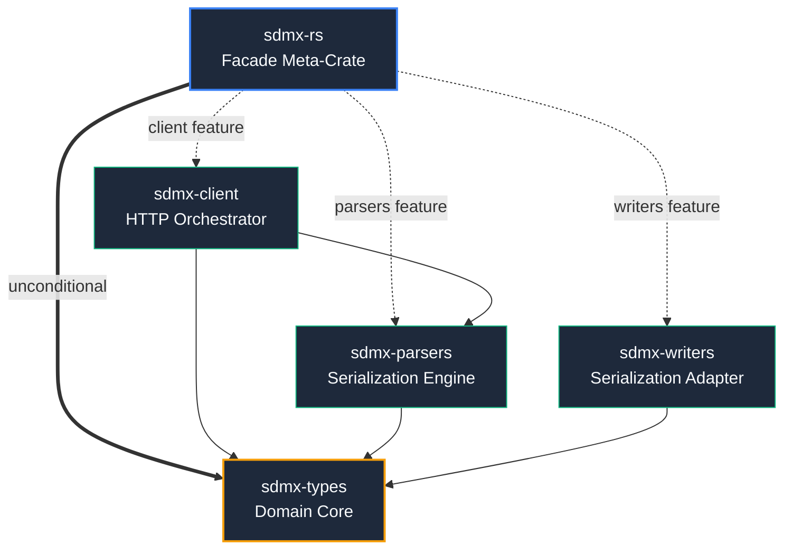

# Architecture: sdmx-rs

This document describes the design decisions, dependency boundaries, and engineering invariants of the `sdmx-rs` workspace.

## Specification Scope

`sdmx-rs` targets the **SDMX 3.0** and **SDMX 3.1** specifications. SDMX 2.1 is explicitly out of scope. All data structures, parsing routines, and REST endpoint conventions are implemented against the 3.x standard.

## Crate Dependency Graph

The workspace provides both individual, decoupled crates for granular consumption, and a unified top-level **Meta-Crate/Facade** (`sdmx-rs`) for general framework re-exports:

### 0. sdmx-rs (Facade Meta-Crate)
* **Responsibility**: Workspace-level entry point. It carries no unique logic, serving solely to re-export the underlying sub-crates (`types`, `parsers`, `writers`, `client`) as optional features under a single meta-version.
* **Constraints**: Optional feature-flag mapping (`parsers`, `client`). Ensures developer ergonomics by letting consumers pull in the entire coordinated framework with a single dependency. Uses exact version pinning for workspace components (see [ADR-0003](docs/adr/0003-workspace-crate-facade-and-version-pinning-strategy.md)); decoupled per-crate versioning takes effect from `1.0.0` onward (see [ADR-0004](docs/adr/0004-decoupled-crate-versioning-strategy.md)).

### 1. sdmx-types (Domain Core)
- **Responsibility**: Core SDMX data structures, metadata frameworks, structural keys, and validation invariants.
- **Constraints**: Minimal, highly stable, and unconditional external dependencies: `thiserror` (for error derivation) and `serde` (for structural serialization). Since SDMX's entire purpose is payload data exchange, making `serde` optional would add significant downstream feature-flag complexity throughout the workspace without providing any realistic utility. `#![no_std]` with `alloc` required (bare-metal targets without a global allocator are out of scope — see [ADR-0005](docs/adr/0005-adopt-no-std-with-alloc-for-sdmx-types-and-sdmx-parsers.md)). No binary output — this crate is a pure domain model library. No downstream protocol or transport types may leak into this crate.

### 2. sdmx-parsers (Serialization Engine)
- **Responsibility**: Streaming serialization and deserialization of SDMX payloads in XML and JSON formats.
- **Constraints**: Depends on `sdmx-types` only. Parsing routines target minimal memory allocations and zero-copy slicing where safe. `#![no_std]` with `alloc` required (see [ADR-0005](docs/adr/0005-adopt-no-std-with-alloc-for-sdmx-types-and-sdmx-parsers.md)).

### 3. sdmx-client (HTTP Orchestrator)
- **Responsibility**: Async HTTP client managing connectivity to SDMX REST endpoints, coordinating payload deserialization and state hydration.
- **Constraints**: Depends on `sdmx-parsers` and `sdmx-types`. Built on Tokio and reqwest/rustls (see [ADR-0011](docs/adr/0011-use-tokio-as-the-primary-async-runtime.md), [ADR-0012](docs/adr/0012-use-reqwest-over-hyper-and-ureq-for-the-http-client.md), and [ADR-0013](docs/adr/0013-use-rustls-over-native-tls-for-transport-layer-security.md)). Exposes fallible construction ([ADR-0014](docs/adr/0014-fallible-client-construction-and-custom-error-mapping.md)) and optional blocking execution bridge under the `blocking` feature flag ([Design 0005](docs/design/0005-synchronous-and-blocking-api-execution-bridge.md)).

### 4. sdmx-writers (Serialization Adapter)
- **Responsibility**: Standardized serialization of SDMX structural and data payloads into XML, JSON, and CSV formats.
- **Constraints**: Depends on `sdmx-types` only. Implements the `TargetVersion` API contract for version-aware serialization ([Design 0008](docs/design/0008-target-version-policy-for-serialization.md)). `#![no_std]` with `alloc` required.

### Rationale for Five-Crate Boundary

The workspace is deliberately split into five independent crates. This boundary strategy achieves two goals:

1. **Decoupling for Stability**: Core domain types reach maturity independently of transport and serialization layers. `sdmx-types` can stabilize to `1.0.0` while `sdmx-parsers` and `sdmx-client` continue iterating—downstream consumers are not forced to bump major versions unless they directly use the changing layer.

2. **Enabling Composition**: Each crate can be used in isolation or combined. A CLI tool might use only `sdmx-types` (pure data structures, no I/O). An embedded system might use `sdmx-parsers` without HTTP. A high-performance server might use both and add its own transport (gRPC, MessagePack) in a separate crate.

**Boundary Decisions**:

| Crate                | Why Separate                                | What It Enables                                                                                                   |
|----------------------|---------------------------------------------|-------------------------------------------------------------------------------------------------------------------|
| **sdmx-types**       | Domain logic is distinct from I/O           | Reuse in no_std/WASM; swap parsers/transport without changing types                                               |
| **sdmx-parsers**     | Deserialization is distinct from types      | Test parsing in isolation; add new formats (Protocol Buffers, CSV) without touching types or HTTP                 |
| **sdmx-writers**     | Serialization mirrors parsing's separation  | Write SDMX data without consuming HTTP stack; round-trip testing (parse→serialize→parse)                          |
| **sdmx-client**      | HTTP orchestration is distinct from parsing | Swap HTTP client (reqwest→hyper→custom) without touching parsers; test client without real network                |
| **sdmx-rs (facade)** | Point-in-time crate versioning              | Guarantee users get coordinated, tested combinations of sub-crates; sub-crates stay free to version independently |

#### Example: Adding CSV Support

Under this architecture, CSV support would be added as:
1. New parsing module in `sdmx-parsers` (depends on types only)
2. New writing module in `sdmx-writers` (depends on types only)
3. Optional feature in `sdmx-rs` facade

No changes to `sdmx-types` or `sdmx-client`. Consumers could use `sdmx-rs` with `features = ["csv"]` or directly depend on `sdmx-parsers` with their own transport.

#### Trade-off: Complexity vs Flexibility

Five crates is more complex than one monolithic crate. The trade-off is deliberate:
- **Monolithic cost**: Every change propagates; domain types can't stabilize independently; consumers stuck with breaking transport changes
- **Modular benefit**: Stability boundaries are explicit; reusability is natural; transport can evolve without affecting types

## Design Decisions

> **Note**: The rationale for significant technical choices is historically captured and maintained as immutable **Architecture Decision Records (ADRs)** located in the `docs/adr/` directory. The summaries below reflect the current active state of those decisions.

### Async Runtime

`sdmx-client` is built on **Tokio** as the primary async runtime target. To support consumers operating in synchronous-only contexts, a blocking API is provided via optional methods on the built `SdmxClient` when configured with a `BlockingStrategy`.

#### Blocking Strategy

The client's synchronous API is built on two independent layers:

**Layer 1 — Runtime Acquisition.** At `build_sync()` time the builder calls `Handle::try_current()`. If a runtime is active its handle is wrapped as `RuntimeHandle::Active`. If no runtime is active a private `current_thread` Tokio runtime is created and wrapped as `RuntimeHandle::Owned(Arc<Runtime>)`. Construction is panic-free in both cases, enabling zero-setup synchronous scripting.

**Layer 2 — Blocking Bridge.** The `BlockingStrategy` enum, configured at builder time via `SdmxClientBuilder::blocking_strategy()`, applies only to `RuntimeHandle::Active`:

- **`SpawnBlocking`**: Always delegates to `handle.block_on()`. Safe from `spawn_blocking` threads or external threads.
- **`Auto` (default)**: Attempts `tokio::task::block_in_place()` first; falls back to `handle.block_on()` if the runtime is single-threaded. Provides best-effort performance.
- **`BlockInPlace`**: Forces `block_in_place()` directly, returning `Error::BlockingNotSupported` if the runtime is single-threaded. For verified high-performance deployments.

When `RuntimeHandle::Owned` is held (no ambient runtime), `BlockingStrategy` is ignored and `rt.block_on()` is always used — the client owns the scheduler, so strategy negotiation is unnecessary.

This design keeps the library agnostic to the caller's runtime context while enabling progressive performance optimization and zero-setup scripting. For full rationale and implementation details, see [Design 0005](docs/design/0005-synchronous-and-blocking-api-execution-bridge.md).

### Error Handling

Error handling in `sdmx-rs` is designed around strict crate boundaries. Each crate in the workspace defines its own scoped `Error` type using `thiserror` (e.g., `sdmx_types::Error`, `sdmx_parsers::Error`). Errors are mapped and converted explicitly as they propagate upward. A unified workspace-level error enum is rejected to prevent coupling core domain types to transport or parser dependencies.

For the full architectural rationale and design constraints, see [ADR-0006](docs/adr/0006-standardise-error-handling-with-thiserror-per-crate.md).

### Serialization Libraries
- **JSON**: `serde_json`
- **XML**: `quick-xml` (with `serde` integration via the `serialize` feature)

`quick-xml` and `serde_json` are chosen to handle parsing sequentially without loading full DOM trees into memory. For the streaming parser rationale and zero-copy slicing memory architecture, see [ADR-0009](docs/adr/0009-use-quick-xml-and-serde-json-for-streaming-deserialization.md).

### HTTP Client Library & TLS Backend

`sdmx-client` uses **`reqwest`** (leveraging the **`rustls`** cryptographic backend) to communicate async with remote SDMX endpoints.

For the complete architectural comparisons and rationales behind these choices, see:
* **HTTP Client Selection**: [ADR-0012](docs/adr/0012-use-reqwest-over-hyper-and-ureq-for-the-http-client.md) (reqwest over hyper/ureq/surf)
* **TLS Backend Selection**: [ADR-0013](docs/adr/0013-use-rustls-over-native-tls-for-transport-layer-security.md) (rustls over native-tls)

### Thread Safety and Concurrency Guarantees

As a library designed for modern, high-performance web and data architectures, `sdmx-rs` establishes strict concurrency guarantees:

- **Send + Sync Core Types**: All domain structures and types inside `sdmx-types` are fully `Send` and `Sync`, allowing multi-threaded parallel execution across worker thread pools (such as Rayon or Tokio executor grids) without synchronization overhead.
- **Stateless, Shared Client**: `SdmxClient` in `sdmx-client` maintains internal state strictly behind thread-safe abstractions (such as the connection pool handled by `reqwest`). The client is explicitly `Send` + `Sync`. Consumers are encouraged to share a single client instance using simple cloned references across multiple concurrent tasks (e.g., sharing the client directly), avoiding the need to serialize requests through a `Mutex` wrapper.

### Streaming Parser Memory Architecture

Statistical Data and Metadata Exchange payloads can scale to gigabytes of tabular observation streams. Materializing a full Document Object Model (DOM) for such payloads is a common source of Out-of-Memory (OOM) crashes in enterprise systems.

To mitigate this, `sdmx-parsers` employs a strict **streaming-only memory architecture**:
- **Token-Driven XML/JSON Deserialization**: The parsing engine processes XML streams token-by-token via `quick-xml`'s reader and deserializes JSON streams sequentially via `serde_json`'s stream reader. Large structural metadata payloads are parsed iteratively.
- **Zero-Copy Slicing**: Where safe, parsers extract text boundaries by slicing directly from input read buffers rather than allocating new strings. Note that XML payloads containing entity references (e.g., `&amp;` or `&lt;`) must be decoded and thus require allocation. To accommodate this, parser structures in `sdmx-parsers` utilize `Cow<'a, str>` to borrow decoded text slices directly when no entities are present, falling back to owned `String` allocation only when decoding modifies the source slice.
- **No Global DOM Accumulation**: Instead of building a unified in-memory schema forest, data arrays are hydrated on-the-fly and streamed out to caller-defined channels or custom observers, maintaining a flat memory consumption profile regardless of payload scale. In async contexts (e.g., `sdmx-client`), this is paired with a non-blocking stream bridge using worker threads to read network packets dynamically without blocking the executor core.

### Feature Flags

The workspace facade crate (`sdmx-rs`) coordinates framework consumption using the following feature flags:
- `parsers` (enabled by default): Compiles in the `sdmx-parsers` serialization engine, including both streaming XML (`quick-xml`) and JSON (`serde_json`) support out of the box.
- `client` (enabled by default): Compiles in the `sdmx-client` network orchestrator, bringing in async HTTP client capabilities.
- `writers` (enabled by default): Compiles in the `sdmx-writers` serialization adapter for SDMX output generation across multiple formats. Introduces the `TargetVersion` API contract for version-aware payload serialization. Phase 2 deliverable; the scaffold is present unconditionally but provides no functional output until Phase 2 implementation is complete (see [Design 0008](docs/design/0008-target-version-policy-for-serialization.md)).

> **Note**: `sdmx-types` is not a feature flag. It is always compiled as the unconditional domain foundation underlying `parsers`, `client`, and `writers`.

### SDMX 3.0 vs 3.1 Spec Divergence (ConstraintModel)

To handle the structural metadata schema divergence between the **SDMX 3.0** and **SDMX 3.1** specifications, core domain types in `sdmx-types` use unified, version-agnostic abstractions (such as the `ConstraintModel` enum) rather than splitting structural paths. This isolates wire-version detection to `sdmx-parsers` and keeps the public API clean.

For the full technical details of this divergence and the unified modeling strategy, see [ADR-0008](docs/adr/0008-model-sdmx-3-0-and-3-1-divergence-with-a-unified-constraintmodel.md).

### Benchmarking
Performance-sensitive code paths will be benchmarked using **`criterion`** (planned — Phase 2).

---

## API Design & Ergonomics

Query builders in `sdmx-client` use the **Typestate pattern** to enforce compile-time validation of mandatory fields, preventing invalid queries from being constructed. See [Design 0007](docs/design/0007-typestate-query-validation.md) for the rationale and alternatives considered.

Detailed query builder API design, state machines, code blueprints, and implementation roadmap are documented in [docs/design/0003-typestate-query-builders-design.md](docs/design/0003-typestate-query-builders-design.md).

---

## Versioning Strategy

All crates move in lockstep at the same version until `1.0.0`. Pre-1.0 minor bumps signal phase completion and may contain breaking API changes. From `1.0.0` onward, crates are versioned independently to reflect their differing stability profiles — `sdmx-types` is expected to stabilise ahead of the parsing and HTTP transport layers, so downstream API changes in network components do not force major version increments on pure, stable data structures. The phase-by-phase version table and full pre-1.0 policy are in [ROADMAP.md — Versioning Strategy](ROADMAP.md#versioning-strategy); the decoupled post-1.0 steady-state is documented in [ADR-0004](docs/adr/0004-decoupled-crate-versioning-strategy.md).

These releases are managed through the workspace facade meta-crate (`sdmx-rs`), which maps its version boundaries to tested, verified alignments of the underlying child crates, matching standard Rust monorepo practices. To guarantee the facade acts as a reliable, point-in-time snapshot, the facade crate **pins its child dependencies using exact version constraints** (for example, `sdmx-types = "=1.0.0"`). This architectural rule ensures downstream consumers are insulated from silent version drift or dynamic sub-crate updates. All operational release instructions, including pre-release checklists, coordinated publishing, and failure recovery, are documented in [docs/project/releasing.md](docs/project/releasing.md).

Every published `.crate` artifact carries cryptographically verifiable supply-chain provenance. The CI publish pipeline (`publish.yml`) authenticates to crates.io via Trusted Publishing (ephemeral OIDC tokens — no long-lived registry credentials), and writes three attestations per crate to the GitHub attestation store: SLSA L2 build provenance, a CycloneDX SBOM, and an SPDX SBOM. This satisfies EO 14028, OMB M-22-18, and NTIA SBOM minimum element requirements. The full provenance model and consumer verification instructions are documented in [SECURITY.md](SECURITY.md); the design rationale is in [docs/design/0004](docs/design/0004-release-publish-pipeline-and-supply-chain-provenance.md).

## Invariants

- **Memory discipline**: Prefer stack allocation and explicit lifetime boundaries. Avoid cloning large structural types across crate boundaries.
- **Nix environment hermeticity**: Nix is a strict requirement for all development and verification workflows. Pinned compiler toolchains, linters, target linkers, formatting utilities, and target runtimes are provisioned exclusively via the Nix Flake configuration. This guarantees environmental determinism and ensures 1:1 parity between local developer environments and CI, preventing any class of compiler or tooling behavior drift.
- **Deterministic behavior**: All parsing must produce identical results across platform runtimes. No global mutable state.
- **Lossless infoset store (two-layer model)**: The `sdmx-types` domain store holds the **pre-validation infoset** within schema content — element order, repeated elements (including schema-valid duplicates), attribute statedness, and raw value lexemes are all preserved. Constructors reject only mechanically schema-invalid input; prose-only spec rules are non-destructive lints; every consumer convenience (applied defaults, canonical projections, lookups) is a derived view, never a collapse of the store. **XSD defaulting is a view over the data, not the data itself** — schema assessment (the PSVI) is Layer 2. See [ADR-0023](docs/adr/0023-two-layer-infoset-store-and-derived-views-architecture.md).
- **Document integrity (byte-preserving edits)**: Editing a document through the library must never change bytes outside the edited region — byte in == byte out elsewhere. This invariant is satisfied by a dedicated lossless document pathway (the domain model acting as a typed view over a byte-preserving representation), while the canonical parse → model → serialize pathway guarantees equivalence up to the wire format's own non-information layer. See [ADR-0024](docs/adr/0024-byte-preserving-document-integrity-pathway.md).
- **Single write path for invariants**: Every domain invariant is enforced in the type's `Result`-returning constructor, reached identically by hand construction and by (custom, where required) serde deserialization — a hand-built invalid value is uncallable, and wire input meets the same enforcement as programmatic input. See [ADR-0021](docs/adr/0021-domain-invariant-validation-and-encapsulation-strategy.md).
- **Lifetimeless domain types**: All domain types own their data (`'static`); lifetime complexity is confined to parser internals. See [ADR-0022](docs/adr/0022-owned-string-ownership-strategy.md).
- **No unsafe code**: `unsafe` is forbidden across all crates via `[workspace.lints.rust] unsafe_code = "forbid"`.
- **Zero compiler warnings**: All crates compile clean under `clippy::pedantic` with `-D warnings`. Note that public API documentation coverage (`missing_docs`) is set to `warn` at the source level during active prototyping (Phases 1–4) to avoid unnecessary development friction, but is elevated to a hard compilation block in CI and local quality gates via the `-D warnings` compiler flag. This lint will be formally promoted to a hard source-level `deny` at the manifest level in Phase 5 (Stabilisation) of the ROADMAP prior to our 1.0 release.
- **Formatting strictness**: Code aesthetics are strictly enforced using unstable `rustfmt` features (via a Nix-provisioned nightly formatter), ensuring completely uniform imports and documentation comments.
- **WASM target portability**: `sdmx-types`, `sdmx-parsers`, and `sdmx-writers` must compile cleanly for `wasm32-unknown-unknown` without std leakage (enforced strictly as pure `no_std` + `alloc` structures). This guarantees that the core model library and deserialization/serialization engines can be embedded directly in browser-based tools, web applications, or serverless edge computing environments without dynamic JS gluing or standard-library reliance. This is mechanically enforced by a dedicated CI compilation gate and mirrored locally via `just check-wasm`.
- **MSRV compatibility floor**: The declared Minimum Supported Rust Version (MSRV) represents a strict, stable compatibility floor for downstream consumers. While the active Nix development toolchain may bump to newer releases for tooling or linting gains, the library code is strictly prohibited from adopting language or standard-library features beyond the declared MSRV without a formal, coordinated MSRV bump. This floor is mechanically validated on every pull request.
- **Dual-context maintenance check enforcement**: To balance developer velocity with strict quality assurance, maintenance review schedules are decoupled by context. Overdue deadlines result in non-blocking warnings during Pull Request verification, preventing pipeline friction for external contributors. Conversely, overdue items trigger hard build failures on the default branch and during scheduled checks to guarantee prompt remediation.
