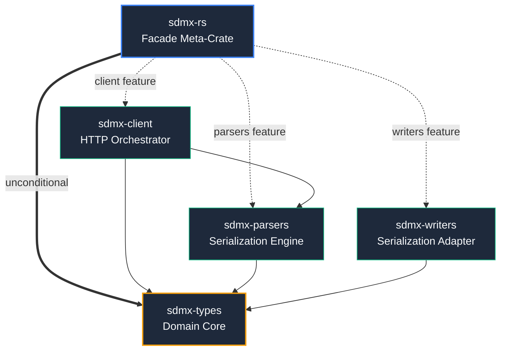

# sdmx-rs

<!-- [](https://crates.io/crates/sdmx-rs) -->
<!-- [](https://docs.rs/sdmx-rs) -->
[](https://github.com/dgalbraith/sdmx-rs/blob/main/docs/project/msrv.md)
[](https://github.com/dgalbraith/sdmx-rs#license)

Universal Statistical Data and Metadata Exchange (SDMX) framework for Rust.

This crate serves as the top-level facade and entry point for the `sdmx-rs` workspace, coordinating re-exports of individual sub-crates under clear feature flags.

## Workspace Architecture



## Features

*   **`types`** (Always Compiled): Pure, `#![no_std]`, dependency-free domain models, metadata schemas, and validation invariants.
*   **`parsers`** (Default Feature): Streaming XML and JSON parser engine.
*   **`writers`** (Default Feature): Serialization adapter for SDMX output generation (XML, JSON, CSV) via the `TargetVersion` API contract.
*   **`client`** (Default Feature): Tokio-based async HTTP orchestrator managing REST endpoints.

### TLS (when `client` is enabled)

| Feature | Default | TLS engine | Certificate source                                      |
|---------|:-------:|:----------:|---------------------------------------------------------|
| `tls`   | ✓       | rustls     | Host OS / native trust store (rustls-platform-verifier) |

By default this library uses the **host OS trust store** via reqwest 0.13's default
`rustls-platform-verifier`. This works identically on Linux, macOS, and Windows — no host
certificate configuration required. (`rustls` is the only TLS backend, so the flag is simply
`tls` — on or off.)

**Corporate / internal CA environments**: add your internal CA certificate at runtime — it is
**merged** into the native roots:

```rust
use reqwest::tls::Certificate;
let ca = Certificate::from_pem(include_bytes!("internal-ca.pem"))?;
let client = reqwest::Client::builder().tls_certs_merge([ca]).build()?;
```

To compile without any TLS support (advanced / custom transport scenarios):

```toml
[dependencies]
sdmx-rs = { version = "0.1", default-features = false, features = ["parsers", "client"] }
```

## Usage

Add `sdmx-rs` to your `Cargo.toml` dependencies. By default, both the parser and HTTP client layers are enabled:

```toml
[dependencies]
sdmx-rs = "0.1"
```

For pure `#![no_std]`, embedded, or WASM-minimal environments, disable default features to compile only the core domain types layer:

```toml
[dependencies]
sdmx-rs = { version = "0.1", default-features = false }
```

## License

Licensed under either of:

*   Apache License, Version 2.0 ([LICENSE-APACHE](https://github.com/dgalbraith/sdmx-rs/blob/main/LICENSE-APACHE) or http://www.apache.org/licenses/LICENSE-2.0)
*   MIT license ([LICENSE-MIT](https://github.com/dgalbraith/sdmx-rs/blob/main/LICENSE-MIT) or http://opensource.org/licenses/MIT)
