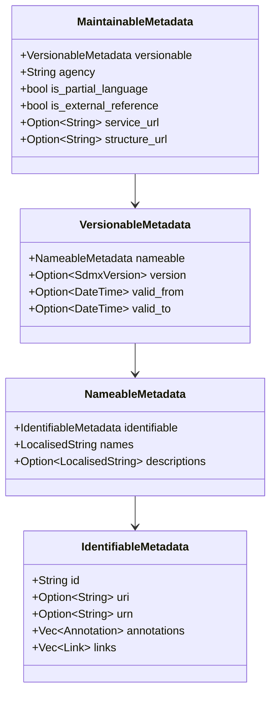

# 0010. SDMX Core Domain Types Design

Date: 2026-06-08

## Status

Proposed

<!-- Valid statuses: Proposed, Accepted, Implemented, Superseded -->

---

## Summary

This design document outlines the domain modeling strategy for the `sdmx-types` crate, targeting both the **SDMX 3.0** and **SDMX 3.1** specifications. The crate serves as the foundational core of the `sdmx-rs` workspace, defining the metadata structures (Codelists, Value Lists, Concept Schemes, Agency Schemes, Data Structure Definitions, Dataflows, and Constraints) and validation invariants that underpin all deserialization, serialization, and HTTP transport layers. The design guarantees full `#![no_std]` + `alloc` compatibility, target portability for headless WebAssembly (`wasm32-unknown-unknown`), and clean separation of concerns without runtime overhead.

---

## Problem / Motivation

SDMX (Statistical Data and Metadata Exchange) is an ISO standard representing complex, highly nested, and multi-versioned statistical structures. Transitioning the library to Phase 1 (Core Domain Types) requires addressing several key engineering and domain modeling challenges:

1. **Simulating Object-Oriented Inheritance in Rust:** The SDMX Information Model relies extensively on structural inheritance:

   - `Annotable` ➔ `Identifiable` ➔ `Nameable` ➔ `Versionable` ➔ `Maintainable`

   Rust does not support class-based inheritance. Simulating this via naive composition (nesting structs) without formal trait abstractions makes the public API verbose and hard to consume. Conversely, relying on trait objects (`Box<dyn MaintainableArtefact>`) introduces runtime dynamic dispatch overhead (vtable lookup) and heap allocations, violating our zero-cost abstraction philosophy and complicating serialization.

2. **Strict `#![no_std]` + `alloc` Boundary:** As established in ADR-0005, the domain types must compile for WebAssembly targets without accessing hosted OS capabilities. This prohibits the use of standard-library collections like `HashMap` and requires strict dependency hygiene (no transitive standard library dependencies).

3. **Lossless Multi-Version Support:** The structural schema diverges between SDMX 3.0 and SDMX 3.1 (most notably in data constraints, see ADR-0008). The core types must provide a unified, version-agnostic representation — the *Canonical Superset Model* of ADR-0008 — in which every field reachable from any supported version is expressible, so that no version-specific information need be lost. The core types do not themselves normalise or round-trip between versions; the adapter crates (`sdmx-parsers`, `sdmx-writers`) perform that conversion to and from the canonical model. The model's job is to make those round-trips lossless *by construction*.

4. **Lifetimeless Domain API:** To prevent lifetime pollution (`'a`) from propagating throughout the entire workspace API (forcing all user code, parsers, and client configurations to carry complex annotations), domain models must own their data. However, allocations must be minimized.

5. **Validation Invariants:** Metadata objects must enforce structural invariants at construction time (e.g. a DSD must contain at least one dimension; identifiers must match their per-artefact SDMX lexical type — `IDType` for codes and generic ids, the stricter `NCNameIDType` for agencies and concepts — see D-0023).

---

## Proposed Design

### Architecture / Key Decisions

#### 1. Metaclass Composition and Trait Hierarchy

To balance structural reuse (avoiding duplicate fields) with ergonomic access, we adopt a hybrid **Composition & Trait Delegation** pattern:

- **Composition for Storage:** We define four metadata leaf structures (`IdentifiableMetadata`, `NameableMetadata`, `VersionableMetadata`, `MaintainableMetadata`) that nest progressively.
- **Traits for Interface:** We define four corresponding traits (`IdentifiableArtefact`, `NameableArtefact`, `VersionableArtefact`, `MaintainableArtefact`) that provide standard getter methods.
- **Auto-Delegation:** We implement these traits for every concrete domain struct that carries the corresponding metadata.



**Figure 1:** Metadata inheritance composition hierarchy. Each level nests its predecessor, enabling progressive enrichment from identifier → names → versions → agency maintenance.

#### 2. Localised Strings & Collection Ordering

SDMX metadata contains multilingual text (e.g. Names and Descriptions). We define:

- `LocalisedString` as an **ordered list** of `(language, text)` entries in wire order, where the key is the spec's `xml:lang` (= `xs:language`) tag (e.g. `"en"`, `"fr"`) — stored as `Option<String>`, because `TextType` declares `xml:lang` with `default="en"`: an absent tag and a stated `"en"` are different documents, and the default is an effective view (D-0052/D-0059). See D-0016/D-0051/D-0059.
- **Every wire collection is stored as an ordered `Vec` in wire order** (D-0051 / ADR-0023): element order is wire information no keyed map preserves (a `BTreeMap` sorts), and so are the duplicate identities the schema actually permits (`ValueItem` ids, concept-inherited DSD component ids, `LocalisedString` languages, cube-region selection ids; official samples exhibit them). Most in-scope schemes *do* carry an `xs:unique` on their explicit `@id` (codes, concepts, agencies, explicit DSD component/group ids), so a duplicate there is schema-invalid rather than wire to preserve, but order-faithfulness alone already dictates `Vec`. Identity lookups (`get(id)`, `get(lang)`) are first-match Layer-2 views; duplicate identities are catalogued lints, never silent collapses.
- Determinism is **wire-order-out**: serializing a parsed document reproduces the received order, and programmatic insertion order is itself deterministic. (The earlier `BTreeMap`-everywhere policy bought determinism by sorting — itself a normalization — at the cost of destroying order and duplicates; superseded, D-0006 → D-0051.)

#### 3. Generic ItemScheme Framework

Many SDMX structures represent schemes containing items (e.g. `Codelist` contains `Code`s, `ConceptScheme` contains `Concept`s). Rather than duplicating the scheme administration fields, we define a generic `ItemScheme<I>` framework.

`ItemScheme<I>` requires `I: SchemeItem`, where `SchemeItem` is an open (unsealed) marker supertrait over `IdentifiableArtefact`:

```rust
pub trait SchemeItem: IdentifiableArtefact {}
```

`SchemeItem` is deliberately left open — it is an inbound structural bound ("this type can supply its own id for use as a map key"), not an outbound capability assertion. There is no invariant or boundary that breaks if a downstream crate implements `SchemeItem` on its own identifiable type; `I: IdentifiableArtefact` already guarantees the only thing `ItemScheme` needs. This is the opposite policy to `SdmxSerialize`, which is sealed because self-approval would defeat the serialization boundary's purpose. The asymmetry is intentional: seal only when openness would let a caller break an invariant you are responsible for. A downstream custom scheme item works in-memory but cannot cross into `sdmx-writers` without explicit `SdmxSerialize` approval — extensibility where it is harmless, sealing where it matters.

`ItemScheme<I>` stores its items as an **ordered `Vec` in wire order** (D-0051). The earlier private-map design existed to make key/id desync impossible by construction; with no derived key there is nothing to desync, so the rationale no longer applies — `ItemScheme` is a transparent pub-field carrier (every field self-enforcing; ADR-0021's sharper test) with derived `Deserialize`:

```rust
pub struct ItemScheme<I: SchemeItem> {
    pub metadata: MaintainableMetadata,
    pub is_partial: Option<bool>,  // statedness stored; schema default false is a view (D-0052)
    pub items: Vec<I>,             // wire order; schema-valid duplicates preserved (D-0051)
}

impl<I: SchemeItem> ItemScheme<I> {
    pub fn new(metadata: MaintainableMetadata, is_partial: Option<bool>) -> Self {
        Self { metadata, is_partial, items: Vec::new() }
    }
    pub fn insert(&mut self, item: I) { self.items.push(item); }
    /// First-match lookup view (Layer 2). Wire order is preserved (a keyed map sorts); a
    /// duplicate id is schema-invalid for these schemes (Code/Concept/Agency `@id` is
    /// `xs:unique`-enforced), but if a non-conformant document presents one it is held
    /// verbatim and flagged by a catalogued lint, never collapsed. First match is policy.
    pub fn get(&self, id: &str) -> Option<&I> {
        self.items.iter().find(|i| i.id() == id)
    }
    pub fn iter(&self) -> impl Iterator<Item = &I> { self.items.iter() }
    /// Effective view of the spec's `isPartial` (schema default false) — D-0052.
    pub fn is_partial(&self) -> bool { self.is_partial.unwrap_or(false) }
}
```

Lookup is O(n) — fine at SDMX metadata cardinalities (tens to thousands); cached index views are the sanctioned later evolution if profiling demands (ADR-0023), additive and non-breaking precisely because the store side is the `Vec`.

Concrete domain types wrap or compose this generic container to expose a domain-specific API:

- `Codelist` composed of `ItemScheme<Code>`
- `ConceptScheme` composed of `ItemScheme<Concept>`
- `AgencyScheme` composed of `ItemScheme<Agency>`

#### 4. Data Structure Definition (DSD) & Component Layout

A DSD (`DataStructureDefinition`) is a maintainable artifact defining the dimensions, attributes, and measures of a dataset. The spec's component containers are **identifiable descriptors** (`ComponentListType` extends `IdentifiableType` — each carries annotations/links/urn; their ids are fixed values, except `Group`'s, which is required and user-chosen), modelled as structs that own their content and their mechanical non-empty invariants (D-0049):

- `DimensionList` (required, exactly one): an ordered `Vec` of `Dimension` (the spec's `Dimension+` — at least one, enforced at `DimensionList::new()`), plus an optional `TimeDimension` held in a *separate* `Option` slot on the descriptor — it has no position and is not part of the ordered key (D-0029). Order is preserved because CSV observation coordinates match the dimension declaration order. Each component carries an optional `Representation` (an enumeration reference — codelist, or value list where the position admits it — or text-format facets, plus the representation-level occurs attributes — D-0028/D-0048), replacing the earlier codelist-only field. The per-position mechanical restrictions (dimension: codelist-only; time: TextFormat-only; per-tier facet and textType subsets) are enforced at the component constructors (D-0048).
- `Group` (0..\*): a named selection of dimensions (`GroupDimension+`) that attributes attach to via `AttributeRelationship::Group`. Carried as `Vec<Group>` to preserve wire order (a keyed map sorts) and stay uniform with the descriptor model. Group `@id` is `use="required"` and shares the `DataStructureUniqueComponent` `xs:unique` scope, so duplicate *group* ids are in fact schema-invalid; the residual duplicate the store must still hold verbatim is the *concept-inherited* component id elsewhere in the DSD, which escapes that `xs:unique` (per the `DataStructureComponents` annotation: such checks fall "outside of the XML validation") (D-0049).
- `AttributeList` (optional): the attribute descriptor — a single ordered list of members in wire order, each an `Attribute` or a `MetadataAttributeUsage` (one wire choice, so one interleaved `Vec` — D-0050/D-0051), with filtered views per kind. Each attribute defines its relationship to DSD components via `AttributeRelationship` (a structured enum carrying the full relationship specifics — which dimensions, group, or observation level — not just an attachment category), links to a concept, carries an optional `Representation`, and may name the measures it applies to (`MeasureRelationship` — D-0050).
- `MeasureList` (optional): the measure descriptor. SDMX 3.x models **multiple** measures (`Measure+`, each with an optional `usage` of `mandatory`/`optional`) — there is no single `PrimaryMeasure` (that was the 2.1 model). `None` is the wire's *absent* list (a measure-less DSD); a present descriptor mechanically holds at least one measure. See D-0025 as revised by D-0049.

#### 5. Unified Constraint Model

Symmetric with ADR-0008, data constraints are modeled as a unified enum:

```rust
pub enum ConstraintModel {
    Data(DataConstraint),
    Availability(AvailabilityConstraint),
}
```

- `DataConstraint` (`Data` variant) is a maintainable, registerable artefact constraining the data of a dataflow — what is allowed, or (3.0 `role="Actual"`) what is actually present. It carries `MaintainableMetadata`; a `role: Option<ConstraintRole>` (`Allowed`/`Actual`) mirroring the 3.0-only required `role` attribute — `None` is the 3.1 wire, where the attribute does not exist, so all three schema-expressible shapes are stored 1:1 (D-0037); an *optional* `DataConstraintAttachment` (DataProvider / DataStructure / Dataflow / ProvisionAgreement — D-0034; plus the 3.0-only SimpleDataSource arm and QueryableDataSource companions — D-0044; `minOccurs="0"` on the wire, so an unattached constraint can be modelled — D-0041); a 3.0-only `ReleaseCalendar` (D-0042); unbounded `DataKeySet`s (full or partial data keys, each set flagged inclusive/exclusive via its required `isIncluded` — D-0039); and up to two `CubeRegion` filters (`CubeRegions`, the spec's `maxOccurs="2"`; zero is valid — D-0036, so a constraint may be key-set-only). The name matches the spec's `DataConstraintType` (both versions); the earlier invented `ReportingConstraint` was renamed — see Drawbacks / D-0037. A 3.0 `role="Actual"` constraint lives in **this** variant, never in `Availability` — the two shapes are structurally disjoint (D-0037 records the mapping).
- `AvailabilityConstraint` (`Availability` variant) is an ephemeral, non-maintainable response type representing actual data holdings for a specific query. It carries no `MaintainableMetadata` — it has no registry identity, no version, and no agency — only an `AvailabilityConstraintAttachment` (the data-side subset DataStructure / Dataflow / ProvisionAgreement, each single — D-0034), a single `CubeRegion`, its own `annotations` (it extends `AnnotableType` directly — non-maintainable ≠ non-annotable; D-0033), and optional observation/series counts. The asymmetry between the two variants is intentional and reflects the spec's own distinction (now along two axes: maintainability *and* attachment subset).

#### 6. Serialization Boundary

To prevent `sdmx-types` from depending on writers or parsers, we define a sealed marker trait `SdmxSerialize`:

```rust
pub trait SdmxSerialize: private::Sealed {}
```

Only approved domain types implement this trait, allowing the `sdmx-writers` crate to accept them safely under a unified serialization API.

#### 7. Deserialization Construction Contract

Domain types with stated invariants (e.g. `LocalisedString` must contain at least one entry; `IdentifiableMetadata` must carry a valid `IDType` identifier — with `Agency`/`Concept` tightening to `NCNameIDType` in their own constructors, D-0023; a `DimensionList` must contain at least one dimension — D-0049) use **private fields and `Result`-returning constructors** as the single write path. This applies regardless of which caller is constructing the type.

Two construction callers exist in the architecture:

- **Serde-driven deserialization** (`sdmx-parsers` using serde-json or serde-xml for JSON and small XML payloads): uses a custom `Deserialize` impl on the domain type that accumulates fields via a serde visitor and calls the validated `new()` constructor at completion. Derived `Deserialize` is explicitly rejected for invariant-bearing types because serde's derive bypasses user-defined constructors and constructs the struct directly, silently defeating any validation.
- **Streaming accumulator construction** (`sdmx-parsers` using pull-based XML for large payloads): the parser maintains its own internal staging structs, accumulates fields across parse events, and calls the same validated `new()` constructor at the closing element boundary.

Both paths converge on the same `new()` — the domain type enforces identical invariants regardless of which parser drove construction. This design decision is made now so that the streaming parser can be added in a later phase without requiring any refactor of the base domain types.

Types with no invariants (reference structs, `Annotation`, `SimpleComponentValue`, etc.) may use derived `Deserialize` with `pub` fields — there is no contract to enforce at construction time. This is the public side of the crate-wide field-visibility rule (D-0017/ADR-0021): private fields where mutation could break an invariant the type owns; public fields where the type is a transparent carrier and any invariant lives in the constructor or deserializer. `CubeRegion` keeps public fields and, with its selections stored as ordered `Vec`s (D-0051), needs no custom `Deserialize` at all — its two wire collections map field-by-field. NOTE: D-0017 originally had `CubeRegion` *normalise* an empty value-set to "absent"; that normalisation is **withdrawn** (D-0026) — under the full S3 model a component-with-no-values (`ComponentSelection::Empty`) is a meaningful distinct state, so collapsing it would erase information. D-0017's visibility rule survives; only its normalisation clause is gone.

**The custom-vs-derived test is sharper than "invariant-bearing → custom."** Derived `Deserialize` calls each field's own `Deserialize` in turn; it bypasses nothing. It is therefore *correct* for any type whose every field enforces its own invariants, because the composite is enforced for free by the inner impls. A custom impl is required only when the invariant is **between fields** — a relationship that field-by-field deserialization cannot see. Concretely:

- **Within-field invariant → custom on that field, derive on its containers.** `IdentifiableMetadata` (id must be a valid `IDType`), `LocalisedString` (non-empty entry list — keys and values are otherwise unconstrained and stored verbatim, per D-0016 as revised by D-0059), and `FixedInclude` (a stated `false` on a `fixed="true"` attribute is a mechanical mismatch — D-0052) carry custom impls. `Code` — which merely *composes* `NameableMetadata` with pub fields — uses derived `Deserialize`, delegating correctly to those inner custom impls; `AgencyScheme` (a newtype over `ItemScheme` whose scheme id is `IDType`) likewise derives. No extra rule exists at the composing level for these, so a hand-written impl would add nothing.
- **Tightened-within-field invariant → custom on the wrapper.** Several types carry a *stricter* id rule than their inner metadata enforces (NCNameIDType, not just IDType — D-0023), so the tighter check lives on the wrapper's own validated `new()` and a **custom `Deserialize`** that routes through it: the scheme *items* `Concept`/`Agency` (vs. their inner `NameableMetadata`); and the scheme *wrappers* `Codelist`/`ConceptScheme` (whose scheme id is NCName, vs. the IDType the inner `ItemScheme`/`MaintainableMetadata` enforces). The *components* `Dimension`/`TimeDimension`/`Attribute`/`Measure` (D-0025/D-0029) carry their NCName rule on their **own** `ComponentMetadata` leaf instead (the component id is `use="optional"`, so the check is conditional-on-stated and lives where the field lives — D-0057); their custom impls remain for the per-position representation rules (D-0048). All are NOT in the derive list above even though they look structurally like their derived cousins (`Code`, `AgencyScheme`). The inner type cannot know it sits inside a stricter wrapper — hence the check climbs one level.
- **Cross-field invariant → custom on the composite.** The DSD descriptor lists — `DimensionList` (`Dimension+`), `AttributeList` (choice ≥1, fixed id), `MeasureList` (`Measure+`), all D-0049 — own relationships *between* their fields that the XSD enforces mechanically (`minOccurs`, fixed-value mismatch), so they require custom impls. `DataStructureDefinition` itself, post-D-0049, composes *self-enforcing* descriptors and carries **no** cross-field invariant — so by this section's own sharper test it is a pub-field carrier with derived `Deserialize` (the A1 contradiction was resolved by changing both sides: the invariant moved into `DimensionList::new()`, and this section's earlier listing of the DSD in the custom category was the outdated section). `ItemScheme<I>` left this category under D-0051: with items in an ordered `Vec` there is no derived map key and no key/id invariant, so it derives too. (The dimension `position`-vs-order rule is *not* such an invariant: the spec states it only in prose, so under D-0031 it is a lint, not a construction rejection — see §5.6/D-0022.)

Caveat for future maintainers: a derived `Deserialize` on `Code` is sound **only while it carries no invariant stricter than its fields enforce, and no cross-field invariant.** If `Code` later gains a cross-field rule (e.g. `parent_id` must reference an existing sibling code), that rule belongs in the enclosing `ItemScheme`'s custom impl — which can see siblings — not in a derive on the item. (`Concept`/`Agency` already crossed this line via their tighter id rule, hence their custom impls.) Do not add such an invariant to a derived type without converting it (or its container) to a custom impl.

The `Serialize` direction is unaffected by this decision: derived `Serialize` reads fields directly and requires no special handling in either case.

The `Dimension::position` field is stored verbatim as `Option<i32>` (D-0022 re-homed under D-0031): `DataStructureDefinition::new()` neither sorts nor canonicalises by it (both would collapse wire information — reordering the `Vec` or erasing absent-vs-stated). The spec's "a stated position must be consistent with key-descriptor order" is a prose-only constraint, so it is surfaced as a non-destructive lint; the canonical/effective position is a derived view (`Dimension::effective_position(index)`), not a stored, normalised value.

`ItemScheme<I>` and the DSD descriptor lists (`DimensionList`/`AttributeList`/`MeasureList` — D-0049) deliberately expose a mutating `insert()` surface alongside the `new()` constructor. This is not a violation of the single write path rule — the rule exists to prevent callers from bypassing invariant enforcement, not to prevent multiple validated entry points. All collections are ordered `Vec`s (D-0051), so `insert()` appends in order; for the descriptor lists the mechanical non-empty floor was already established at `new()` and appending cannot lower it. No write path can corrupt an invariant, even though there are multiple entry points. A future reader seeing `insert()` should not interpret it as a loophole in the construction contract.

---

### Examples / Pseudo-code

Below is the type system blueprint for `crates/sdmx-types/src/lib.rs` (and its submodules). The code is organized into logical sections for clarity during implementation.

#### 5.1 Common Base Types

`LocalisedString` enforces one invariant at construction time (a non-empty entry list — the parent requires ≥1 `Name`). Keys and values are otherwise stored verbatim: a blank value is schema-valid (D-0016 as revised by D-0031), an absent key is schema-valid wire whose `"en"` default is an effective view (D-0059), and a blank or off-pattern stated key — though mechanically schema-invalid — is held verbatim with validity surfaced as a view, per the parsable-within-spec decision (D-0059). Entries are stored in wire order with duplicate languages preserved (D-0051). `Annotation` and `AnnotationUrl` carry no invariants and use derived `Deserialize` with public fields.

##### 5.1.1 Lexical newtype convention (D-0027)

Several SDMX fields are constrained lexical types — `xs:decimal`, `xs:integer`, `VersionType`, `StandardTimePeriodType` — whose value space does not map losslessly onto any fixed Rust type (`xs:decimal`/`xs:integer` are unbounded; the time/version types are structured grammars). The crate models each as a **validated newtype with lossless `String` storage**:

- **Lossless storage:** the canonical lexical form is kept verbatim in a `String` (`raw`). It is the source of truth for round-trip — never normalised or rewritten.
- **Validated at construction, never deferred:** `new()` checks the grammar (cheap, hand-rolled, `no_std` — no regex crate). Per D-0004 this runs on the single write path, so *every* caller (not just the parser) gets a well-formed object — a hand-built `SdmxDecimal("banana")` is uncallable. This replaces the earlier "defer grammar to the parser" approach (D-0024 Tier-A).
- **Retain the cheap discriminant:** where validation naturally classifies the value (it must traverse the string to validate anyway), the classification is retained alongside `raw` as cheap derived fields (`SdmxVersion`'s parsed components; `SdmxTimePeriod`'s `kind`). Where no useful sub-kind exists, the bare newtype suffices (`SdmxDecimal`, `SdmxInteger`).
- **Naming:** the `Sdmx` prefix is applied to these because their bare names collide with well-known types in normal use (`Decimal`↔`rust_decimal`, `Integer`↔primitives, `Version`↔semver crates, `TimePeriod`↔`chrono`). Distinctive domain names (`Codelist`, `Dimension`, `CubeRegion`, …) and the per-crate `Error` (ADR-0006, path-disambiguated as `sdmx_types::Error`) stand bare.

```rust
use alloc::string::String;
use alloc::vec::Vec;
use chrono::{DateTime, FixedOffset};

// xs:decimal — unbounded precision, fractional. String is the only lossless representation
// (f64 rounds; rust_decimal is bounded). Bare newtype: no useful sub-kind.
pub struct SdmxDecimal(String);

impl SdmxDecimal {
    pub fn new(s: String) -> Result<Self, Error> {
        validate_xs_decimal(&s)?; // sign?, digits, at most one '.', no exponent — hand-rolled
        Ok(Self(s))
    }
    pub fn as_str(&self) -> &str { &self.0 }
}
// Custom Deserialize calls SdmxDecimal::new().

// xs:integer — unbounded, integral. Distinct type from SdmxDecimal so a *coded* facet cannot
// hold a fractional value ("2.5" is unrepresentable here — make-illegal-states-unrepresentable).
pub struct SdmxInteger(String);

impl SdmxInteger {
    pub fn new(s: String) -> Result<Self, Error> {
        validate_xs_integer(&s)?; // optional sign + digits only — no '.', no exponent
        Ok(Self(s))
    }
    pub fn as_str(&self) -> &str { &self.0 }
}
// Custom Deserialize calls SdmxInteger::new().

// Every xs:integer lexeme IS a valid xs:decimal lexeme, so widening is total, infallible,
// zero-cost (the raw string carries over verbatim). This `From` *is* the "integers ⊂ decimals"
// fact made executable.
impl From<SdmxInteger> for SdmxDecimal {
    fn from(i: SdmxInteger) -> Self { SdmxDecimal(i.0) }
}
// Narrowing is a strict LEXICAL validation, NOT a conversion: it succeeds iff the decimal's
// raw string is ALREADY a valid xs:integer lexeme, and never rewrites it. "42" → Ok; "2.5" → Err;
// "42.0" → Err (fractional syntax — integral in value but not an integer lexeme; rejected, not
// normalised, to preserve the lossless raw form).
impl TryFrom<SdmxDecimal> for SdmxInteger {
    type Error = Error;
    fn try_from(d: SdmxDecimal) -> Result<Self, Error> {
        validate_xs_integer(&d.0)?; // accept-or-reject on the existing string; no mutation
        Ok(SdmxInteger(d.0))
    }
}

// Ordered (language, text) entries in WIRE ORDER (D-0051): repeated Name/Description elements
// arrive as a sequence; order and schema-valid duplicate language tags are preserved (no
// xs:unique constrains them). Lookups are first-match Layer-2 views; a duplicate language is a
// catalogued lint, not a collapse.
//
// The language key is Option<String> (D-0059): `TextType` declares `xml:lang` with
// `default="en"` (both versions), so `<Name>Foo</Name>` and `<Name xml:lang="en">Foo</Name>`
// are DISTINCT schema-valid documents — statedness is stored (None ⟺ the attribute was absent;
// the D-0052 rule), and the "en" default is the per-entry effective_lang() view, never baked in.
//
// The key's VALIDITY is a view, not a constructor check (D-0059, the parsable-within-spec
// decision): a blank or off-pattern stated key ("e!", "123") IS mechanically schema-invalid
// (`xs:language` pattern `[a-zA-Z]{1,8}(-[a-zA-Z0-9]{1,8})*`), but it is fully representable —
// a string in a content slot, nothing structural depends on its grammar — so the store holds it
// verbatim and well-formedness is a catalogued lint the consuming app reads. This deliberately
// supersedes the earlier blank-key rejection (D-0016 as first revised): mechanical invalidity
// marks the CEILING of what new() may reject, not a mandate to reject — see the amended
// ADR-0023 reject-line. Structural invariants (the non-empty list) are unaffected.
pub struct LocalisedString(Vec<(Option<String>, String)>);

impl LocalisedString {
    pub fn new(entries: Vec<(Option<String>, String)>) -> Result<Self, Error> {
        if entries.is_empty() {
            // The element is `maxOccurs="unbounded"` with the parent requiring ≥1 Name — an empty
            // entry list is mechanically schema-invalid, so rejecting enforces the XSD constraint
            // (D-0031). This is a STRUCTURAL invariant (cardinality), so it stays a rejection
            // under D-0059.
            return Err(Error::EmptyLocalisation);
        }
        // No key inspection (D-0059): the VALUE is bare xs:string (blank is schema-valid —
        // D-0016 as revised), and the KEY — absent, stated, blank, or off-pattern — is stored
        // verbatim; well-formedness (`is_well_formed_lang`) is a catalogued lint, not an error.
        Ok(Self(entries))
    }

    /// Layer-2 view: the entry's effective language — the stated tag, else the schema
    /// default "en" (TextType `xml:lang` `default="en"` — D-0059).
    fn effective_lang(key: &Option<String>) -> &str {
        key.as_deref().unwrap_or("en")
    }

    /// First-match lookup view (Layer 2): the FIRST entry whose EFFECTIVE language equals
    /// `lang`, in wire order — so `get("en")` finds a tag-less entry (effective "en").
    /// A duplicate (effective) language is schema-valid wire (held verbatim; catalogued lint).
    pub fn get(&self, lang: &str) -> Option<&str> {
        self.0.iter().find(|(k, _)| Self::effective_lang(k) == lang).map(|(_, v)| v.as_str())
    }
    // Infallible: the non-empty invariant guarantees at least one entry — this is the
    // payoff of the validated constructor. Returns the FIRST entry in wire order: a
    // deterministic fallback, NOT a locale preference (D-0051 changed the tiebreak from
    // lexicographically-earliest to wire-first; equally deterministic, strictly verbatim).
    // Preference ranking is the caller's concern (loop over get(), or a caller-owned helper).
    pub fn first(&self) -> &str {
        // Safe: the constructor rejects empty lists, so the first element always exists.
        self.0.first().map(|(_, v)| v.as_str()).unwrap()
    }
    // yields (stated_language_key, value) pairs in wire order — Layer 1 (infoset): the key
    // exactly as the wire carried it, None ⟺ absent (D-0059). The language key is independent
    // data, not derivable from the value, so both halves are exposed.
    pub fn iter(&self) -> impl Iterator<Item = (Option<&str>, &str)> {
        self.0.iter().map(|(k, v)| (k.as_deref(), v.as_str()))
    }
    /// Layer-2 view: the EFFECTIVE language of each entry in wire order (stated, else "en").
    /// The raw stated keys are reachable via iter() (the D-0031 expose-both convention).
    pub fn languages(&self) -> impl Iterator<Item = &str> {
        self.0.iter().map(|(k, _)| Self::effective_lang(k))
    }
    #[allow(clippy::len_without_is_empty)] // invariant: always ≥ 1 entry; is_empty() would always return false
    pub fn len(&self) -> usize {
        self.0.len()
    }
    // is_empty() is intentionally absent: the constructor guarantees at least one
    // entry, so is_empty() would always return false. Its absence documents the invariant.
}

// Custom Deserialize calls LocalisedString::new(), enforcing the single structural invariant:
// a non-empty entry list (mechanically schema-invalid otherwise — D-0031). Neither keys nor
// values are otherwise constrained (D-0016 as revised by D-0031/D-0059): blank values are
// schema-valid and stored verbatim; keys are stored verbatim — absent (None), stated, blank,
// or off-pattern — with key statedness round-tripping exactly (a writer emits a stated tag and
// omits an absent one) and key well-formedness a catalogued lint. Derived Serialize reads the
// inner entries directly, in wire order.

// `lang` is a loose Option<String> tag, not a LocalisedString: the spec attaches a single
// optional xml:lang to each AnnotationURL element (one url, one language), whereas names and
// descriptions are genuine multi-language maps. Modelling it as LocalisedString would imply a
// structure the wire does not have. See D-0011.
#[derive(Clone, Debug, PartialEq, Eq, serde::Serialize, serde::Deserialize)]
pub struct AnnotationUrl {
    pub url: String,
    pub lang: Option<String>,
}

#[derive(Clone, Debug, PartialEq, Eq, serde::Serialize, serde::Deserialize)]
pub struct Annotation {
    pub id: Option<String>,
    pub annotation_type: Option<String>,
    pub annotation_title: Option<String>,
    pub annotation_urls: Vec<AnnotationUrl>,
    pub annotation_value: Option<String>,
    pub texts: Option<LocalisedString>,
}

// `Link` (D-0035, revising D-0014's omission). `LinkType` sits on `IdentifiableType` itself
// (`minOccurs="0" maxOccurs="unbounded"`, both 3.0 and 3.1), NOT in the HTTP envelope — it is a
// typed, multi-valued association from an identifiable artefact to another resource, persisted in
// the structure message. It carries strictly more than the `uri` field (D-0014): a relationship
// type, an optional registry urn of the target, and an optional media-type hint. Invariant-free
// pub-field carrier (derived). `rel`/`url` are required (xs:string / xs:anyURI); `urn`/`link_type`
// optional. `rel` and `link_type` stay `String` — both are bare `xs:string` with NO enumeration
// in the spec (`type`'s "e.g. PDF, text, HTML" are examples, not a closed set), so an enum would
// invent a constraint the wire does not impose (adhere-don't-invent; cf. annotation_type D-0011).
// `type` → `link_type` (Rust keyword). URLs unvalidated `xs:anyURI`, like `uri` (D-0014).
#[derive(Clone, Debug, PartialEq, Eq, serde::Serialize, serde::Deserialize)]
pub struct Link {
    pub rel: String,                // required — the relationship / type of object linked to
    pub url: String,                // required — xs:anyURI
    pub urn: Option<String>,        // optional — SDMX registry URN of the linked object
    pub link_type: Option<String>,  // optional — spec attr `type` (media-type hint, e.g. "PDF")
}
```

#### 5.2 Metadata Composition Leaf Structures

All four metadata structs use private fields and `Result`-returning constructors. Derived `Deserialize` is rejected for each — custom impls accumulate fields via a serde visitor and call `new()` at completion, ensuring identifier validation is enforced regardless of which construction path is used. See Architecture §7.

**Two-layer model (D-0031).** The *store* is a precise image of the wire: every distinction a schema-valid document can express is preserved in the fields, and `new()`/`Deserialize` reject **only** schema-*invalid* input — specifically, what an XSD validator could mechanically reject (off-pattern ids, malformed lexemes, missing required elements, out-of-`minOccurs`/`maxOccurs` cardinality). Constraints the spec states **only in prose** (`<xs:documentation>`, e.g. `position` "must be consistent with" key order) are **not** `new()` rejections — a document violating them still validates against the XSD, so it is schema-valid input the store must hold; such rules become non-destructive **lints** (Layer 2). Convenience — canonical/derived values consumers want — is provided by *views* (trait accessors, derived methods) computed from the infoset store, never by collapsing it. The rule, stated once: *Conflicts between ease-of-use and data preservation are resolved by exposing derived views, rather than mutating the underlying data.* Where a field below stores an `Option` or raw form that an earlier draft canonicalised away, that is this principle applied (see D-0022/D-0024/D-0016 supersessions).

**Identifier validation is per-artefact lexical type, not blanket NCName (D-0023).** SDMX uses three id lexical types, and the generic/`Code` id is the *loosest* — validating every id as NCName would reject valid SDMX (a code id of `1`, `EUR$`, or `@INTERNAL` is legal `IDType` but not NCName). Three hand-rolled (`no_std`, no regex crate) validators apply per role:

| Validator                | Spec type            | Pattern                         | Applied to (base, then per-type tighten)                     |
| ------------------------ | -------------------- | ------------------------------- | ------------------------------------------------------------ |
| `validate_id`            | `IDType`             | `[A-Za-z0-9_@$\-]+`             | `IdentifiableMetadata.id` — the base check every identifiable artefact shares. Sufficient (no tighten) for `Code`, DSD, `Dataflow`, `DataConstraint`, `AgencyScheme` |
| `validate_ncname`        | `NCNameIDType`       | `[A-Za-z][A-Za-z0-9_\-]*`       | re-checked in the constructor of: scheme items `Agency`/`Concept`; components `Dimension`/`TimeDimension`/`Attribute`/`Measure` (their ids are `use="optional"` — checked **when stated**, in `ComponentMetadata::new()`, D-0057); scheme wrappers `Codelist`/`ConceptScheme` |
| `validate_nested_ncname` | `NestedNCNameIDType` | `[A-Za-z][A-Za-z0-9_\-]*(\.…)*` | `MaintainableMetadata.agency`                                |

`IdentifiableMetadata::new()` runs `validate_id` (the loosest tier every artefact shares). The NCName-tier types re-validate their own stricter id in their own constructors (§5.5/§5.6). The base IDType check stays even for them: every NCName is a valid IDType, so it is harmless redundancy and avoids an `IdKind` parameter. **The maintainable artefacts are deliberately split** — `Codelist`/`ConceptScheme` tighten to NCName, but DSD/`Dataflow`/`DataConstraint`/`AgencyScheme` do not (the spec leaves their ids at `IDType`); this mirrors the spec, not an inconsistency. Embedded reference ids and `Parent` fields are *not* re-validated here — D-0020 governs them (validate at declaration, structural-only at reference).

```rust
pub struct IdentifiableMetadata {
    id: String,
    uri: Option<String>,
    urn: Option<String>,
    annotations: Vec<Annotation>,
    // `Link` is on IdentifiableType (0..*), so it lives on this leaf — every identifiable
    // artefact inherits it, the same single chokepoint as `annotations` (D-0035, revising D-0014).
    // `Vec<Link>` with empty ≡ absent: 1:1 with the wire's minOccurs=0/unbounded (D-0031), same
    // idiom as annotations (D-0033). Invariant-free — rides the existing custom Deserialize.
    links: Vec<Link>,
}

impl IdentifiableMetadata {
    pub fn new(
        id: String,
        uri: Option<String>,
        urn: Option<String>,
        annotations: Vec<Annotation>,
        links: Vec<Link>,
    ) -> Result<Self, Error> {
        validate_id(&id)?; // IDType — the loosest tier (D-0023); Agency/Concept tighten in their own new()
        Ok(Self { id, uri, urn, annotations, links })
    }
}

// Custom Deserialize calls IdentifiableMetadata::new(), enforcing IDType validation.

pub struct NameableMetadata {
    identifiable: IdentifiableMetadata,
    names: LocalisedString,
    descriptions: Option<LocalisedString>,
}

impl NameableMetadata {
    pub fn new(
        identifiable: IdentifiableMetadata,
        names: LocalisedString,
        descriptions: Option<LocalisedString>,
    ) -> Self {
        Self { identifiable, names, descriptions }
    }
}

// Custom Deserialize constructs IdentifiableMetadata and LocalisedString via their
// respective new() constructors, then calls NameableMetadata::new().

// `version` is Option<SdmxVersion>, not String (D-0024). The spec marks version `use="optional"`
// with "if not supplied, artefact is considered un-versioned" and assigns NO default — so
// `None` (un-versioned) is a distinct state, NOT a synonym for "1.0". Modelling it `Option`
// keeps that distinction lossless; defaulting absent→"1.0" was rejected as a state collision.
pub struct VersionableMetadata {
    nameable: NameableMetadata,
    version: Option<SdmxVersion>,
    valid_from: Option<DateTime<FixedOffset>>,
    valid_to: Option<DateTime<FixedOffset>>,
}

impl VersionableMetadata {
    pub fn new(
        nameable: NameableMetadata,
        version: Option<SdmxVersion>,
        valid_from: Option<DateTime<FixedOffset>>,
        valid_to: Option<DateTime<FixedOffset>>,
    ) -> Self {
        Self { nameable, version, valid_from, valid_to }
    }
}

// `SdmxVersion` is a validating newtype over the spec's `VersionType` (a union of
// `SemanticVersionNumberType` = major.minor.patch(-extension)? and `LegacyVersionNumberType`
// = major.minor?). Per the lexical-newtype convention (D-0027, revising D-0024): `raw` is the
// lossless canonical string; new() VALIDATES the full grammar (not deferred) and retains the
// parsed decomposition. `patch: None` encodes the legacy form (major.minor) — so the
// semantic-vs-legacy distinction is structural, no separate kind enum. `extension` is the
// semantic prerelease suffix (e.g. "rc.1"), kept so prerelease versions are lossless and `raw`
// and the fields never disagree. major/minor/patch are u32 — parsed from a digits-only
// validated grammar whose lexical space mechanically excludes a sign, so unsigned loses
// nothing (the D-0043 rule: integer types mirror the XSD value space; contrast xs:int fields
// like position and the availability counts, which admit negatives and store i32).
pub struct SdmxVersion {
    raw: String,               // validated, lossless, canonical — the round-trip source of truth
    major: u32,
    minor: u32,
    patch: Option<u32>,        // None = legacy (major.minor); Some = semantic (major.minor.patch)
    extension: Option<String>, // semantic prerelease suffix; None for legacy/plain semantic
}

impl SdmxVersion {
    pub fn new(raw: String) -> Result<Self, Error> {
        // Validates the VersionType union grammar and populates the fields. Rejects garbage
        // ("banana"), leading zeros, etc. (hand-rolled, no_std). On success `raw` is retained
        // verbatim; major/minor/patch/extension are the parsed decomposition of that string.
        parse_sdmx_version(raw)
    }
    pub fn as_str(&self) -> &str { &self.raw }
    pub fn major(&self) -> u32 { self.major }
    pub fn minor(&self) -> u32 { self.minor }
    pub fn patch(&self) -> Option<u32> { self.patch }
    pub fn extension(&self) -> Option<&str> { self.extension.as_deref() }
    pub fn is_legacy(&self) -> bool { self.patch.is_none() }
}
// Custom Deserialize calls SdmxVersion::new(). Display is VERBATIM (raw, no sentinel).
impl core::fmt::Display for SdmxVersion {
    fn fmt(&self, f: &mut core::fmt::Formatter<'_>) -> core::fmt::Result { f.write_str(&self.raw) }
}

// Equality is on `raw` (two versions are equal iff their canonical strings match) — so a
// prerelease and its release (`1.0.0-rc` vs `1.0.0`) are correctly UNEQUAL.
impl PartialEq for SdmxVersion { fn eq(&self, o: &Self) -> bool { self.raw == o.raw } }
impl Eq for SdmxVersion {}

// Ordering is DEFERRED past Phase 1 (D-0060): no `Ord`/`PartialOrd` is implemented on the type.
// SemVer §11 precedence (<https://semver.org/#spec-item-11>) is the intended basis, but the
// legacy/semantic-equivalence question (`3.1` vs `3.1.0`: equal under precedence, distinct under
// the raw-based `Eq` above) is undecided and premature to lock, and a precedence `Ord` bound to
// raw-`Eq` would violate the `Ord`/`Eq` consistency contract (the lossy collision D-0024/D-0027
// avoid). The likely future shape is an explicit precedence-comparison convenience (a method or a
// comparison wrapper) rather than an `Ord` impl, so raw-`Eq` and SemVer precedence coexist without
// an `Ord`/`Eq` contract: distinct under equality, equal under precedence.

// Display adapter for the OPTIONAL version. The `<unversioned>` sentinel lives ONLY here,
// reachable only through `VersionableArtefact::version_display()` (§5.3). The angle brackets
// are outside every SDMX id/version lexical set, so the sentinel is un-roundtrippable by
// design: if it ever reaches a writer it fails validation loudly rather than passing as a
// plausible version. Display/logging only — writers match on `version()` and emit nothing for None.
pub struct VersionDisplay<'a>(pub Option<&'a SdmxVersion>);

impl core::fmt::Display for VersionDisplay<'_> {
    fn fmt(&self, f: &mut core::fmt::Formatter<'_>) -> core::fmt::Result {
        match self.0 {
            Some(v) => write!(f, "{v}"),
            None => f.write_str("<unversioned>"),
        }
    }
}

// `SdmxTimePeriod` is the validated newtype for `StandardTimePeriodType` (D-0027): `raw` lossless,
// `kind` the cheap discriminant extracted during validation. `kind` mirrors the spec union 1:1.
pub struct SdmxTimePeriod {
    raw: String,
    kind: SdmxTimePeriodKind,
}

impl SdmxTimePeriod {
    pub fn new(raw: String) -> Result<Self, Error> {
        let kind = classify_time_period(&raw)?; // validates AND classifies in one pass
        Ok(Self { raw, kind })
    }
    pub fn as_str(&self) -> &str { &self.raw }
    pub fn kind(&self) -> SdmxTimePeriodKind { self.kind }
}
// Custom Deserialize calls SdmxTimePeriod::new().

// Mirrors StandardTimePeriodType = (Gregorian* | xs:dateTime) | Reporting* — verified 1:1
// against SDMXCommon.xsd. Exhaustive (D-0021): a bounded spec-fixed union.
#[derive(Clone, Copy, Debug, PartialEq, Eq, serde::Serialize, serde::Deserialize)]
pub enum SdmxTimePeriodKind {
    GregorianYear, GregorianYearMonth, GregorianDay, DateTime, // Basic / calendar
    ReportingYear, ReportingSemester, ReportingTrimester,
    ReportingQuarter, ReportingMonth, ReportingWeek, ReportingDay, // Reporting
}

impl SdmxTimePeriodKind {
    // Derived projection that collapses the calendar-system axis: GregorianYear and
    // ReportingYear both map to Granularity::Year, etc. Gives the plain-name view without
    // duplicating variants or losing the spec-exact kind. `Instant` = a point in time (DateTime).
    pub fn granularity(&self) -> Granularity {
        use SdmxTimePeriodKind::*;
        match self {
            GregorianYear | ReportingYear => Granularity::Year,
            ReportingSemester => Granularity::Semester,
            ReportingTrimester => Granularity::Trimester,
            ReportingQuarter => Granularity::Quarter,
            GregorianYearMonth | ReportingMonth => Granularity::Month,
            ReportingWeek => Granularity::Week,
            GregorianDay | ReportingDay => Granularity::Day,
            DateTime => Granularity::Instant,
        }
    }
}

#[derive(Clone, Copy, Debug, PartialEq, Eq)]
pub enum Granularity { Year, Semester, Trimester, Quarter, Month, Week, Day, Instant }

pub struct MaintainableMetadata {
    versionable: VersionableMetadata,
    agency: String,
    // STATEDNESS stored (D-0052): None ⟺ the attribute was absent on the wire; the schema
    // default (false) is applied by the Layer-2 trait view, never baked into the store —
    // XSD defaulting is a view over the data, not the data itself.
    is_partial_language: Option<bool>,
    // The spec's `isExternalReference` + serviceURL/structureURL triple (every MaintainableType,
    // identical in 3.0/3.1 — D-0030, re-homed under D-0031). Stored VERBATIM: every schema-valid
    // combination round-trips, including the dubious `is_external_reference == false` with a URL
    // present. We do NOT collapse this into a `Local | External` enum nor reject the dubious
    // combination at `new()` — that would destroy a schema-valid wire shape in the store for
    // convenience, which violates D-0031. The "URLs imply external" coherence is a *view/lint*
    // (see `is_external_reference()` accessor + the coherence lint), not a construction invariant.
    // URLs are `xs:anyURI` → unvalidated `Option<String>` (D-0014). (`Link` is NOW modelled, on
    // IdentifiableMetadata — D-0035 revised D-0014's omission; it is unrelated to these URLs.)
    is_external_reference: Option<bool>,    // statedness stored (D-0052); default false is a view
    service_url: Option<String>,
    structure_url: Option<String>,
}

impl MaintainableMetadata {
    pub fn new(
        versionable: VersionableMetadata,
        agency: String,
        is_partial_language: Option<bool>,
        is_external_reference: Option<bool>,
        service_url: Option<String>,
        structure_url: Option<String>,
    ) -> Result<Self, Error> {
        // `agency` maps to the spec's agencyID = NestedNCNameIDType (dotted NCName), so it is
        // validated here (D-0023) — a schema-grammar check (rejects only schema-INVALID input),
        // which is exactly what Layer 1 (D-0031) permits `new()` to enforce. This is the *only*
        // reason MaintainableMetadata::new() is fallible. The external-reference triple adds NO
        // rejection: the `false + URL-present` shape is schema-valid, so it is stored, not refused.
        validate_nested_ncname(&agency)?;
        Ok(Self { versionable, agency, is_partial_language, is_external_reference, service_url, structure_url })
    }
}

// VersionableMetadata::new() is infallible (it delegates all invariant enforcement to its
// nested constructors). MaintainableMetadata::new() is fallible: it owns the agencyID check.
```

#### 5.3 Inheritance Trait Hierarchy

```rust
pub trait IdentifiableArtefact {
    fn id(&self) -> &str;
    fn urn(&self) -> Option<&str>;
    fn annotations(&self) -> &[Annotation];
    /// The artefact's `Link`s (D-0035). Sibling of `annotations()` — both are `IdentifiableType`
    /// members carried on `IdentifiableMetadata`; empty slice = none on the wire.
    fn links(&self) -> &[Link];
}

pub trait NameableArtefact: IdentifiableArtefact {
    fn names(&self) -> &LocalisedString;
    fn descriptions(&self) -> Option<&LocalisedString>;
}

pub trait VersionableArtefact: NameableArtefact {
    // Option: `None` is the spec's "un-versioned" state, distinct from any version value (D-0024).
    fn version(&self) -> Option<&SdmxVersion>;
    fn valid_from(&self) -> Option<&DateTime<FixedOffset>>;
    fn valid_to(&self) -> Option<&DateTime<FixedOffset>>;

    // Default method — every versioned artefact inherits the display path for free, with no
    // per-impl boilerplate. The `<unversioned>` sentinel is confined to VersionDisplay (§5.2);
    // display/logging only — never round-trip the result. Override is never needed.
    fn version_display(&self) -> VersionDisplay<'_> {
        VersionDisplay(self.version())
    }
}

pub trait MaintainableArtefact: VersionableArtefact {
    fn agency(&self) -> &str;
    /// Returns `true` if this artefact carries only a *subset* of the localisations
    /// declared by its maintenance agency — i.e. its names/descriptions are a partial
    /// language set, not the complete set the agency maintains. `false` (the default)
    /// asserts the localisations are complete. Maps to the spec's `isPartialLanguage`
    /// attribute, which is **SDMX 3.1 only** (absent from 3.0 `MaintainableType`); the
    /// canonical superset carries it unconditionally and `false` applies when parsing a
    /// 3.0 payload exactly as for an absent 3.1 attribute (see D-0010/D-0011). Named after
    /// the field for spec alignment, documented here because the phrase is not self-evident.
    fn is_partial_language(&self) -> bool;

    // External-reference triple (D-0030, re-homed under D-0031). Stored verbatim; these are
    // Layer-1 accessors that return the wire values verbatim. (`Link` is modelled on
    // IdentifiableMetadata — D-0035; it is a distinct IdentifiableType member, not part of this triple.)
    /// The spec's `isExternalReference`: `true` means the artefact is a stub whose full definition
    /// lives elsewhere (resolve via `service_url`/`structure_url`); `false` (the default, and the
    /// value applied to a 3.0 payload or an absent attribute) means it is defined inline.
    fn is_external_reference(&self) -> bool;
    /// `serviceURL` — an SDMX web-service endpoint from which the artefact can be retrieved.
    fn service_url(&self) -> Option<&str>;
    /// `structureURL` — a structure message (same version) containing the artefact.
    fn structure_url(&self) -> Option<&str>;
}
```

#### 5.4 Trait Implementations for Metadata Structs

All metadata and domain structs implement the corresponding trait hierarchy through delegation. Below are the patterns; concrete domain types (Code, Codelist, DSD, etc.) follow similar delegation:

```rust
impl IdentifiableArtefact for IdentifiableMetadata {
    fn id(&self) -> &str { &self.id }
    fn urn(&self) -> Option<&str> { self.urn.as_deref() }
    fn annotations(&self) -> &[Annotation] { &self.annotations }
    fn links(&self) -> &[Link] { &self.links }
}

impl IdentifiableArtefact for NameableMetadata {
    fn id(&self) -> &str { self.identifiable.id() }
    fn urn(&self) -> Option<&str> { self.identifiable.urn() }
    fn annotations(&self) -> &[Annotation] { self.identifiable.annotations() }
    fn links(&self) -> &[Link] { self.identifiable.links() }
}
impl NameableArtefact for NameableMetadata {
    fn names(&self) -> &LocalisedString { &self.names }
    fn descriptions(&self) -> Option<&LocalisedString> { self.descriptions.as_ref() }
}

impl IdentifiableArtefact for VersionableMetadata {
    fn id(&self) -> &str { self.nameable.id() }
    fn urn(&self) -> Option<&str> { self.nameable.urn() }
    fn annotations(&self) -> &[Annotation] { self.nameable.annotations() }
    fn links(&self) -> &[Link] { self.nameable.links() }
}
impl NameableArtefact for VersionableMetadata {
    fn names(&self) -> &LocalisedString { self.nameable.names() }
    fn descriptions(&self) -> Option<&LocalisedString> { self.nameable.descriptions() }
}
impl VersionableArtefact for VersionableMetadata {
    fn version(&self) -> Option<&SdmxVersion> { self.version.as_ref() }
    fn valid_from(&self) -> Option<&DateTime<FixedOffset>> { self.valid_from.as_ref() }
    fn valid_to(&self) -> Option<&DateTime<FixedOffset>> { self.valid_to.as_ref() }
}

impl IdentifiableArtefact for MaintainableMetadata {
    fn id(&self) -> &str { self.versionable.id() }
    fn urn(&self) -> Option<&str> { self.versionable.urn() }
    fn annotations(&self) -> &[Annotation] { self.versionable.annotations() }
    fn links(&self) -> &[Link] { self.versionable.links() }
}
impl NameableArtefact for MaintainableMetadata {
    fn names(&self) -> &LocalisedString { self.versionable.names() }
    fn descriptions(&self) -> Option<&LocalisedString> { self.versionable.descriptions() }
}
impl VersionableArtefact for MaintainableMetadata {
    fn version(&self) -> Option<&SdmxVersion> { self.versionable.version() }
    fn valid_from(&self) -> Option<&DateTime<FixedOffset>> { self.versionable.valid_from() }
    fn valid_to(&self) -> Option<&DateTime<FixedOffset>> { self.versionable.valid_to() }
}
impl MaintainableArtefact for MaintainableMetadata {
    fn agency(&self) -> &str { &self.agency }
    // The trait accessors are EFFECTIVE views (Layer 2, D-0031 convention #3): the schema
    // default is applied here; the stored statedness (D-0052) is reachable via the struct's
    // own raw accessors for writers and the document pathway.
    fn is_partial_language(&self) -> bool { self.is_partial_language.unwrap_or(false) }
    fn is_external_reference(&self) -> bool { self.is_external_reference.unwrap_or(false) }
    fn service_url(&self) -> Option<&str> { self.service_url.as_deref() }
    fn structure_url(&self) -> Option<&str> { self.structure_url.as_deref() }
}
```

#### 5.5 Generic Item Scheme & Concrete Structs

`ItemScheme<I>` is a transparent pub-field carrier with derived `Serialize` **and** `Deserialize` (D-0051): with items stored as an ordered `Vec`, there is no derived map key and therefore no key/id desync to defend against — every field enforces its own invariants, which is exactly §7's sharper test for the derive. `SchemeItem` is implemented explicitly per item type (not via a blanket impl) so scheme membership is a deliberate opt-in and the marker remains sealable in a later phase if needed.

`Codelist`'s `scheme` field is private — not for item storage (invariant-free) but because the *wrapper* owns the NCName scheme-id invariant; it delegates the full trait hierarchy and forwards the item-access methods (`get`, `iter`, `insert`).

```rust
pub trait SchemeItem: IdentifiableArtefact {}

// Pub-field carrier; derived Serialize AND Deserialize (D-0051 — §7 sharper test).
#[derive(Clone, Debug, PartialEq, Eq, serde::Serialize, serde::Deserialize)]
pub struct ItemScheme<I: SchemeItem> {
    pub metadata: MaintainableMetadata,
    // `isPartial` (xs:boolean, default false) — `ItemSchemeType` adds it on top of
    // MaintainableType (3.0 AND 3.1; D-0032). It lives HERE, not on MaintainableMetadata,
    // because the spec attaches it to the item scheme, NOT the maintainable base — DSD /
    // Dataflow / DataConstraint are maintainable but are not item schemes and cannot carry
    // it; modelling it on the shared metadata would over-reach the superset. DISTINCT from
    // `MaintainableMetadata.is_partial_language` (D-0010): this flags an incomplete set of
    // ITEMS, that one an incomplete set of LANGUAGES. STATEDNESS stored (D-0052): None ⟺
    // attribute absent; the schema default (false) is the is_partial() view's business.
    pub is_partial: Option<bool>,
    // Wire order preserved (a keyed map sorts). Code/Concept/Agency ids ARE xs:unique-
    // enforced (Codelist_UniqueCode / ConceptScheme_UniqueConcept / AgencyScheme_UniqueAgency),
    // so a duplicate id is schema-invalid here; if a non-conformant document presents one it
    // is held verbatim and flagged by a catalogued lint, never collapsed (D-0051).
    pub items: Vec<I>,
}

impl<I: SchemeItem> ItemScheme<I> {
    pub fn new(metadata: MaintainableMetadata, is_partial: Option<bool>) -> Self {
        Self { metadata, is_partial, items: Vec::new() }
    }
    pub fn insert(&mut self, item: I) { self.items.push(item); }
    /// First-match lookup view (Layer 2), in wire order (D-0051).
    pub fn get(&self, id: &str) -> Option<&I> {
        self.items.iter().find(|i| i.id() == id)
    }
    pub fn iter(&self) -> impl Iterator<Item = &I> { self.items.iter() }
    /// EFFECTIVE view of the spec's `isPartial` (schema default false — D-0052): `true` if
    /// only the relevant portion of the scheme is communicated. Not on the maintainable
    /// hierarchy: that must not surface it (non-scheme maintainables — DSD/Dataflow/DataConstraint
    /// — lack it). A dedicated `ItemSchemeArtefact` trait (mandating `is_partial`/`get`/`iter_items`
    /// across the scheme wrappers) is DEFERRED to its first generic consumer, not rejected (D-0062);
    /// until then the wrappers delegate here via inherent methods.
    pub fn is_partial(&self) -> bool { self.is_partial.unwrap_or(false) }
}

// ItemScheme implements the full artefact hierarchy by delegating to its own
// `metadata`. Concrete wrappers (Codelist, etc.) then delegate through THESE
// trait methods, not through the private `metadata` field — so the wrapper need
// not live in the same module as ItemScheme. This mirrors the metadata-struct
// delegation pattern in §5.4.
impl<I: SchemeItem> IdentifiableArtefact for ItemScheme<I> {
    fn id(&self) -> &str { self.metadata.id() }
    fn urn(&self) -> Option<&str> { self.metadata.urn() }
    fn annotations(&self) -> &[Annotation] { self.metadata.annotations() }
    fn links(&self) -> &[Link] { self.metadata.links() }
}
impl<I: SchemeItem> NameableArtefact for ItemScheme<I> {
    fn names(&self) -> &LocalisedString { self.metadata.names() }
    fn descriptions(&self) -> Option<&LocalisedString> { self.metadata.descriptions() }
}
impl<I: SchemeItem> VersionableArtefact for ItemScheme<I> {
    fn version(&self) -> Option<&SdmxVersion> { self.metadata.version() }
    fn valid_from(&self) -> Option<&DateTime<FixedOffset>> { self.metadata.valid_from() }
    fn valid_to(&self) -> Option<&DateTime<FixedOffset>> { self.metadata.valid_to() }
}
impl<I: SchemeItem> MaintainableArtefact for ItemScheme<I> {
    fn agency(&self) -> &str { self.metadata.agency() }
    fn is_partial_language(&self) -> bool { self.metadata.is_partial_language() }
    fn is_external_reference(&self) -> bool { self.metadata.is_external_reference() }
    fn service_url(&self) -> Option<&str> { self.metadata.service_url() }
    fn structure_url(&self) -> Option<&str> { self.metadata.structure_url() }
}

// There are TWO scheme-item patterns, decided by the item's spec id lexical type (D-0023):
//
//   • CARRIER pattern (Code): id is `IDType` — the loosest tier, already enforced by the
//     base IdentifiableMetadata::new(). Nothing stricter to add, so Code stays a transparent
//     carrier: pub fields, derived Deserialize, no constructor of its own.
//   • VALIDATED-ITEM pattern (Concept, Agency): id is `NCNameIDType` — STRICTER than the base
//     IDType check. The item must re-validate its own id, so it becomes invariant-bearing:
//     private fields, a validated new(), and custom Deserialize (§7). See below.
//
// Code is the carrier exemplar:
#[derive(Clone, Debug, PartialEq, Eq, serde::Serialize, serde::Deserialize)]
pub struct Code {
    pub metadata: NameableMetadata,
    pub parent_id: Option<String>,
}

impl IdentifiableArtefact for Code {
    fn id(&self) -> &str { self.metadata.id() }
    fn urn(&self) -> Option<&str> { self.metadata.urn() }
    fn annotations(&self) -> &[Annotation] { self.metadata.annotations() }
    fn links(&self) -> &[Link] { self.metadata.links() }
}
impl NameableArtefact for Code {
    fn names(&self) -> &LocalisedString { self.metadata.names() }
    fn descriptions(&self) -> Option<&LocalisedString> { self.metadata.descriptions() }
}
// Explicit, deliberate scheme-membership opt-in (no blanket impl):
impl SchemeItem for Code {}

// Codelist's SCHEME id is `NCNameIDType` (CodelistBaseType restricts it — verified in
// SDMXStructureCodelist.xsd), STRICTER than the IDType the base MaintainableMetadata::new()
// enforced. So Codelist::new() re-validates as NCName and is fallible, and Codelist carries
// CUSTOM `Deserialize` (routing through new()) rather than the derive — the same validated-item
// promotion applied to Concept/Agency and the components (D-0023). This is NOT uniform across
// the three scheme wrappers: ConceptScheme tightens identically; AgencyScheme does NOT (its id
// is IDType, `fixed="AGENCIES"`) and stays infallible + derived. See §7 / D-0023.
// ===== Codelist extensions (D-0054) =====
// CodelistType carries CodelistExtension 0..unbounded (both versions): a codelist composed by
// extending others (official `codelist - extended.xml` sample). Selection content values are
// wildcardable strings, stored verbatim; `cascade` is Option with NO effective-view default
// (the schema declares none — contrast the D-0052 defaulted sites). `prefix` is what the
// selection-level removePrefix flag (D-0038) refers to.
#[derive(Clone, Debug, PartialEq, Eq, serde::Serialize, serde::Deserialize)]
pub struct MemberValue {
    pub value: String,            // WildcardedMemberValueType content — wildcards are content
    pub cascade: Option<Cascade>, // optional, no schema default
}

pub struct MemberValues(Vec<MemberValue>); // private field; constructor rejects empty

impl MemberValues {
    pub fn new(values: Vec<MemberValue>) -> Result<Self, Error> {
        if values.is_empty() { return Err(Error::EmptyMemberValues); } // MemberValue+ — mechanical
        Ok(Self(values))
    }
    pub fn as_slice(&self) -> &[MemberValue] { &self.0 }
}
// Custom Deserialize calls MemberValues::new().

// The optional Inclusive/Exclusive selection choice. Exhaustive: exactly these two arms.
#[derive(Clone, Debug, PartialEq, Eq, serde::Serialize, serde::Deserialize)]
pub enum CodeSelection {
    Inclusive(MemberValues),
    Exclusive(MemberValues),
}

// Invariant-free pub-field carrier (derived): ref self-validates structurally (D-0020),
// selection composes the newtype, prefix is an unconstrained xs:string (no default → Option).
#[derive(Clone, Debug, PartialEq, Eq, serde::Serialize, serde::Deserialize)]
pub struct CodelistExtension {
    pub codelist: CodelistReference,
    pub selection: Option<CodeSelection>, // choice minOccurs="0"
    pub prefix: Option<String>,
}

#[derive(Clone, Debug, PartialEq, Eq, serde::Serialize)]
pub struct Codelist {
    scheme: ItemScheme<Code>,
    // 0..unbounded; empty ⟺ absent (D-0054). Invariant-free → pub even though `scheme` is
    // private (the NCName invariant lives on the scheme id, not here).
    pub extensions: Vec<CodelistExtension>,
}

impl Codelist {
    pub fn new(metadata: MaintainableMetadata, is_partial: Option<bool>) -> Result<Self, Error> {
        validate_ncname(metadata.id())?; // scheme id is NCNameIDType (D-0023)
        Ok(Self { scheme: ItemScheme::new(metadata, is_partial), extensions: Vec::new() })
    }
    // Forward item access so the private scheme stays encapsulated.
    pub fn insert(&mut self, code: Code) { self.scheme.insert(code) }
    pub fn get(&self, id: &str) -> Option<&Code> { self.scheme.get(id) }
    pub fn iter(&self) -> impl Iterator<Item = &Code> { self.scheme.iter() }
    // `isPartial` is not a maintainable-trait method (no item-scheme trait); forwarded directly
    // (the effective view — D-0052).
    pub fn is_partial(&self) -> bool { self.scheme.is_partial() }
}
// Custom Deserialize calls Codelist::new() (enforces the NCName scheme-id invariant).
// Invariant-free pub fields on a custom-impl type (here `extensions`) are populated DIRECTLY —
// the custom impl assigns the field after new(), and programmatic callers push onto it; only
// invariant-bearing state must route through the constructor (report-5 V-12).

// Delegation goes through ItemScheme's trait methods (self.scheme.agency()),
// not its private field — so Codelist may live in its own module.
impl MaintainableArtefact for Codelist {
    fn agency(&self) -> &str { self.scheme.agency() }
    fn is_partial_language(&self) -> bool { self.scheme.is_partial_language() }
    fn is_external_reference(&self) -> bool { self.scheme.is_external_reference() }
    fn service_url(&self) -> Option<&str> { self.scheme.service_url() }
    fn structure_url(&self) -> Option<&str> { self.scheme.structure_url() }
}
impl VersionableArtefact for Codelist {
    fn version(&self) -> Option<&SdmxVersion> { self.scheme.version() }
    fn valid_from(&self) -> Option<&DateTime<FixedOffset>> { self.scheme.valid_from() }
    fn valid_to(&self) -> Option<&DateTime<FixedOffset>> { self.scheme.valid_to() }
}
impl NameableArtefact for Codelist {
    fn names(&self) -> &LocalisedString { self.scheme.names() }
    fn descriptions(&self) -> Option<&LocalisedString> { self.scheme.descriptions() }
}
impl IdentifiableArtefact for Codelist {
    fn id(&self) -> &str { self.scheme.id() }
    fn urn(&self) -> Option<&str> { self.scheme.urn() }
    fn annotations(&self) -> &[Annotation] { self.scheme.annotations() }
    fn links(&self) -> &[Link] { self.scheme.links() }
}

// Concept is the VALIDATED-ITEM exemplar (D-0023): its id is NCNameIDType, stricter than the
// base IDType check, so it owns a validated new() and private fields. This is NOT the same
// shape as Code — do not read "scheme item" as "transparent carrier".
pub struct Concept {
    metadata: NameableMetadata, // private — the new() write path is the only way in
    parent_id: Option<String>,
    // ConceptType carries a CoreRepresentation (the concept's default datatype/enumeration),
    // modelled with the same Representation type as components (D-0028). Optional (minOccurs="0").
    core_representation: Option<Representation>,
}

impl Concept {
    pub fn new(
        metadata: NameableMetadata,
        parent_id: Option<String>,
        core_representation: Option<Representation>,
    ) -> Result<Self, Error> {
        // Re-validate the OWN id against the stricter NCName rule. The base
        // IdentifiableMetadata::new() already passed it as IDType; this tightens to NCNameIDType.
        // Harmless redundancy (every NCName is a valid IDType); two-layer errors are intentional
        // (an `@`-id reports InvalidIdentifier from the base, a `1abc`-id reports InvalidNcNameIdentifier
        // here). parent_id is a REFERENCE — structural-only per D-0020, not NCName-validated.
        validate_ncname(metadata.id())?;
        // CoreRepresentation position rules: Basic tier, like Attribute/Measure (D-0048) —
        // Codelist or ValueList enumeration; textType ∈ Basic; format textType ∈ Code.
        validate_basic_representation("Concept", core_representation.as_ref())?;
        Ok(Self { metadata, parent_id, core_representation })
    }
    pub fn parent_id(&self) -> Option<&str> { self.parent_id.as_deref() }
    pub fn core_representation(&self) -> Option<&Representation> { self.core_representation.as_ref() }
}
// Custom Deserialize calls Concept::new() (§7: it now owns an invariant the inner metadata's
// derive cannot see). Trait delegation (IdentifiableArtefact / NameableArtefact / SchemeItem)
// is written out exactly as for Code, forwarding to self.metadata.
//
// ===== Organisation contacts (D-0055) =====
// Every organisation carries Contact 0..unbounded (both versions). The detail elements
// (Telephone/Fax/X400/URI/Email) are ONE repeated wire choice, so the store is ONE
// interleaved Vec in wire order (the D-0051 AttributeListMember precedent). The localisable
// triple reuses LocalisedString exactly as artefact names do. Both types are invariant-free
// pub-field carriers (derived Deserialize).
#[derive(Clone, Debug, PartialEq, Eq, serde::Serialize, serde::Deserialize)]
pub enum ContactDetail {
    Telephone(String),
    Fax(String),
    X400(String),
    Uri(String),   // xs:anyURI — unvalidated (D-0014 precedent)
    Email(String),
}

#[derive(Clone, Debug, PartialEq, Eq, serde::Serialize, serde::Deserialize)]
pub struct Contact {
    pub names: Option<LocalisedString>,        // Name* is minOccurs=0 — None ⟺ no names
    pub departments: Option<LocalisedString>,
    pub roles: Option<LocalisedString>,
    pub details: Vec<ContactDetail>,           // one interleaved wire choice, order preserved
}

// Agency follows the SAME validated-item pattern (id is NCNameIDType): private fields, a
// validated new() calling validate_ncname(metadata.id()), and custom Deserialize. It
// additionally carries `contacts: Vec<Contact>` (0..unbounded; empty ⟺ absent — D-0055), an
// invariant-free field threaded through new() with no extra check. Contacts on the OTHER
// organisation kinds (data/metadata providers, organisation units) ride those unmodelled
// schemes — out of 0010 scope (D-0055).
//
// ConceptScheme (wrapping Concept) and AgencyScheme (wrapping Agency) follow Codelist's
// wrapper shape: explicit `impl SchemeItem for Concept/Agency {}`, a private `scheme` field,
// and hand-written trait delegation through ItemScheme's trait methods. The delegation is
// written out per type rather than macro-generated, keeping the blueprint explicit.
//
// The three scheme wrappers are NOT uniform on scheme-id validation (D-0023, verified per type):
//   • Codelist      — scheme id NCNameIDType → fallible new() + custom Deserialize (above)
//   • ConceptScheme — scheme id NCNameIDType → IDENTICAL to Codelist (fallible, custom)
//   • AgencyScheme  — scheme id IDType with `use="required" fixed="AGENCIES"` → fallible new()
//     + custom Deserialize (D-0052): a stated value differing from a FIXED value is mechanically
//     schema-invalid, so new() rejects id != "AGENCIES" (Error::FixedAttributeMismatch). It
//     still does NOT re-validate NCName — the declared type is IDType; the fixed-value check is
//     a different, mechanical rule. (Required + fixed ⟹ no statedness question here.)
// Do not "consistency-fix" AgencyScheme into NCName: the asymmetry is the spec's, not an oversight.
// Independently, the contained ITEMS carry their own id rule: Code = IDType (carrier), but
// Concept/Agency = NCNameIDType (validated items, above).

// ===== ValueList (D-0047) =====
// A MAINTAINABLE artefact (ValueListBaseType restricts MaintainableType: Name+ required; its
// id stays IDType — no NCName tighten, unlike Codelist) holding a closed set of values for a
// dimension, measure, or attribute. It is NOT an item scheme and deliberately does not use
// ItemScheme<I>: ValueItemType extends AnnotableType directly (not ItemType), its Name is
// OPTIONAL, and its id is plain xs:string — the FOURTH id tier (unrestricted; none of
// D-0023's three validators applies, and there is nothing mechanical for Layer 1 to reject).
// Identical in 3.0 and 3.1.
//
// `items` is a Vec, NOT a BTreeMap: ValueItem ids carry NO uniqueness constraint (no
// xs:unique), and official material exhibits duplicates (valuelist.xml carries `¥` twice —
// CNY and JPY). Keying by id would silently destroy schema-valid wire, so the infoset store
// holds the element list verbatim, order included (D-0031).
// ValueItem 0..unbounded — an EMPTY value list is schema-valid (plain Vec, no newtype).
// No invariant of its own → pub fields + derived Deserialize (§7); the metadata enforces
// itself. Trait delegation (MaintainableArtefact chain) forwards to `metadata` as usual.
#[derive(Clone, Debug, PartialEq, Eq, serde::Serialize, serde::Deserialize)]
pub struct ValueList {
    pub metadata: MaintainableMetadata,
    pub items: Vec<ValueItem>,
}

#[derive(Clone, Debug, PartialEq, Eq, serde::Serialize, serde::Deserialize)]
pub struct ValueItem {
    // Plain xs:string, REQUIRED — deliberately unvalidated (fourth tier): `$`, `€`, `¥`,
    // even "" are mechanically schema-valid. Blank/duplicate-id concerns are lints (D-0031).
    pub id: String,
    pub names: Option<LocalisedString>,        // Name* is minOccurs=0 — None ⟺ no names
    pub descriptions: Option<LocalisedString>,
    pub annotations: Vec<Annotation>,          // AnnotableType direct → bare field (D-0033)
}
```

#### 5.6 Data Structure Definition (DSD)

##### 5.6.1 Component Representation (D-0028)

A component's representation (`LocalRepresentation`, and a concept's `CoreRepresentation`) declares how the component is typed and valued. The spec's `RepresentationType` is attributes plus a **choice**: an `Enumeration` (a codelist **or value-list** reference — D-0048/D-0047) optionally refined by an `EnumerationFormat`, OR a `TextFormat` (the *uncoded* case, a bundle of facets), plus `minOccurs`/`maxOccurs` on the representation node. This **replaces** the earlier ad-hoc `codelist: Option<CodelistReference>` field on components — that was a half-modelled representation (coded case only). `representation: Option<Representation>` is `Option` because `LocalRepresentation` is `minOccurs="0"` for Dimension/Attribute/Measure (a component may inherit its representation from its concept); it is mandatory on `TimeDimension` (defined later in §5.6).

The store is the **superset** of every position's shape; the per-position mechanical restrictions are enforced at the **component constructors** (D-0048, the D-0023 owns-its-own-check pattern). The verified position table (identical 3.0/3.1):

| Position                                       | TextFormat tier                              | Enumeration admits        | textType subset  | Extra                                 |
| ---------------------------------------------- | -------------------------------------------- | ------------------------- | ---------------- | ------------------------------------- |
| Concept core / Attribute / Measure             | Basic (`isMultiLingual`+`pattern` allowed)   | Codelist **or ValueList** | Basic (41 of 44) |                                       |
| Dimension                                      | Simple (`isMultiLingual` prohibited)         | **Codelist only**         | Simple (40)      | repr-level `maxOccurs` **prohibited** |
| TimeDimension                                  | Time (only `textType`/`startTime`/`endTime`) | **none**                  | Time (17)        |                                       |
| `EnumerationFormat` (all enumerated positions) | Coded (`decimals` prohibited)                | —                         | Code (33)        |                                       |

```rust
// DataType is the spec's `textType` facet — all 44 enumerated values (identical 3.0/3.1),
// modelled exhaustively (D-0021: bounded spec-fixed set; a new value would be a real spec event).
// Default is `String` (the XSD default). ONE wide enum is the store; the spec's per-position
// subsets (Basic = 44 − {DataSetReference, IdentifiableReference, KeyValues}; Simple = Basic −
// {XHTML}; Code = Simple − {DateTime, Decimal, Double, Float, GeospatialInformation, Time,
// TimeRange}; Time = the 17 time values) are exposed as subset-membership predicates
// (is_basic()/is_simple()/is_code()/is_time() — Layer-2 views) and ENFORCED at the component
// constructors (D-0048), not by four parallel enums.
#[derive(Clone, Copy, Debug, PartialEq, Eq, serde::Serialize, serde::Deserialize)]
pub enum DataType {
    String, Alpha, AlphaNumeric, Numeric, BigInteger, Integer, Long, Short, Decimal, Float,
    Double, Boolean, URI, Count, InclusiveValueRange, ExclusiveValueRange, Incremental,
    ObservationalTimePeriod, StandardTimePeriod, BasicTimePeriod, GregorianTimePeriod,
    GregorianYear, GregorianYearMonth, GregorianDay, ReportingTimePeriod, ReportingYear,
    ReportingSemester, ReportingTrimester, ReportingQuarter, ReportingMonth, ReportingWeek,
    ReportingDay, DateTime, TimeRange, Month, MonthDay, Day, Time, Duration,
    GeospatialInformation, XHTML, KeyValues, IdentifiableReference, DataSetReference,
}

// TextFormat — the uncoded facet bundle: the SUPERSET of the spec's TextFormat tier chain
// (TextFormatType, 15 attributes — the earlier "14 facets" undercounted). Numeric facets are
// xs:decimal → SdmxDecimal (lossless, D-0027). Time facets are StandardTimePeriodType →
// SdmxTimePeriod. No invariant BETWEEN facets → pub fields, derived Deserialize; which facets
// a given POSITION may carry is the component constructor's check (D-0048, table above).
#[derive(Clone, Debug, PartialEq, Eq, serde::Serialize, serde::Deserialize)]
pub struct TextFormat {
    // STATEDNESS stored (D-0052): None ⟺ the attribute was absent; the schema default
    // (String — ObservationalTimePeriod at the time position) is a position-aware effective
    // view supplied at the component level, never baked into the store.
    pub text_type: Option<DataType>,
    pub is_sequence: Option<bool>,
    pub interval: Option<SdmxDecimal>,
    pub start_value: Option<SdmxDecimal>,
    pub end_value: Option<SdmxDecimal>,
    pub time_interval: Option<String>,  // xs:duration — lexical form, grammar deferred (parser)
    pub start_time: Option<SdmxTimePeriod>,
    pub end_time: Option<SdmxTimePeriod>,
    pub min_length: Option<u32>,        // xs:positiveInteger — bounded ordinal, u32 (cf. D-0043)
    pub max_length: Option<u32>,
    pub min_value: Option<SdmxDecimal>,
    pub max_value: Option<SdmxDecimal>,
    pub decimals: Option<u32>,
    // Optional on the UNCODED TextFormatType too, both versions (D-0048 corrected the earlier
    // coded-only claim — D-0028 amendment note).
    pub pattern: Option<String>,
    // Allowed at the TextFormatType/BasicComponentTextFormatType tiers only — prohibited from
    // SimpleComponentTextFormatType down (constructor-enforced: a Dimension/TimeDimension
    // rejects it). Option<bool> is MANDATORY, not style: the schema default FLIPS between
    // versions (3.0 true, 3.1 false — D-0046), so absent has version-dependent meaning and is
    // stored as None; the effective value is a version-aware view, the adapters' concern.
    pub is_multi_lingual: Option<bool>,
}

// EnumerationFormat — facets on a CODED representation (spec CodedTextFormatType). A near-subset
// of TextFormat: numeric facets are xs:integer → SdmxInteger (so a coded interval cannot be
// fractional — "2.5" is unrepresentable here, D-0027), `decimals` is PROHIBITED, and
// `isMultiLingual` is prohibited (inherited from the Simple tier). `pattern` is NOT the coded
// type's distinguishing mark — it exists on the uncoded side too (D-0048 corrected that claim);
// the real coded-side deltas are integer numerics, no decimals, and the Code textType subset
// (33 values — constructor-enforced). The integer-vs-decimal split is the spec's;
// SdmxInteger→SdmxDecimal widening is available (D-0027) for code that reads both uniformly.
#[derive(Clone, Debug, PartialEq, Eq, serde::Serialize, serde::Deserialize)]
pub struct EnumerationFormat {
    // CodeDataType subset; optional with NO schema default (CodedTextFormatType re-declares
    // textType without one, both versions — the restriction replaces the base declaration, so
    // the uncoded side's "String" default does NOT carry over; report-5 V-8). Absent means
    // "unrestricted": no effective_*() default applies at the coded position.
    pub text_type: Option<DataType>,
    pub is_sequence: Option<bool>,
    pub interval: Option<SdmxInteger>,
    pub start_value: Option<SdmxInteger>,
    pub end_value: Option<SdmxInteger>,
    pub time_interval: Option<String>,
    pub start_time: Option<SdmxTimePeriod>,
    pub end_time: Option<SdmxTimePeriod>,
    pub min_length: Option<u32>,
    pub max_length: Option<u32>,
    pub min_value: Option<SdmxInteger>,
    pub max_value: Option<SdmxInteger>,
    pub pattern: Option<String>,        // also on the uncoded side (D-0048); no `decimals` here
}

// The enumeration reference — the base RepresentationType admits Codelist OR ValueList
// (AnyCodelistReferenceType, both versions); dimensions restrict to Codelist-only
// (constructor-enforced, D-0048). Exhaustive: the URN pattern set is exactly these two.
#[derive(Clone, Debug, PartialEq, Eq, serde::Serialize, serde::Deserialize)]
pub enum EnumerationReference {
    Codelist(CodelistReference),
    ValueList(ValueListReference), // admitted at concept/attribute/measure positions (D-0047/D-0048)
}

// Representation-level maxOccurs is OccurenceType: a number OR the literal "unbounded" — a
// u32 cannot hold the literal, so it gets its own arm (D-0048). The schema default is
// POSITION-DEPENDENT (report-5 V-5 corrected the earlier blanket "no schema default" claim):
// the base RepresentationType declares none, but AttributeRepresentationType and
// MeasureRepresentationType re-declare it default="1" (both versions), and the dimension
// position PROHIBITS it (constructor-enforced). So: Option stores statedness (D-0052), and
// the applied default is a position-aware effective_max_occurs() view supplied at the
// component level — the same shape as text_type's position-aware default.
#[derive(Clone, Copy, Debug, PartialEq, Eq, serde::Serialize, serde::Deserialize)]
pub enum MaxOccurs {
    Count(u32), // xs:nonNegativeInteger — narrowed per the D-0028 length precedent
    Unbounded,
}

// Representation — the spec's RepresentationType is attributes + a choice: the same node
// shape as CubeRegionKey (D-0038), so the same wrapper idiom (D-0048; this also closes the
// earlier drift where min/max_occurs were promised "on the component wrapper" but never
// drawn). Invariant-free pub-field carrier (derived Deserialize); POSITION validity — which
// choice arms, facets, and textTypes a given component admits — is the component
// constructor's check, not this type's (see the §5.6.1 table).
#[derive(Clone, Debug, PartialEq, Eq, serde::Serialize, serde::Deserialize)]
pub struct Representation {
    pub choice: RepresentationChoice,
    // xs:nonNegativeInteger with schema DEFAULT 1 — STATEDNESS stored (D-0052): None ⟺ absent
    // on the wire; the default is the effective_min_occurs() view's business (u32 narrowing per
    // the D-0028 length precedent).
    pub min_occurs: Option<u32>,
    pub max_occurs: Option<MaxOccurs>,
}

// The spec's choice itself. Exhaustive: exactly these two arms.
#[derive(Clone, Debug, PartialEq, Eq, serde::Serialize, serde::Deserialize)]
pub enum RepresentationChoice {
    Enumeration {
        enumeration: EnumerationReference,
        format: Option<EnumerationFormat>,
    },
    TextFormat(TextFormat),
}

// The reference structs derive `Hash` (their fields are all `String`, so it is free).
// `Hash` is deliberately scoped to the reference/identity types — they are the natural
// map keys (e.g. "have I already fetched this DSD?", deduping a set of references). The
// composite types (DataStructureDefinition, Codelist, …) are NOT hashed: you key *by their
// reference*, not by the whole object, and several carry Vec collections where a derived Hash
// would be semantically pointless. Scoped by actual use, not blanket (cf. D-0021).
#[derive(Clone, Debug, PartialEq, Eq, Hash, serde::Serialize, serde::Deserialize)]
pub struct DsdReference {
    pub agency: String,
    pub id: String,
    pub version: String,
}

#[derive(Clone, Debug, PartialEq, Eq, Hash, serde::Serialize, serde::Deserialize)]
pub struct ConceptReference {
    pub agency: String,
    pub scheme_id: String,
    pub id: String,
}

#[derive(Clone, Debug, PartialEq, Eq, Hash, serde::Serialize, serde::Deserialize)]
pub struct CodelistReference {
    pub agency: String,
    pub id: String,
    pub version: String,
}

// ValueList is MAINTAINABLE (D-0047), so its reference is the flat triple, like
// CodelistReference. Referenced from EnumerationReference (D-0048).
#[derive(Clone, Debug, PartialEq, Eq, Hash, serde::Serialize, serde::Deserialize)]
pub struct ValueListReference {
    pub agency: String,
    pub id: String,
    pub version: String,
}

// Added for the constraint-attachment split (D-0034 / D3). ProvisionAgreement is a MAINTAINABLE
// artefact (MaintainableUrnReferenceType), so its reference is the flat agency/id/version triple,
// like DsdReference/DataflowReference.
#[derive(Clone, Debug, PartialEq, Eq, Hash, serde::Serialize, serde::Deserialize)]
pub struct ProvisionAgreementReference {
    pub agency: String,
    pub id: String,
    pub version: String,
}

// DataProvider is an ITEM in a DataProviderScheme — its spec type OrganisationReferenceType
// restricts the SAME base as ConceptReferenceType (ComponentUrnReferenceType), so it takes the
// item-in-scheme shape (agency + scheme_id + id), NOT the maintainable triple. Mirrors
// ConceptReference, not DsdReference. (D-0034 / D3.)
#[derive(Clone, Debug, PartialEq, Eq, Hash, serde::Serialize, serde::Deserialize)]
pub struct DataProviderReference {
    pub agency: String,
    pub scheme_id: String,  // the DataProviderScheme (DATA_PROVIDERS) the provider belongs to
    pub id: String,
}

// ===== Component metadata (D-0057) =====
// A component's id is `use="optional"` (ComponentBaseType, both versions): when absent, the
// component's identity is INHERITED from its concept identity. Components therefore cannot
// reuse IdentifiableMetadata (whose id is mechanically required — the right rule for every
// other identifiable artefact, so the shared chokepoint is NOT loosened). This leaf stores
// the id's STATEDNESS exactly: None ⟺ inherited; Some is NCName-validated (the D-0023
// component tier, now conditional-on-stated).
//
// THE TRAIT IS THE DOMAIN BOUNDARY (D-0057): the components' IdentifiableArtefact::id()
// returns the EFFECTIVE identity — self.metadata.stated_id().unwrap_or(self.concept.id), and
// "TIME_PERIOD" for the time slot — because the inherited id IS the component's identity in
// the information model; stated_id() is the raw Layer-1 safety valve for writers and the
// ADR-0024 document pathway (D-0031 convention #3; the position/effective_position shape).
// Lookup views (AttributeList::get, MeasureList::get) resolve by effective id. NB the D-0051
// Vec store is what makes this a pure field concern: an id-keyed map would have had to key by
// the EFFECTIVE id, baking a Layer-2 view into the store's structure.
pub struct ComponentMetadata {
    id: Option<String>,        // stated id; NCName-validated when Some; None ⟺ inherited
    uri: Option<String>,
    urn: Option<String>,
    annotations: Vec<Annotation>,
    links: Vec<Link>,
}

impl ComponentMetadata {
    pub fn new(
        id: Option<String>,
        uri: Option<String>,
        urn: Option<String>,
        annotations: Vec<Annotation>,
        links: Vec<Link>,
    ) -> Result<Self, Error> {
        if let Some(ref id) = id {
            validate_ncname(id)?; // component id is NCNameIDType — when stated (D-0023/D-0057)
        }
        Ok(Self { id, uri, urn, annotations, links })
    }
    /// Layer-1 (infoset): the id exactly as the wire carried it. `None` = inherited.
    pub fn stated_id(&self) -> Option<&str> { self.id.as_deref() }
}
// Custom Deserialize calls ComponentMetadata::new().

// Dimension is a COMPONENT, so like Attribute/Measure it is a validated-item type: private
// fields, validated new(), custom Deserialize. IdentifiableArtefact::id() = the effective
// identity (stated, else concept item id) — D-0057; stated_id() forwarded from the leaf.
pub struct Dimension {
    metadata: ComponentMetadata,
    concept: ConceptReference,
    representation: Option<Representation>, // replaces the ad-hoc codelist field (D-0028)
    // Spec types `position` as `xs:int` (signed 32-bit) and marks it OPTIONAL — derivable from the
    // dimension's order in the DimensionList. STORED VERBATIM as `Option<i32>` (D-0022, re-homed
    // under D-0031): `None` = the wire omitted it, `Some(n)` = the wire stated it. The earlier model
    // collapsed this to a mandatory `u32` (canonicalised against list order in DSD::new()) — that
    // destroyed the absent-vs-stated distinction and could *reorder* the Vec, both forbidden by
    // D-0031. `i32` mirrors `xs:int` exactly (a negative stated position is schema-valid even if
    // meaningless — not ours to reject; a coherence lint flags it). The spec's "if specified must be
    // consistent with the key-descriptor position" is a PROSE constraint (not XSD-mechanical), so it
    // is a lint, NOT a DSD::new() rejection (D-0031). The effective/canonical position is a VIEW:
    // `effective_position()` below, and DSD-level derivation from index.
    position: Option<i32>,
}

impl Dimension {
    pub fn new(
        metadata: ComponentMetadata, // stated-id validation already done by the leaf (D-0057)
        concept: ConceptReference,
        representation: Option<Representation>,
        position: Option<i32>,
    ) -> Result<Self, Error> {
        // Dimension position rules (SimpleDataStructureRepresentationType — D-0048, all
        // mechanical): Codelist-only enumeration (ValueList → Err); isMultiLingual prohibited;
        // representation-level maxOccurs prohibited; textType ∈ Simple subset; enumeration
        // format textType ∈ Code subset.
        validate_dimension_representation(representation.as_ref())?;
        Ok(Self { metadata, concept, representation, position })
    }
    /// Layer-1 (infoset): the id exactly as the wire carried it. `None` = inherited (D-0057).
    pub fn stated_id(&self) -> Option<&str> { self.metadata.stated_id() }
    /// Layer-1 (infoset): the position exactly as the wire carried it. `None` = omitted.
    pub fn position(&self) -> Option<i32> { self.position }
    /// Layer-2 (view): the effective position — the stated value if present, else derived from
    /// the dimension's index in the enclosing DimensionList. The list index is passed in because a
    /// `Dimension` alone does not know its position in the parent (the DSD owns the order).
    /// CONVENTION PINNED 1-BASED (D-0056): the derived fallback is `list_index + 1`, matching
    /// official stated-position usage (ECB_EXR states "1".."5" for five dimensions in order).
    /// The position-consistency lint's predicate: stated != list_index + 1.
    pub fn effective_position(&self, list_index: usize) -> i32 {
        self.position.unwrap_or(list_index as i32 + 1)
    }
    // concept()/representation() accessors elided — straight getters.
}
// Custom Deserialize calls Dimension::new(). Position is stored verbatim; no canonicalisation.
// The "stated position must agree with list order" coherence rule is a DSD-level LINT (D-0031),
// not a DSD::new() rejection — a DSD whose stated positions disagree with order still validates
// against the XSD, so it is schema-valid input the model must hold.
//
// IdentifiableArtefact for the components returns the EFFECTIVE identity (Layer 2 — D-0057):
//   fn id(&self) -> &str { self.metadata.stated_id().unwrap_or(&self.concept.id) }
// urn/annotations/links delegate to the ComponentMetadata leaf as usual. The same pattern
// applies to Attribute and Measure; TimeDimension's effective id is "TIME_PERIOD" (fixed).

// The data-carrying relationship variants wrap private-field newtypes so the
// invariant (non-empty group id / non-empty dimension list) is enforced by
// construction, not by convention: `AttributeRelationship::Dimensions(..)` cannot
// be built without a `DimensionIds`, which only its validating constructor produces.
// This closes the D-0005 gap — a raw `Dimensions(vec![])` is uncallable, and the
// custom Deserialize on each newtype nforces the constraint on the deserialization
// path too. Referential integrity (do these ids name real components in the DSD?) is
// NOT checked here — see D-0020; that is a cross-object concern above the type level.
pub struct GroupId(String);        // private field; constructor rejects empty

impl GroupId {
    pub fn new(id: String) -> Result<Self, Error> {
        if id.is_empty() { return Err(Error::InvalidIdentifier(id)); }
        Ok(Self(id))
    }
    pub fn as_str(&self) -> &str { &self.0 }
}
// Custom Deserialize calls GroupId::new().

// Each <Dimension> ref in the Dimensions relationship is OptionalLocalDimensionReferenceType
// (both versions — D-0058): NCName element content PLUS a per-ref `optional` attribute
// (xs:boolean, default "false") — whether the attribute's value may vary when this dimension
// is wildcarded. STATEDNESS stored (D-0052): None ⟺ absent; the default is the
// effective_optional() view. Earlier drafts stored bare Strings, silently dropping the
// attribute — the report-5 V-1 superset hole. The id is structural-only (D-0020).
#[derive(Clone, Debug, PartialEq, Eq, serde::Serialize, serde::Deserialize)]
pub struct DimensionRef {
    pub id: String,
    pub optional: Option<bool>,
}

impl DimensionRef {
    /// EFFECTIVE view (D-0052): the schema default is "false".
    pub fn effective_optional(&self) -> bool { self.optional.unwrap_or(false) }
}

pub struct DimensionIds(Vec<DimensionRef>); // private field; constructor rejects empty

impl DimensionIds {
    pub fn new(refs: Vec<DimensionRef>) -> Result<Self, Error> {
        if refs.is_empty() { return Err(Error::EmptyAttributeDimensions); }
        Ok(Self(refs))
    }
    pub fn as_slice(&self) -> &[DimensionRef] { &self.0 }
}
// Custom Deserialize calls DimensionIds::new().

// The enum merely composes unit variants and already-valid newtypes, so it carries
// derived Deserialize (delegates to the newtypes' custom impls — §7 cross-field rule).
// Exhaustive (no #[non_exhaustive]): these four are the complete set of SDMX attachment
// relationships, fixed by the spec. A fifth would be a major spec event, not routine
// growth — so an exhaustive consumer match is correct and a future addition rightly
// breaks (cf. the per-enum rationale at §5.9). As of D-0034 every modelled enum is exhaustive;
// #[non_exhaustive] remains the policy for any future routine-growth enum but has no current instance.
#[derive(Clone, Debug, PartialEq, Eq, serde::Serialize, serde::Deserialize)]
pub enum AttributeRelationship {
    Dataflow,
    Observation,
    Group(GroupId),
    Dimensions(DimensionIds),
}

impl AttributeRelationship {
    // Ergonomic forwarders so callers do not touch the newtypes directly.
    pub fn group(id: String) -> Result<Self, Error> { Ok(Self::Group(GroupId::new(id)?)) }
    pub fn dimensions(refs: Vec<DimensionRef>) -> Result<Self, Error> {
        Ok(Self::Dimensions(DimensionIds::new(refs)?))
    }
}

// `Usage` is the spec's single `UsageType` enum (mandatory|optional), shared by BOTH
// `Attribute` and `Measure` — the spec uses one type for both, so the domain model uses
// one type too (renamed from the earlier `AttributeUsage`; the D-0018 bool-vs-enum worked
// example still applies — it is set positionally in a constructor, so an enum, not a bool).
#[derive(Clone, Copy, Debug, PartialEq, Eq, serde::Serialize, serde::Deserialize)]
pub enum Usage {
    Mandatory,
    Optional,
}

// Attribute, Dimension, and Measure are COMPONENTS — their id is `NCNameIDType` in the spec
// (ComponentBaseType restricts it, because component ids become XML element/attribute names)
// and `use="optional"` (inherited from the concept identity when absent). They are
// validated-item types (private fields, validated new(), custom Deserialize), with the
// stated-id NCName check living in ComponentMetadata::new() (D-0057 — the D-0025 deferral is
// now built): the store keeps absent-vs-stated, the trait id() exposes the inherited value as
// the effective view, and stated_id() is the raw accessor.
// spec MeasureRelationshipType (D-0050): the measures an attribute applies to — `Measure`
// (NCName LOCAL refs) 1..unbounded, so the bespoke non-empty newtype pattern applies (D-0034);
// refs are structural-only (D-0020).
pub struct MeasureRelationship(Vec<String>); // private field; constructor rejects empty

impl MeasureRelationship {
    pub fn new(measure_ids: Vec<String>) -> Result<Self, Error> {
        if measure_ids.is_empty() { return Err(Error::EmptyMeasureRelationship); }
        Ok(Self(measure_ids))
    }
    pub fn as_slice(&self) -> &[String] { &self.0 }
}
// Custom Deserialize calls MeasureRelationship::new().

pub struct Attribute {
    metadata: ComponentMetadata,            // stated-id statedness + leaf validation (D-0057)
    concept: ConceptReference,
    representation: Option<Representation>, // replaces the ad-hoc codelist field (D-0028)
    relationship: AttributeRelationship,
    // MeasureRelationship is minOccurs="0" on AttributeType (D-0050): the measures this
    // attribute applies to; non-empty when present (the newtype enforces it).
    measure_relationship: Option<MeasureRelationship>,
    // STATEDNESS stored (D-0052): the schema default (optional) is the effective_usage() view.
    usage: Option<Usage>,
}

impl Attribute {
    pub fn new(
        metadata: ComponentMetadata, // stated-id validation done by the leaf (D-0057)
        concept: ConceptReference,
        representation: Option<Representation>,
        relationship: AttributeRelationship,
        measure_relationship: Option<MeasureRelationship>,
        usage: Option<Usage>,
    ) -> Result<Self, Error> {
        // Attribute position rules (AttributeRepresentationType, Basic tier — D-0048):
        // Codelist OR ValueList enumeration both fine; textType ∈ Basic subset; enumeration
        // format textType ∈ Code subset. (isMultiLingual/pattern allowed at this tier.)
        // measure_relationship composes the already-valid newtype — nothing further to check.
        validate_basic_representation("Attribute", representation.as_ref())?;
        Ok(Self { metadata, concept, representation, relationship, measure_relationship, usage })
    }
    /// EFFECTIVE view (D-0052): the spec's `usage` schema default is `optional`.
    pub fn effective_usage(&self) -> Usage { self.usage.unwrap_or(Usage::Optional) }
    // read accessors (concept(), representation(), relationship(), usage() — the raw
    // Option, for writers/document pathway) elided — straight getters.
}
// Custom Deserialize calls Attribute::new().

// Measure replaces the 2.1-era `PrimaryMeasure`. SDMX 3.0 AND 3.1 model MULTIPLE measures
// (MeasureList contains Measure with maxOccurs="unbounded") with a `usage` attribute — there
// is no single PrimaryMeasure in 3.x. Shape mirrors Attribute (component): concept + optional
// representation + usage (measures have no relationship). See D-0025 / D-0028.
pub struct Measure {
    metadata: ComponentMetadata,            // stated-id statedness + leaf validation (D-0057)
    concept: ConceptReference,
    representation: Option<Representation>, // D-0028 (measures CAN be coded/typed)
    usage: Option<Usage>,                   // statedness stored (D-0052); default optional is a view
}

impl Measure {
    pub fn new(
        metadata: ComponentMetadata, // stated-id validation done by the leaf (D-0057)
        concept: ConceptReference,
        representation: Option<Representation>,
        usage: Option<Usage>,
    ) -> Result<Self, Error> {
        // Measure position rules: identical to Attribute (Basic tier — D-0048).
        validate_basic_representation("Measure", representation.as_ref())?;
        Ok(Self { metadata, concept, representation, usage })
    }
}
// Custom Deserialize calls Measure::new().

// TimeDimension is the spec's `DimensionList = Dimension+ , TimeDimension?` time slot (M1/D-0029).
// It is NOT a member of the ordered key (Vec<Dimension>): `position` is PROHIBITED on it, so it
// has none. Its id is `use="optional" fixed="TIME_PERIOD"` — statedness stored via the
// ComponentMetadata leaf, with a stated value differing from "TIME_PERIOD" rejected at new()
// (FixedAttributeMismatch — the D-0052 rule, applied by D-0057; the effective id is always
// "TIME_PERIOD"). Its representation is ALWAYS a time TextFormat (mandatory
// LocalRepresentation, no Enumeration) — so `representation: Representation` (not Option),
// with the TextFormat-only restriction ENFORCED at new() (D-0048; this was the A4 gap — the
// restriction is mechanical, "Enumerated values are not allowed"). Modelling it separately
// captures "this DSD has a time dimension" distinctly from a code-less dimension.
pub struct TimeDimension {
    metadata: ComponentMetadata,
    concept: ConceptReference,
    representation: Representation, // mandatory; TextFormat (time) arm enforced at new()
}

impl TimeDimension {
    pub fn new(
        metadata: ComponentMetadata,
        concept: ConceptReference,
        representation: Representation,
    ) -> Result<Self, Error> {
        // Fixed-id mismatch is mechanical (D-0052/D-0057): a stated id must equal TIME_PERIOD.
        // validate_fixed takes Option<&str> (report-5 V-11: the earlier &Option<String> shape
        // forced this site to clone); the descriptor sites pass id.as_deref().
        validate_fixed(metadata.stated_id(), "TIME_PERIOD")?;
        // TimeDimension position rules (TimeDimensionRepresentationType — D-0048, mechanical):
        // any Enumeration arm → Err (TextFormat-only); within the TextFormat, only
        // textType ∈ Time subset, start_time, and end_time may be set — every other facet
        // (including is_multi_lingual and pattern) is prohibited.
        validate_time_representation(&representation)?;
        Ok(Self { metadata, concept, representation })
    }
}
// Custom Deserialize calls TimeDimension::new(). IdentifiableArtefact::id() returns
// "TIME_PERIOD" (the fixed effective identity); stated_id() reports what the wire carried.

// ===== DSD component descriptors (D-0049/D-0050) =====
// The spec's component containers are IDENTIFIABLE (ComponentListType extends IdentifiableType
// — X6): each carries annotations/links/urn. The three list descriptors' ids are OPTIONAL with
// FIXED values ("DimensionDescriptor"/"AttributeDescriptor"/"MeasureDescriptor"): statedness is
// stored as a PRIVATE Option<String> with mismatch rejected at new() and a stated_id() accessor
// (D-0049 as amended by D-0052; visibility per ADR-0021 — report-5 V-4); Group's id is REQUIRED
// and user-chosen, so Group carries full IdentifiableMetadata. Each list descriptor owns its own
// mechanical non-empty invariant (the type owning the invariant enforces it — D-0019), takes
// the initial collection at new(), and exposes the §7 insert() surface for additions.
// Identical 3.0/3.1 (D-0046).

pub struct DimensionList {              // spec DimensionListType (id fixed="DimensionDescriptor")
    // The descriptor id is OPTIONAL with a FIXED value: STATEDNESS is stored (D-0052 — None ⟺
    // the wire omitted it), and a stated value differing from "DimensionDescriptor" is
    // mechanically schema-invalid → rejected at new() (Error::FixedAttributeMismatch).
    // PRIVATE (ADR-0021 — report-5 V-4): mutation could break the fixed-id invariant new()
    // enforces; stated_id() is the raw accessor (the ComponentMetadata shape), and the
    // effective id is the fixed value.
    id: Option<String>,
    pub annotations: Vec<Annotation>,
    pub links: Vec<Link>,
    pub urn: Option<String>,
    dimensions: Vec<Dimension>,         // private: Dimension+ — non-empty by construction
    // The spec's TimeDimension? slot (D-0029) — it lives on the DESCRIPTOR (D-0049), still a
    // separate Option, never a member of the ordered key (it has no position).
    pub time_dimension: Option<TimeDimension>,
}

impl DimensionList {
    pub fn new(
        id: Option<String>,
        dimensions: Vec<Dimension>,
        time_dimension: Option<TimeDimension>,
        annotations: Vec<Annotation>,
        links: Vec<Link>,
        urn: Option<String>,
    ) -> Result<Self, Error> {
        validate_fixed(id.as_deref(), "DimensionDescriptor")?; // fixed mismatch is mechanical (D-0052)
        // DimensionListType requires Dimension+ — an empty list is mechanically schema-invalid.
        // This is the EmptyDimensionList producer §7 promises; it moved HERE from the DSD (D-0049).
        if dimensions.is_empty() { return Err(Error::EmptyDimensionList); }
        Ok(Self { id, annotations, links, urn, dimensions, time_dimension })
    }
    pub fn insert(&mut self, dimension: Dimension) { self.dimensions.push(dimension); }
    pub fn dimensions(&self) -> &[Dimension] { &self.dimensions }
    /// Layer-1 (infoset): the descriptor id as the wire carried it (D-0052 statedness).
    pub fn stated_id(&self) -> Option<&str> { self.id.as_deref() }
}
// Custom Deserialize calls DimensionList::new() (§7 cross-field rule: the non-empty list).

// Group dimension references: GroupDimension+ → bespoke non-empty newtype (D-0034 pattern);
// the referenced dimension ids are structural-only (D-0020).
pub struct GroupDimensions(Vec<String>); // private field; constructor rejects empty

impl GroupDimensions {
    pub fn new(dimension_ids: Vec<String>) -> Result<Self, Error> {
        if dimension_ids.is_empty() { return Err(Error::EmptyGroupDimensions); }
        Ok(Self(dimension_ids))
    }
    pub fn as_slice(&self) -> &[String] { &self.0 }
}
// Custom Deserialize calls GroupDimensions::new().

// spec GroupType (D-0049): the named dimension selection that AttributeRelationship::Group(GroupId)
// points at — modelled, so that variant no longer dangles (B7). Identifiable with a REQUIRED,
// user-chosen IDType id → full IdentifiableMetadata. Both fields self-validate, so this is a
// pub-field carrier with derived Deserialize (§7 sharper test); IdentifiableArtefact delegates
// to `metadata` as usual.
#[derive(Clone, Debug, PartialEq, Eq, serde::Serialize, serde::Deserialize)]
pub struct Group {
    pub metadata: IdentifiableMetadata,
    pub dimensions: GroupDimensions,
}

// spec MetadataAttributeUsageType (D-0050): a USAGE of a metadata attribute defined in the
// metadata structure the DSD references — so id is PROHIBITED and ConceptIdentity/
// LocalRepresentation are excluded (maxOccurs="0"); encoded by field omission. What remains:
// the local ref + a full AttributeRelationship. Annotable (D-0033 bare field). The wire admits
// AT MOST ONE Link here (minOccurs="0", maxOccurs defaulting to 1 — unlike the unbounded Link
// everywhere else): Option, not Vec, so a second link is unrepresentable. Invariant-free
// pub-field carrier, derived Deserialize. The MSD artefact itself stays out of 0010 scope —
// the local reference does not pull it in (D-0020).
#[derive(Clone, Debug, PartialEq, Eq, serde::Serialize, serde::Deserialize)]
pub struct MetadataAttributeUsage {
    pub metadata_attribute_ref: String,      // NCName local ref into the MSD — structural-only
    pub relationship: AttributeRelationship, // the same spec type Attribute carries
    pub annotations: Vec<Annotation>,
    pub link: Option<Link>,
}

// The wire's attribute list is ONE repeated choice (Attribute | MetadataAttributeUsage), so
// the store is ONE interleaved Vec in wire order (D-0051) — two parallel Vecs would erase the
// interleaving, which is schema-expressible state. `attributes()`/`usages()` are filtered views.
#[derive(Clone, Debug, PartialEq, Eq, serde::Serialize, serde::Deserialize)]
pub enum AttributeListMember {
    Attribute(Attribute),
    MetadataAttributeUsage(MetadataAttributeUsage),
}

// spec AttributeListType (id fixed="AttributeDescriptor"): a choice 1..unbounded of
// Attribute | MetadataAttributeUsage (D-0050) — a PRESENT descriptor mechanically holds ≥1
// member of EITHER kind (empty rejected at new()); "no attributes at all" is the ABSENT
// descriptor (the DSD field is None — D-0025 as revised by D-0049).
pub struct AttributeList {
    // fixed="AttributeDescriptor"; statedness stored (D-0052). PRIVATE with a stated_id()
    // accessor (ADR-0021 — report-5 V-4): the fixed-id invariant is new()'s to keep.
    id: Option<String>,
    pub annotations: Vec<Annotation>,
    pub links: Vec<Link>,
    pub urn: Option<String>,
    members: Vec<AttributeListMember>,  // private: ≥1 by construction; wire order (D-0051)
}

impl AttributeList {
    pub fn new(
        id: Option<String>,
        members: Vec<AttributeListMember>,
        annotations: Vec<Annotation>,
        links: Vec<Link>,
        urn: Option<String>,
    ) -> Result<Self, Error> {
        validate_fixed(id.as_deref(), "AttributeDescriptor")?; // fixed mismatch is mechanical (D-0052)
        if members.is_empty() {
            return Err(Error::EmptyAttributeList); // the choice is minOccurs=1 — mechanical
        }
        Ok(Self { id, annotations, links, urn, members })
    }
    /// Layer-1 (infoset): the descriptor id as the wire carried it (D-0052 statedness).
    pub fn stated_id(&self) -> Option<&str> { self.id.as_deref() }
    pub fn insert(&mut self, member: AttributeListMember) { self.members.push(member); }
    pub fn members(&self) -> &[AttributeListMember] { &self.members }
    /// Filtered view over the Attribute members, in wire order (D-0051).
    pub fn attributes(&self) -> impl Iterator<Item = &Attribute> {
        self.members.iter().filter_map(|m| match m {
            AttributeListMember::Attribute(a) => Some(a),
            _ => None,
        })
    }
    /// Filtered view over the MetadataAttributeUsage members, in wire order.
    pub fn usages(&self) -> impl Iterator<Item = &MetadataAttributeUsage> {
        self.members.iter().filter_map(|m| match m {
            AttributeListMember::MetadataAttributeUsage(u) => Some(u),
            _ => None,
        })
    }
    /// First-match attribute lookup view (Layer 2); duplicate ids are schema-valid (lint).
    pub fn get(&self, id: &str) -> Option<&Attribute> {
        self.attributes().find(|a| a.id() == id)
    }
}
// Custom Deserialize calls AttributeList::new() (cross-field: the ≥1-member choice + fixed id).

// spec MeasureListType (id fixed="MeasureDescriptor"): Measure+ — a present descriptor holds
// ≥1 measure (D-0049), stored in wire order (D-0051; lookup is a first-match view).
pub struct MeasureList {
    // fixed="MeasureDescriptor"; statedness stored (D-0052). PRIVATE with a stated_id()
    // accessor (ADR-0021 — report-5 V-4): the fixed-id invariant is new()'s to keep.
    id: Option<String>,
    pub annotations: Vec<Annotation>,
    pub links: Vec<Link>,
    pub urn: Option<String>,
    measures: Vec<Measure>,             // private: ≥1 by construction; wire order
}

impl MeasureList {
    pub fn new(
        id: Option<String>,
        measures: Vec<Measure>,
        annotations: Vec<Annotation>,
        links: Vec<Link>,
        urn: Option<String>,
    ) -> Result<Self, Error> {
        validate_fixed(id.as_deref(), "MeasureDescriptor")?; // fixed mismatch is mechanical (D-0052)
        if measures.is_empty() { return Err(Error::EmptyMeasureList); } // Measure+ — mechanical
        Ok(Self { id, annotations, links, urn, measures })
    }
    /// Layer-1 (infoset): the descriptor id as the wire carried it (D-0052 statedness).
    pub fn stated_id(&self) -> Option<&str> { self.id.as_deref() }
    pub fn insert(&mut self, measure: Measure) { self.measures.push(measure); }
    /// First-match lookup view (Layer 2); duplicate ids are schema-valid (lint).
    pub fn get(&self, id: &str) -> Option<&Measure> {
        self.measures.iter().find(|m| m.id() == id)
    }
    pub fn iter(&self) -> impl Iterator<Item = &Measure> { self.measures.iter() }
}
// Custom Deserialize calls MeasureList::new().

// The DSD itself (D-0049): post-redraw it composes SELF-ENFORCING descriptors and owns NO
// cross-field invariant — so, by §7's own sharper test, it is a pub-field carrier with
// DERIVED Deserialize (the A1 contradiction was resolved by changing BOTH sides: the
// non-empty-dimensions invariant moved into DimensionList::new(), and §7's earlier listing of
// the DSD in the custom category was the stale half). `None` for attribute_list/measure_list
// ⟺ the wire's ABSENT descriptor (a measure-less DSD is an absent MeasureList, not an empty
// map — D-0025 as revised by D-0049).
#[derive(Clone, Debug, PartialEq, Eq, serde::Serialize, serde::Deserialize)]
pub struct DataStructureDefinition {
    pub metadata: MaintainableMetadata,
    pub dimension_list: DimensionList,
    // 0..unbounded; a Vec, NOT a map: preserves wire order (a map sorts) and stays uniform
    // with the descriptor model. Group @id is required and shares the
    // DataStructureUniqueComponent xs:unique scope, so explicit duplicate group ids are
    // schema-invalid; the residual uncollapsible duplicate is the concept-inherited
    // component id elsewhere in the DSD, which escapes that xs:unique (D-0049).
    // Lookup is a view (below).
    pub groups: Vec<Group>,
    pub attribute_list: Option<AttributeList>,
    pub measure_list: Option<MeasureList>,
    // 3.1-only attribute, schema default false (D-0045): the DSD may gain NEW dimensions under
    // a MINOR version update; dataflows using such a DSD pin their subset via
    // DimensionConstraint (§5.7 — the coupling is prose, hence a lint). STATEDNESS stored
    // (D-0052): None ⟺ absent (every 3.0 document, and a 3.1 document omitting it); the
    // schema default (false) is the effective view's business.
    pub evolving_structure: Option<bool>,
}

impl DataStructureDefinition {
    /// Resolve the group an `AttributeRelationship::Group(GroupId)` names — a Layer-2 lookup
    /// view over the raw infoset Vec. First match wins; a duplicate group id is schema-valid
    /// but dubious (catalogued lint, D-0031).
    pub fn get_group(&self, id: &str) -> Option<&Group> {
        self.groups.iter().find(|g| g.metadata.id() == id)
    }
}
```

#### 5.7 Dataflow

```rust
// DimensionConstraint — 3.1-only (zero occurrences in 3.0; D-0045): pins the subset of the
// DSD's dimensions this dataflow uses. The XSD prose makes it "required" when the dataflow
// references an EVOLVING data structure (see `evolving_structure`, §5.6) with a wildcarded
// minor version — that coupling is prose, so it is a catalogued LINT (D-0031), never a
// construction rejection. DimensionConstraintType = Dimension (common:IDType) 1..unbounded —
// mechanical, so the bespoke non-empty newtype pattern applies. The ids are REFERENCES to
// dimensions, so structural-only validation (D-0020), not NCName-checked.
pub struct DimensionConstraint(Vec<String>); // private field; constructor rejects empty

impl DimensionConstraint {
    pub fn new(dimension_ids: Vec<String>) -> Result<Self, Error> {
        if dimension_ids.is_empty() { return Err(Error::EmptyDimensionConstraint); }
        Ok(Self(dimension_ids))
    }
    pub fn as_slice(&self) -> &[String] { &self.0 }
}
// Custom Deserialize calls DimensionConstraint::new().

#[derive(Clone, Debug, PartialEq, Eq, serde::Serialize, serde::Deserialize)]
pub struct Dataflow {
    pub metadata: MaintainableMetadata,
    // `Structure` is minOccurs="0" in BOTH versions (D-0053): `None` is a schema-valid wire
    // state — typically an external-reference stub (D-0030) whose full definition lives
    // elsewhere. The prose "must reference a DSD unless defined externally" is documentation,
    // not a facet, so a non-stub dataflow without a DSD is held, not rejected; the stub
    // coherence check is a catalogued lint (ADR-0023).
    pub dsd: Option<DsdReference>,
    // 3.1-only (D-0045) — isPartialLanguage provenance class (D-0010): the superset carries it;
    // a 3.0 payload simply never produces Some.
    pub dimension_constraint: Option<DimensionConstraint>,
}
```

#### 5.8 Constraints

```rust
// CubeRegion is modelled to the FULL spec structure (D-0026), replacing the earlier
// `BTreeMap<String, BTreeSet<String>>` which lost four distinctions the canonical superset
// must carry (ADR-0008 #1): (1) dimension (KeyValue) vs attribute/measure (Component)
// selections — the spec gives these DIFFERENT types AND different id grammars; (2) per-value
// `cascadeValues` (include child codes); (3) `TimeRange` as an alternative to a value list;
// (4) the "component referenced with no values" state. D-0038 then corrected a D-0026 error of
// record and completed the node: `include` is NOT region-level only — `MemberSelectionType`
// declares per-selection `include` (default true), `removePrefix`, and `validFrom`/`validTo`
// (both versions; the validity pair inherited on the KeyValue side, PROHIBITED on the Component
// side), all carried on the CubeRegionKey/ComponentValueSet node structs below.

// Spec CascadeSelectionType = `boolean | "excluderoot"` — a tri-state, so an enum (D-0018).
#[derive(Clone, Copy, Debug, PartialEq, Eq, serde::Serialize, serde::Deserialize)]
pub enum Cascade {
    None,            // false (default): just this value
    IncludeChildren, // true: this value + all child codes in a simple hierarchy
    ExcludeRoot,     // "excluderoot": child codes only, NOT this value itself
}

// The cube-side per-value types (D-0040, replacing the earlier shared `CubeValue`): the spec
// gives each selection position its own restriction of SimpleComponentValueType, with a
// DISTINCT attribute set — modelled as bespoke types so every prohibited attribute is
// unrepresentable by field omission (D-0038/D-0039 move). The four-member family:
//   cube Component  → SimpleComponentValue  (cascade + lang + validity)     — here
//   cube KeyValue   → CubeKeyValue          (cascade + validity, NO lang)   — here
//   key-set Component → DataComponentValue  (cascade + lang, NO validity)   — D-0039
//   key-set KeyValue  → bare String         (everything prohibited)         — D-0039
// The official data_constraint_cuberegion.xml sample exercises per-value validity (X5).
// Both are invariant-free pub-field carriers (derived Deserialize).

// spec CubeKeyValueType — a dimension value: cascade + validity window; xml:lang PROHIBITED.
#[derive(Clone, Debug, PartialEq, Eq, serde::Serialize, serde::Deserialize)]
pub struct CubeKeyValue {
    pub value: String,
    pub cascade: Option<Cascade>,            // statedness stored (D-0052); default false is a view
    pub valid_from: Option<SdmxTimePeriod>,
    pub valid_to: Option<SdmxTimePeriod>,
}

// spec SimpleComponentValueType — a component value: cascade + single optional xml:lang
// (loose Option<String>, D-0011 precedent) + validity window. The spec reuses this type for
// metadata-attribute values (MetadataAttributeValueSetType) — out of 0010 scope (D-0034), but
// the name is already right if that boundary ever moves.
#[derive(Clone, Debug, PartialEq, Eq, serde::Serialize, serde::Deserialize)]
pub struct SimpleComponentValue {
    pub value: String,
    pub cascade: Option<Cascade>,            // statedness stored (D-0052)
    pub lang: Option<String>,
    pub valid_from: Option<SdmxTimePeriod>,
    pub valid_to: Option<SdmxTimePeriod>,
}

// Non-empty values newtypes (D-0038's A3 fix, split per kind by D-0040): a CHOSEN `Value+` arm
// requires ≥1 value in both selection kinds, so an empty list is mechanically schema-INVALID
// and new() rejects it (D-0031) — the no-values wire state is a DIFFERENT shape (the Component
// choice omitted entirely = ComponentSelection::Empty). Bespoke per kind now that the element
// types differ (the D-0034 rationale): each names its own empty-error.
pub struct CubeKeyValues(Vec<CubeKeyValue>); // private field; constructor rejects empty

impl CubeKeyValues {
    pub fn new(values: Vec<CubeKeyValue>) -> Result<Self, Error> {
        if values.is_empty() { return Err(Error::EmptyCubeKeyValues); }
        Ok(Self(values))
    }
    pub fn as_slice(&self) -> &[CubeKeyValue] { &self.0 }
}
// Custom Deserialize calls CubeKeyValues::new().

pub struct SimpleComponentValues(Vec<SimpleComponentValue>); // private; constructor rejects empty

impl SimpleComponentValues {
    pub fn new(values: Vec<SimpleComponentValue>) -> Result<Self, Error> {
        if values.is_empty() { return Err(Error::EmptySimpleComponentValues); }
        Ok(Self(values))
    }
    pub fn as_slice(&self) -> &[SimpleComponentValue] { &self.0 }
}
// Custom Deserialize calls SimpleComponentValues::new().

// One endpoint of a time-range selection. The wire type of the period content is
// ObservationalTimePeriodType = StandardTimePeriodType ∪ TimeRangeType (report-5 V-7 corrected
// the earlier StandardTimePeriodType claim) — a strict superset admitting time-range lexemes
// (`<start>/<duration>`), so the raw String stays for now and the scheduled lexical-typing
// alignment (the Phase-2 reference-types/URN-contract entry gate, ROADMAP scope item 4) must cover the ObservationalTimePeriod union
// type; adopting the Standard-only SdmxTimePeriod here would reject schema-valid wire.
#[derive(Clone, Debug, PartialEq, Eq, serde::Serialize, serde::Deserialize)]
pub struct TimePeriodRange {
    pub period: String,
    // isInclusive (xs:boolean, schema DEFAULT "true", both versions): STATEDNESS stored
    // (D-0052 — a missed sweep site, closed by report-5 V-6); the default is the
    // effective_is_inclusive() view (self.inclusive.unwrap_or(true)).
    pub inclusive: Option<bool>,
}

// TimeRange: before a period, after a period, or between two (spec TimeRangeValueType choice).
#[derive(Clone, Debug, PartialEq, Eq, serde::Serialize, serde::Deserialize)]
pub enum TimeRange {
    Before(TimePeriodRange),
    After(TimePeriodRange),
    Between { from: TimePeriodRange, to: TimePeriodRange },
}

// The value CHOICE of a dimension (KeyValue) selection — the content model of spec
// `CubeRegionKeyType`; the node type itself (attributes + this choice) is `CubeRegionKey`
// below. The choice is MANDATORY (`Value+` or `TimeRange`): a dimension selection always
// names something. So there is NO Empty variant — dimension-empty is unrepresentable. The
// enum composes the already-valid CubeKeyValues newtype, so it keeps derived Deserialize
// (§7 cross-field rule).
#[derive(Clone, Debug, PartialEq, Eq, serde::Serialize, serde::Deserialize)]
pub enum KeyValueSelection {
    Values(CubeKeyValues), // non-empty BY CONSTRUCTION — enforced by the newtype (D-0038/D-0040)
    TimeRange(TimeRange),
}

// The value choice of an attribute/measure (Component) selection — the content model of spec
// `ComponentValueSetType`; the node type is `ComponentValueSet` below. The choice is OPTIONAL
// here: a component MAY be referenced with no values — a real, distinct state (NOT "all
// values"), hence the Empty variant. With `Values` non-empty by construction (D-0038), Empty
// is the SOLE no-values state, mirroring the wire exactly (`<Component id="X"/>` vs a chosen
// `Value+` arm) — the old `Values(vec![])`-duplicates-`Empty` ambiguity is unrepresentable.
// Combined with the node-level `include` (CubeRegionKey/ComponentValueSet below):
// Empty + include=true ⟺ "component present, regardless of value";
// Empty + include=false ⟺ "component absent" (the spec's reading of a value-less reference).
#[derive(Clone, Debug, PartialEq, Eq, serde::Serialize, serde::Deserialize)]
pub enum ComponentSelection {
    Values(SimpleComponentValues),
    TimeRange(TimeRange),
    Empty, // component referenced with no values — distinct from "key absent from the map"
}

// The selection NODE types, named after the spec complexTypes (cf. DataConstraint ←
// DataConstraintType): each carries its REQUIRED id (D-0051 — formerly the map key; id
// grammars: SingleNCNameIDType for KeyValue, NestedNCNameIDType — dotted, e.g.
// CONTACT.ADDRESS.STREET — for Component; structural-only, exactly as the keys were), the
// value choice, and the MemberSelectionType attributes (D-0038; identical 3.0/3.1). No
// cross-field invariant — every field is self-enforcing — so pub fields + derived Deserialize
// (ADR-0021); the non-empty values newtypes and SdmxTimePeriod carry their own custom impls.
#[derive(Clone, Debug, PartialEq, Eq, serde::Serialize, serde::Deserialize)]
pub struct CubeRegionKey {              // spec CubeRegionKeyType
    pub id: String,                     // required; references a dimension (D-0020 structural-only)
    pub selection: KeyValueSelection,
    // Per-selection `include` (xs:boolean, schema DEFAULT true): STATEDNESS stored (D-0052) —
    // None ⟺ absent; the default is the effective view's business. Whether the values named
    // here are included in or excluded from the region.
    pub include: Option<bool>,
    // `removePrefix` has NO schema default — absent-vs-stated is wire state, hence Option<bool>
    // (D-0031). Meaningful with CodelistExtension prefixes (should codes drop the extension
    // prefix); carried as verbatim wire data.
    pub remove_prefix: Option<bool>,
    // Selection-level validity window (StandardTimePeriodType → SdmxTimePeriod, D-0027).
    // KeyValue selections MAY carry these; Component selections may NOT (use="prohibited") —
    // so ComponentValueSet below has no such fields. Region-level validFrom/validTo are
    // likewise prohibited on CubeRegionType.
    pub valid_from: Option<SdmxTimePeriod>,
    pub valid_to: Option<SdmxTimePeriod>,
}

#[derive(Clone, Debug, PartialEq, Eq, serde::Serialize, serde::Deserialize)]
pub struct ComponentValueSet {          // spec ComponentValueSetType
    pub id: String,                     // required; NestedNCNameIDType ref (structural-only)
    pub selection: ComponentSelection,
    pub include: Option<bool>,          // statedness stored (D-0052); as on CubeRegionKey
    pub remove_prefix: Option<bool>,    // as on CubeRegionKey
    // NO valid_from/valid_to: ComponentValueSetType PROHIBITS them (both versions) — the
    // illegal state is made unrepresentable by field omission.
}

// CubeRegion keeps PUBLIC fields (ADR-0021's visibility rule — no cross-field invariant),
// and with the selections as ordered Vecs (D-0051) it needs NO custom Deserialize at all:
// the two wire collections (KeyValue* then Component*, a SEQUENCE — nothing interleaves)
// map field-by-field, every field self-enforcing. D-0017's empty-set NORMALISATION stays
// WITHDRAWN (D-0026): `Empty` is a meaningful state. `include` exists at BOTH levels
// (D-0038): region-level here, per-selection on the node structs. A dimension ABSENT from
// `key_values` = "all values in scope"; a component present with `Empty` = "referenced, no
// value constraint". The prose-only "each key component only once" rule is a catalogued
// lint (D-0051) — duplicate selection ids are schema-valid wire, held verbatim.
#[derive(Clone, Debug, PartialEq, Eq, serde::Serialize, serde::Deserialize)]
pub struct CubeRegion {
    pub key_values: Vec<CubeRegionKey>,      // dimensions (spec: KeyValue), wire order (D-0051)
    pub components: Vec<ComponentValueSet>,  // attributes/measures (spec: Component), wire order
    // Region-level include (schema default true): statedness stored (D-0052).
    pub include: Option<bool>,
    // `RegionType` extends `common:AnnotableType` (3.0 AND 3.1), so a CubeRegion is annotable on
    // the wire — annotations are SDMX's universal producer-defined extension point, modelled on
    // every annotable type (D-0033). CubeRegion is non-identifiable, so it carries the field
    // directly rather than via IdentifiableMetadata. `Vec<Annotation>` maps the wire's two states
    // exactly: `Annotations` is `minOccurs="0"` (absent = none) and `AnnotationsType` requires ≥1
    // `Annotation` (present-but-empty is schema-INVALID), so empty⟺absent, non-empty⟺present —
    // verbatim, no collapse (D-0031). Annotation-internal *selections* (MemberSelectionType) are
    // NOT annotable, so the field stops here, not on CubeRegionKey/ComponentValueSet.
    pub annotations: Vec<Annotation>,
}

// ===== Data key sets (D-0039) =====
// DataConstraintType allows `DataKeySet` 0..unbounded (both versions): a data constraint can be
// expressed via key sets, cube regions, both, or neither. The field lives on DataConstraint
// below (plain Vec — empty is schema-valid).

// DataKeySetType = Key (DataKeyType) 1..unbounded + REQUIRED isIncluded. The non-empty bound is
// mechanical (minOccurs defaults to 1), so a bespoke newtype enforces it (D-0034 pattern).
pub struct DataKeys(Vec<DataKey>); // private field; constructor rejects empty

impl DataKeys {
    pub fn new(keys: Vec<DataKey>) -> Result<Self, Error> {
        if keys.is_empty() { return Err(Error::EmptyDataKeys); }
        Ok(Self(keys))
    }
    pub fn as_slice(&self) -> &[DataKey] { &self.0 }
}
// Custom Deserialize calls DataKeys::new().

#[derive(Clone, Debug, PartialEq, Eq, serde::Serialize, serde::Deserialize)]
pub struct DataKeySet {
    pub keys: DataKeys,
    // REQUIRED on the wire (no schema default): whether the keys in this set are inclusive or
    // exclusive to the constraint. Mandatory bool — absence is mechanically schema-invalid, so
    // there is no absent state to preserve (contrast remove_prefix's Option<bool>).
    pub is_included: bool,
}

// The fixed="true" include mechanism (report-5 V-3 closed the gap: the comment used to claim a
// "custom impl on the field" that was never drawn). A small validated WITHIN-FIELD wrapper —
// the same §7 category as the lexical newtypes — storing the statedness of an attribute whose
// only schema-valid stated value is "true" (D-0052): None ⟺ omitted; Some(true) ⟺ stated; a
// stated `false` is mechanically schema-invalid (fixed mismatch) and unconstructible. Its
// containers stay derived pub-field carriers, and §7's "every field enforces its own
// invariants" is genuinely true of them.
#[derive(Clone, Copy, Debug, PartialEq, Eq, serde::Serialize)]
pub struct FixedInclude(Option<bool>);

impl FixedInclude {
    pub fn new(stated: Option<bool>) -> Result<Self, Error> {
        if stated == Some(false) {
            return Err(Error::FixedAttributeMismatch("include".into(), "false".into()));
        }
        Ok(Self(stated))
    }
    /// Layer-1 (infoset): the statedness exactly as the wire carried it.
    pub fn stated(&self) -> Option<bool> { self.0 }
    /// Layer-2 (view): the effective value is always the fixed value.
    pub fn effective(&self) -> bool { true }
}
// Custom Deserialize calls FixedInclude::new() — the wire path rejects a stated "false" too.

// DataKeyType is a RESTRICTION of RegionType — a data key is itself a region: annotable (the
// D-0033 bare-field placement; a non-identifiable annotable type, exactly the new case D-0033's
// forward rule predicted), two ordered selection collections (a wire SEQUENCE — KeyValue*
// then Component* — so two Vecs provide a verbatim mapping, D-0051), and — unlike CubeRegionType,
// which prohibits them — it INHERITS RegionType's optional validFrom/validTo. Its `include` is
// `use="optional" fixed="true"`: statedness stored, stated-false unconstructible — both
// enforced by the FixedInclude wrapper (D-0052/D-0039). Pub-field carrier with derived
// Deserialize (the rejection rides the wrapper's own custom impl — §7 within-field rule).
#[derive(Clone, Debug, PartialEq, Eq, serde::Serialize, serde::Deserialize)]
pub struct DataKey {
    pub key_values: Vec<DataKeyValue>,           // dimensions (spec: KeyValue), wire order
    pub components: Vec<DataComponentValueSet>,  // attrs/measures (spec: Component), wire order
    pub include: FixedInclude,                      // fixed="true" (D-0052); wrapper enforces it
    pub annotations: Vec<Annotation>,            // empty ⟺ absent (D-0033)
    pub valid_from: Option<SdmxTimePeriod>,
    pub valid_to: Option<SdmxTimePeriod>,
}

// DataKeyValueType values — a genuine 3.0↔3.1 DIVERGENCE (D-0039): 3.0 allows EXACTLY ONE
// Value ("Only a single value can be provided"); 3.1 makes it unbounded (the XSD's own
// annotation documents the change — multi-value keys like FREQ = A or M or Q). The superset
// carries the 3.1 shape as a non-empty vec, which covers 3.0's exactly-one; what a 3.0 writer
// does with len > 1 is Phase-2 adapter policy (same class as DataConstraint.role None — D-0037).
// The element type SimpleKeyValueType PROHIBITS every attribute (cascade, lang, validity) — its
// content is bare xs:string, so the values are bare Strings (a wrapper would invent structure).
pub struct SimpleKeyValues(Vec<String>); // private field; constructor rejects empty

impl SimpleKeyValues {
    pub fn new(values: Vec<String>) -> Result<Self, Error> {
        if values.is_empty() { return Err(Error::EmptySimpleKeyValues); }
        Ok(Self(values))
    }
    pub fn as_slice(&self) -> &[String] { &self.0 }
}
// Custom Deserialize calls SimpleKeyValues::new().

// spec DataKeyValueType. `id` carried on the struct (D-0051; SingleNCNameIDType ref,
// structural-only); `include` is fixed="true" → the FixedInclude wrapper (statedness stored,
// stated-false unconstructible — D-0052); validFrom/validTo PROHIBITED → no fields.
#[derive(Clone, Debug, PartialEq, Eq, serde::Serialize, serde::Deserialize)]
pub struct DataKeyValue {
    pub id: String,
    pub values: SimpleKeyValues,
    pub include: FixedInclude,           // fixed="true" (D-0052); wrapper enforces it
    pub remove_prefix: Option<bool>,  // inherited from MemberSelectionType (no default — D-0038)
}

// spec DataComponentValueType: cascade + OPTIONAL xml:lang, but NO validity (prohibited) — the
// key-set sibling of the cube component value. `lang` is the loose single-tag Option<String>
// shape (D-0011 AnnotationUrl precedent), not a LocalisedString.
#[derive(Clone, Debug, PartialEq, Eq, serde::Serialize, serde::Deserialize)]
pub struct DataComponentValue {
    pub value: String,
    pub cascade: Option<Cascade>,            // statedness stored (D-0052)
    pub lang: Option<String>,
}

pub struct DataComponentValues(Vec<DataComponentValue>); // private; constructor rejects empty

impl DataComponentValues {
    pub fn new(values: Vec<DataComponentValue>) -> Result<Self, Error> {
        if values.is_empty() { return Err(Error::EmptyDataComponentValues); }
        Ok(Self(values))
    }
    pub fn as_slice(&self) -> &[DataComponentValue] { &self.0 }
}
// Custom Deserialize calls DataComponentValues::new().

// The value choice of a key-set Component selection — the content model of spec
// DataComponentValueSetType, mirroring the cube side's ComponentSelection: the choice is
// OPTIONAL, so Empty is the no-values state, with the same include-interaction semantics
// (Empty + include=true ⟺ present regardless of value; + include=false ⟺ absent).
#[derive(Clone, Debug, PartialEq, Eq, serde::Serialize, serde::Deserialize)]
pub enum DataComponentSelection {
    Values(DataComponentValues),
    TimeRange(TimeRange),
    Empty,
}

// spec DataComponentValueSetType. `id` carried on the struct (D-0051; NestedNCNameIDType
// ref, structural-only). Same node attributes as the cube ComponentValueSet: include
// (schema default true → statedness stored, D-0052), removePrefix (no default → Option),
// validity prohibited → no fields (D-0038 reasoning).
#[derive(Clone, Debug, PartialEq, Eq, serde::Serialize, serde::Deserialize)]
pub struct DataComponentValueSet {
    pub id: String,
    pub selection: DataComponentSelection,
    pub include: Option<bool>,        // statedness stored (D-0052); default true is a view
    pub remove_prefix: Option<bool>,
}

// Derives `Hash` for the same reason as the other reference structs (identity/map-key use).
#[derive(Clone, Debug, PartialEq, Eq, Hash, serde::Serialize, serde::Deserialize)]
pub struct DataflowReference {
    pub agency: String,
    pub id: String,
    pub version: String,
}

// Constraint attachment is TWO distinct spec types, modelled as two distinct enums (D-0034 / D3).
// The spec's abstract `ConstraintAttachmentType` (8 targets) is RESTRICTED differently per concrete
// constraint: `DataConstraintAttachmentType` (data side, 4 targets) for DataConstraint, and
// `AvailabilityConstraintAttachmentType` (data subset, 3 targets, each single) for
// AvailabilityConstraint. (A third restriction, MetadataConstraintAttachmentType, feeds a metadata
// constraint type NOT modelled in 0010 — its 4 metadata targets are out of scope.) Modelling one
// flat shared enum would be over-permissive (could attach an availability constraint to a
// DataProvider, which the spec forbids) — so the restriction is encoded in the type, making the
// illegal cross-attachment unrepresentable (same spirit as the two CubeRegion selection maps / the
// Reporting-vs-Availability asymmetry of D-0033). Both enums are EXHAUSTIVE (D-0021): each is a
// bounded, spec-fixed set; a new SDMX attachment target is a rare, significant event, not routine
// growth — so the old `#[non_exhaustive]` (an artefact of the single open enum) is gone.
//
// Cardinality is per the XSD `maxOccurs`: in the DATA constraint, DataStructure/Dataflow/
// ProvisionAgreement are `maxOccurs="unbounded"` (1..* — hence the non-empty-vec newtypes below),
// while DataProvider is single; in the AVAILABILITY constraint every target is `maxOccurs="1"`
// (single). NOTE: this also fixes a latent cardinality bug — the old single `Dataflow(DataflowReference)`
// could not hold a data constraint attached to multiple dataflows, which the spec permits.
//
// 3.0-ONLY members (D-0044; removed in 3.1): the data side additionally allows a
// SimpleDataSource choice arm (xs:anyURI, 1..*) and trailing QueryableDataSource elements
// (0..unbounded) inside each of the three 1..* reference sequences — same superset provenance
// class as `role` (D-0037) and ReleaseCalendar (D-0042).

// Three bespoke non-empty-vec newtypes for the 1..* DATA-constraint arms — NOT a generic
// NonEmptyVec<T>: each carries distinct domain identity (a vec of dataflow refs is not a vec of DSD
// refs), a distinct empty-error variant naming WHAT was empty, and room for arm-specific behaviour
// later. Same bespoke pattern as DimensionIds (D-0019): private field, validating new() rejecting
// empty (a chosen `<choice>` arm with maxOccurs=unbounded requires ≥1 — empty is mechanically
// schema-INVALID, so new()-rejectable under D-0031), custom Deserialize through new().
pub struct DataStructureRefs(Vec<DsdReference>); // private; constructor rejects empty
impl DataStructureRefs {
    pub fn new(refs: Vec<DsdReference>) -> Result<Self, Error> {
        if refs.is_empty() { return Err(Error::EmptyDataStructureRefs); }
        Ok(Self(refs))
    }
    pub fn as_slice(&self) -> &[DsdReference] { &self.0 }
}
pub struct DataflowRefs(Vec<DataflowReference>); // private; constructor rejects empty
impl DataflowRefs {
    pub fn new(refs: Vec<DataflowReference>) -> Result<Self, Error> {
        if refs.is_empty() { return Err(Error::EmptyDataflowRefs); }
        Ok(Self(refs))
    }
    pub fn as_slice(&self) -> &[DataflowReference] { &self.0 }
}
pub struct ProvisionAgreementRefs(Vec<ProvisionAgreementReference>); // private; rejects empty
impl ProvisionAgreementRefs {
    pub fn new(refs: Vec<ProvisionAgreementReference>) -> Result<Self, Error> {
        if refs.is_empty() { return Err(Error::EmptyProvisionAgreementRefs); }
        Ok(Self(refs))
    }
    pub fn as_slice(&self) -> &[ProvisionAgreementReference] { &self.0 }
}
// Custom Deserialize on each calls its new() (the enums below derive — they compose already-valid
// newtypes/refs, §7 cross-field rule).

// 3.0-only (D-0044): the SimpleDataSource choice arm — URLs (xs:anyURI, unvalidated per D-0014)
// of SDMX-ML data/metadata messages. The chosen arm requires ≥1 (mechanical), so the same
// bespoke non-empty pattern as the ref newtypes applies.
pub struct SimpleDataSources(Vec<String>); // private field; constructor rejects empty

impl SimpleDataSources {
    pub fn new(urls: Vec<String>) -> Result<Self, Error> {
        if urls.is_empty() { return Err(Error::EmptySimpleDataSources); }
        Ok(Self(urls))
    }
    pub fn as_slice(&self) -> &[String] { &self.0 }
}
// Custom Deserialize calls SimpleDataSources::new().

// 3.0-only (D-0044): common:QueryableDataSourceType — a queryable SDMX data source. Both
// discriminator bools are REQUIRED attributes (mandatory fields, no Option); URLs are
// unvalidated xs:anyURI (D-0014). Invariant-free pub-field carrier, derived Deserialize.
// (3.1 keeps the type in SDMXCommon for registry use only — it is gone from constraint
// attachments.)
#[derive(Clone, Debug, PartialEq, Eq, serde::Serialize, serde::Deserialize)]
pub struct QueryableDataSource {
    pub data_url: String,
    pub wsdl_url: Option<String>,
    pub wadl_url: Option<String>,
    pub is_rest_datasource: bool,
    pub is_web_service_datasource: bool,
}

// DataConstraintAttachmentType → DataConstraint. The 3.1 restriction has 4 targets; 3.0 adds
// the SimpleDataSource arm and per-sequence QueryableDataSource companions (D-0044). The three
// 1..* reference arms are struct variants because the spec nests refs + queryable sources in
// ONE sequence per arm; `queryable` empty ⟺ absent (always empty on 3.1 wire). DataProvider
// is single (maxOccurs defaults to 1).
#[derive(Clone, Debug, PartialEq, Eq, serde::Serialize, serde::Deserialize)]
pub enum DataConstraintAttachment {
    DataProvider(DataProviderReference),
    SimpleDataSource(SimpleDataSources), // 3.0-only arm (D-0044)
    DataStructure { refs: DataStructureRefs, queryable: Vec<QueryableDataSource> },
    Dataflow { refs: DataflowRefs, queryable: Vec<QueryableDataSource> },
    ProvisionAgreement { refs: ProvisionAgreementRefs, queryable: Vec<QueryableDataSource> },
}

// AvailabilityConstraintAttachmentType → AvailabilityConstraint. Data subset, every target single
// (maxOccurs="1") — so plain single refs, no non-empty-vec wrapper. No DataProvider (spec excludes
// it from the availability restriction).
#[derive(Clone, Debug, PartialEq, Eq, serde::Serialize, serde::Deserialize)]
pub enum AvailabilityConstraintAttachment {
    DataStructure(DsdReference),
    Dataflow(DataflowReference),
    ProvisionAgreement(ProvisionAgreementReference),
}

// Bounded newtype for the data-constraint cube regions (D-0036 / D4). `DataConstraintType` declares
// `CubeRegion` as `minOccurs="0" maxOccurs="2"` (a LITERAL XSD facet, 3.0 and 3.1) — so `new()`
// rejects >2 (mechanically schema-invalid, D-0031), but NOT empty (minOccurs=0 → zero cube regions
// is valid; a data constraint may be expressed purely via DataKeySets). This is the mirror of the
// D-0034 ref newtypes: there the choice-arm made empty invalid; here minOccurs=0 makes empty valid,
// so only the upper bound is enforced. The spec's "a set of included or excluded regions" is NOT a
// one-include-one-exclude rule (a single region expresses an intersection of filters; multiple
// regions express a union). It is also not unconstrained on direction: `DataConstraint_CubeRegionInclusion`
// (and the availability twin) is an `xs:unique` on the region `@include` (SDMXStructure.xsd 3.1:586/603),
// so two regions with the same STATED direction are schema-invalid. `new()` does not re-check this (the
// store is a faithful superset). The residual coherence concern a lint (catalogued, not built, D-0031)
// may flag is the both-`@include`-absent pair, whose equality under the `default="true"` value is
// validator-dependent.
// Bespoke newtype (cf. D-0034 rationale): distinct domain identity + a named error.
pub struct CubeRegions(Vec<CubeRegion>); // private; constructor rejects >2 (empty is valid)
impl CubeRegions {
    pub fn new(regions: Vec<CubeRegion>) -> Result<Self, Error> {
        if regions.len() > 2 { return Err(Error::TooManyCubeRegions); }
        Ok(Self(regions))
    }
    pub fn as_slice(&self) -> &[CubeRegion] { &self.0 }
}
// Custom Deserialize calls CubeRegions::new(): each region deserializes via CubeRegion's
// DERIVED impl (it is a pub-field carrier — §5.8/D-0051), and the ≤2 bound — the one
// cross-field rule here (§7) — is this newtype's own check.

// ConstraintRole — the 3.0 `role` attribute (ConstraintRoleType = Allowed | Actual), REQUIRED on
// every 3.0 constraint, removed entirely in 3.1 (zero occurrences). A 3.0-only superset member
// (D-0037) — the mirror provenance class of `isPartialLanguage` (3.1-only, D-0010). Exhaustive
// (D-0021): a bounded spec-fixed set. NB only DATA constraints can be Actual — the 3.0 metadata
// side pins role to fixed="Allowed" (out of 0010 scope regardless, D-0034).
#[derive(Clone, Copy, Debug, PartialEq, Eq, serde::Serialize, serde::Deserialize)]
pub enum ConstraintRole {
    Allowed, // the constraint states the values allowed for the attached artefact
    Actual,  // the constraint states the data actually present (3.0's availability idiom)
}

// ReleaseCalendar — 3.0-only (zero occurrences in any 3.1 schema; on 3.0 ConstraintType with
// minOccurs="0", retained by the data-side restriction) — D-0042, the same 3.0-only superset
// provenance class as `role` (D-0037). All three elements are REQUIRED xs:string; the
// "P7D"-style duration format is stated only in prose, not as a facet, so the fields are
// unvalidated Strings (a duration-grammar check is lint territory — D-0031). Invariant-free
// pub-field carrier, derived Deserialize. (3.0 also allows it on metadata constraints — out
// of 0010 scope, D-0034.)
#[derive(Clone, Debug, PartialEq, Eq, serde::Serialize, serde::Deserialize)]
pub struct ReleaseCalendar {
    pub periodicity: String, // period between releases of the data set
    pub offset: String,      // interval between January first and the first release in the year
    pub tolerance: String,   // period after which the release of data may be deemed late
}

// Named after the spec's DataConstraintType (identical name in 3.0 and 3.1). The earlier invented
// name `ReportingConstraint` was renamed (D-0037): once `role: Some(Actual)` is representable, a
// "reporting limits" name is actively wrong — an Actual constraint states what data EXISTS. See
// Drawbacks for the reversal record.
// Derived Deserialize is sound: it delegates each field to that field's own Deserialize, and
// `CubeRegions`' custom impl routes through new() — so the ≤2 bound is enforced on every path (§7).
#[derive(Clone, Debug, PartialEq, Eq, serde::Serialize, serde::Deserialize)]
pub struct DataConstraint {
    pub metadata: MaintainableMetadata,
    // 3.0 wire: `role` is REQUIRED (Allowed | Actual). 3.1 wire: the attribute does not exist.
    // `None` ⟺ 3.1, `Some` ⟺ 3.0 — three schema-expressible shapes, three states, stored
    // verbatim (D-0031/D-0037). new() takes no part: requiredness is version-conditional,
    // which the version-agnostic store cannot enforce; per-version validity belongs to the
    // Phase-2 adapters (ADR-0008 #2/#3). A 3.0 role="Actual" constraint stays in THIS type —
    // it never maps onto AvailabilityConstraint (structurally disjoint: maintainable identity,
    // optional wider attachment, 0..2 regions, key sets — D-0037 records the mapping).
    pub role: Option<ConstraintRole>,
    // ConstraintAttachment is minOccurs="0" on the data side in BOTH versions (D-0041): a
    // schema-valid data constraint may be unattached (the attachment supplied by context,
    // e.g. its registration). Contrast AvailabilityConstraint, whose attachment is
    // minOccurs="1" and stays non-Option — the asymmetry is the spec's.
    pub attachment: Option<DataConstraintAttachment>,
    // 3.0-only (D-0042, same provenance class as `role`); a 3.1 writer's handling of Some(..)
    // is Phase-2 adapter policy.
    pub release_calendar: Option<ReleaseCalendar>,
    // DataKeySet 0..unbounded (both versions) — plain Vec, EMPTY VALID (minOccurs=0): a data
    // constraint may be key-set-only, region-only, both, or neither (D-0039). Field order
    // mirrors the wire (attachment, release calendar, key sets, regions).
    pub key_sets: Vec<DataKeySet>,
    pub regions: CubeRegions,  // ≤2 (D-0036); was Vec<CubeRegion>
}

// Non-maintainable: carries no agency, version, or registry identity (D-0013). But
// non-maintainable ≠ non-annotable: `AvailabilityConstraintType` extends `common:AnnotableType`
// directly, so it carries annotations (D-0033) — a bare `annotations: Vec<Annotation>`, since it
// has no IdentifiableMetadata to nest them in (same empty⟺absent verbatim mapping as CubeRegion).
// (3.1-only type — 3.0 has no AvailabilityConstraintType; the superset carries it regardless.)
// Represents actual data holdings returned by an availability query response.
#[derive(Clone, Debug, PartialEq, Eq, serde::Serialize, serde::Deserialize)]
pub struct AvailabilityConstraint {
    pub attachment: AvailabilityConstraintAttachment,
    pub region: CubeRegion,
    pub annotations: Vec<Annotation>,
    // seriesCount/obsCount are OPTIONAL xs:int — stored as Option<i32>, mirroring the wire's
    // value space exactly (D-0043, aligning with the `position` rationale: a negative stated
    // count is schema-valid even if meaningless — not ours to reject; a coherence lint flags
    // it). The rule: the Rust integer type mirrors the XSD value space — i32 for xs:int;
    // unsigned only where the lexical space mechanically excludes a sign.
    pub series_count: Option<i32>,
    pub obs_count: Option<i32>,
}

#[derive(Clone, Debug, PartialEq, Eq, serde::Serialize, serde::Deserialize)]
pub enum ConstraintModel {
    Data(DataConstraint),
    Availability(AvailabilityConstraint),
}
```

#### 5.9 Error Handling

`Error` derives `Clone`, `PartialEq`, `Eq` (every variant is unit or `String`, so all
three are free) — consumers' `assert_eq!(.., Err(Error::EmptyDimensionList))` test
patterns depend on it.

`Error` is deliberately **exhaustive** (no `#[non_exhaustive]`). The domain's validation
failures are knowable from the fixed SDMX spec, and the set is enumerated here. Leaving it
exhaustive lets consumers write a complete `match` with no catch-all arm — and means that
if a future operation introduces a genuinely new failure mode, adding its variant is a
deliberate breaking change that surfaces (via a MINOR bump and a compile error in
downstream `match`es) rather than being silently absorbed. For a bounded, spec-derived
error set a new variant is a rare, significant event we *want* consumers to handle explicitly —
the opposite of an enum whose growth is routine and expected, where `#[non_exhaustive]` would
apply (the D-0021 policy still stands, though after D-0034 split the constraint attachments into
two bounded exhaustive enums, no modelled enum is currently `#[non_exhaustive]`). This is also
why no variant is pre-declared for producers that do not yet exist — e.g.
`MissingPrimaryMeasure` was removed; it rejoins (on a MINOR bump) when a measure-requiring
operation actually lands.

```rust
#[derive(Clone, Debug, PartialEq, Eq, thiserror::Error)]
pub enum Error {
    // Three id-validation variants, one per spec lexical type (D-0023). The base/Code/generic
    // tier reports InvalidIdentifier (IDType); Agency/Concept report InvalidNcNameIdentifier;
    // the agencyID field reports InvalidAgencyIdentifier.
    #[error("Invalid artifact identifier: {0}. Must match SDMX IDType format.")]
    InvalidIdentifier(String),

    #[error("Invalid NCName identifier: {0}. Agency and Concept ids must match SDMX NCNameIDType format.")]
    InvalidNcNameIdentifier(String),

    #[error("Invalid agency identifier: {0}. Must match SDMX NestedNCNameIDType format.")]
    InvalidAgencyIdentifier(String),

    // Lexical-newtype grammar failures (D-0027) — each validated newtype reports its own,
    // so a caller can tell which lexical type rejected the input.
    #[error("Invalid xs:decimal value: {0}.")]
    InvalidDecimal(String),

    #[error("Invalid xs:integer value: {0}.")]
    InvalidInteger(String),

    #[error("Invalid SDMX version: {0}. Must match VersionType (semantic major.minor.patch[-ext] or legacy major[.minor]).")]
    InvalidVersion(String),

    #[error("Invalid SDMX time period: {0}. Must match StandardTimePeriodType.")]
    InvalidTimePeriod(String),

    #[error("Empty localized string. Artifact name or description must contain at least one language variant.")]
    EmptyLocalisation,

    // NB MalformedLocalisation (blank language key) was REMOVED with its only producer when
    // D-0059 withdrew the blank-key rejection (key validity is a lint now) — the same
    // no-producerless-variants policy that removed InvalidConstraintTarget.

    #[error("Invalid dimension list: a DimensionList must contain at least one dimension.")]
    EmptyDimensionList,

    #[error("Invalid group: a Group must reference at least one dimension.")]
    EmptyGroupDimensions,

    #[error("Invalid attribute list: a present AttributeList must contain at least one attribute or metadata attribute usage.")]
    EmptyAttributeList,

    #[error("Invalid measure list: a present MeasureList must contain at least one measure.")]
    EmptyMeasureList,

    #[error("Invalid measure relationship: a MeasureRelationship must reference at least one measure.")]
    EmptyMeasureRelationship,

    #[error("Invalid attribute relationship: an AttributeRelationship::Dimensions must reference at least one dimension id.")]
    EmptyAttributeDimensions,

    #[error("Invalid dimension constraint: a DimensionConstraint must reference at least one dimension id.")]
    EmptyDimensionConstraint,

    #[error("Invalid constraint attachment: a DataConstraintAttachment::DataStructure must reference at least one data structure.")]
    EmptyDataStructureRefs,

    #[error("Invalid constraint attachment: a DataConstraintAttachment::Dataflow must reference at least one dataflow.")]
    EmptyDataflowRefs,

    #[error("Invalid constraint attachment: a DataConstraintAttachment::ProvisionAgreement must reference at least one provision agreement.")]
    EmptyProvisionAgreementRefs,

    #[error("Invalid constraint attachment: a DataConstraintAttachment::SimpleDataSource must reference at least one data source URL.")]
    EmptySimpleDataSources,

    #[error("Invalid data constraint: at most two cube regions are allowed (DataConstraintType CubeRegion maxOccurs=2).")]
    TooManyCubeRegions,

    #[error("Invalid dimension selection: a Values selection must contain at least one value.")]
    EmptyCubeKeyValues,

    #[error("Invalid component selection: a Values selection must contain at least one value.")]
    EmptySimpleComponentValues,

    #[error("Invalid data key set: a DataKeySet must contain at least one key.")]
    EmptyDataKeys,

    #[error("Invalid data key value: at least one value must be provided for a key dimension.")]
    EmptySimpleKeyValues,

    #[error("Invalid data key component: a Values selection must contain at least one value.")]
    EmptyDataComponentValues,

    #[error("Invalid codelist extension: a code selection must contain at least one member value.")]
    EmptyMemberValues,

    // Per-position representation rules (D-0048) — all mechanical XSD restrictions. The first
    // String names the component kind ("Dimension", "TimeDimension", ...).
    #[error("Invalid representation for {0}: a ValueList enumeration is not allowed at this position (codelist-only).")]
    ValueListEnumerationNotAllowed(String),

    #[error("Invalid representation for {0}: an Enumeration is not allowed (TextFormat-only position).")]
    EnumerationNotAllowed(String),

    #[error("Invalid representation for {0}: facet '{1}' is prohibited at this position.")]
    ProhibitedRepresentationFacet(String, String),

    #[error("Invalid representation for {0}: textType '{1}' is outside this position's allowed subset.")]
    InvalidTextTypeForComponent(String, String),

    // D-0052: a STATED value differing from an XSD fixed value is mechanically schema-invalid
    // (an XSD validator rejects the mismatch). First String names the attribute/site, second
    // the offending stated value. Producers: AgencyScheme id ("AGENCIES"), the DSD descriptor
    // ids, TimeDimension's stated id ("TIME_PERIOD" — D-0057), and FixedInclude::new() (the
    // DataKey/DataKeyValue fixed-true includes — the V-3 wrapper).
    #[error("Invalid fixed attribute {0}: stated value '{1}' differs from the schema-fixed value.")]
    FixedAttributeMismatch(String, String),
}
```

#### 5.10 Serialization Boundary — Sealed Trait

```rust
mod private {
    pub trait Sealed {}
}

pub trait SdmxSerialize: private::Sealed {}

// Implemented for all approved domain types:
impl private::Sealed for Codelist {}
impl SdmxSerialize for Codelist {}

impl private::Sealed for ValueList {}
impl SdmxSerialize for ValueList {}

impl private::Sealed for ConceptScheme {}
impl SdmxSerialize for ConceptScheme {}

impl private::Sealed for AgencyScheme {}
impl SdmxSerialize for AgencyScheme {}

impl private::Sealed for DataStructureDefinition {}
impl SdmxSerialize for DataStructureDefinition {}

impl private::Sealed for Dataflow {}
impl SdmxSerialize for Dataflow {}

impl private::Sealed for ConstraintModel {}
impl SdmxSerialize for ConstraintModel {}
```

The `private::Sealed` supertrait prevents external crates from implementing `SdmxSerialize` on arbitrary types. `sdmx-writers` accepts `T: SdmxSerialize` — the sealed bound guarantees only approved domain types cross the serialization boundary, without creating a dependency from `sdmx-types` on `sdmx-writers`.

#### 5.11 Catalogued Lints (Layer 2, not built)

The two-layer architecture (ADR-0023) gives coherence and quality concerns a non-destructive home: the store preserves every schema-valid (and, where ruled, parsable-but-invalid) shape verbatim, and lints flag the dubious ones for the consuming application. This subsection is the single citable home for that surface (D-0031 consequence 4, consolidating the per-decision mentions). **No lint is a Phase-1 deliverable** — this is where they will live when built; the predicates below are recorded so they stay precise. Each member cites the decision that catalogued it.

1. **Duplicate item ids in a scheme** — schema-**invalid** for `Codelist`/`ConceptScheme`/`AgencyScheme` (their `@id` IS `xs:unique`-enforced: `Codelist_UniqueCode`, `ConceptScheme_UniqueConcept`, `AgencyScheme_UniqueAgency`), so this fires only on a non-conformant document a lenient parse admitted; held verbatim, never collapsed, first-match lookup (D-0051). The genuinely schema-valid duplicate-id case is `ValueItem` (lint #9).
2. **Duplicate languages in a `LocalisedString`** — duplicate *effective* languages (stated, else `"en"`), since absent ⟺ effective `"en"` (D-0051/D-0059).
3. **Duplicate selection ids in a region** — the "each key component only once" rule is prose-only (D-0051).
4. **Duplicate concept-inherited component ids on a DSD** — `DataStructureUniqueComponent` enforces `@id` uniqueness across components and groups for *explicitly assigned* ids only; an id a component inherits from its concept identity escapes XML validation (per the `DataStructureComponents` annotation), so a duplicate there is schema-valid wire. Explicit duplicate ids, all group ids included, are schema-invalid and caught at validation (D-0049).
5. **Position consistency** — a stated `position` ≠ `list_index + 1` (D-0022/D-0056).
6. **Negative stated `position`** — schema-valid `xs:int`, meaningless (D-0022).
7. **Negative `series_count`/`obs_count`** — same class (D-0043).
8. **Blank `LocalisedString` value** — schema-valid bare `xs:string` (D-0016 as revised by D-0031).
9. **Blank or duplicate `ValueItem.id`** — plain `xs:string` tier, duplicates in official samples (D-0047).
10. **`is_external_reference` effectively false with a URL present** — stub coherence (D-0030).
11. **`Dataflow.dsd: None` on a non-stub** — the prose "must reference unless defined externally" conditional (D-0053).
12. **Evolving DSD without a dataflow `DimensionConstraint`** — the prose coupling rule (D-0045).
13. **`ReleaseCalendar` duration grammar** — three unvalidated `String`s (D-0042).
14. **Two both-`@include`-absent cube regions** — `*_CubeRegionInclusion` `xs:unique` (on `@include`) makes two regions with the same *stated* direction schema-invalid; the residue a lint may flag is the pair that both omit `@include`, whose equality under the `default="true"` value is validator-dependent (D-0036).
15. **Language-key well-formedness** — a blank or off-pattern stated `xs:language` key, preserved verbatim under the parsable-within-spec principle; validity is this view (D-0059).

The surface grows as decisions catalogue new members; a lint is added here (with its source D-number) at the moment a decision names it, so the catalogue and the register never diverge.

---

## Alternatives Considered

### Alternative A — Direct Class Simulation (No Traits)

Simulating the hierarchy by nesting structs directly, forcing callers to traverse the levels explicitly:
`codelist.metadata.versionable.nameable.identifiable.id`

* **Pros:**
  - Zero traits needed.
  - Very simple mapping to XML/JSON structures.
* **Cons:**
  - Extremely verbose and unergonomic API. Callers must know exactly where a field is located in the inheritance chain.
  - Changing a struct's metadata level (e.g. promoting an identifiable artifact to nameable) breaks all downstream field-access code.
* **Verdict:** Rejected. Erases user ergonomics.

### Alternative B — Dynamic Dispatch via Trait Objects (`dyn MaintainableArtefact`)

Expose APIs that return or store boxed trait objects: `Vec<Box<dyn IdentifiableArtefact>>`

* **Pros:**
  - True polymorphism. Code can handle any identifiable artifact uniformly.
* **Cons:**
  - Requires `alloc` (which we have) but incurs heap-allocation overhead for every single metadata item.
  - Virtual method table (vtable) dispatch prevents compiler inlining, slowing down lookup tables.
  - Extremely difficult to make `serde` compatible. Deserializing into a trait object is not supported natively by Serde.
* **Verdict:** Rejected. Fails our zero-cost abstraction constraint.

### Alternative C — Duplicate Fields (Flat Structs)

Copy and paste metadata fields into every concrete struct definition instead of using composition.

* **Pros:**
  - Flat access: `codelist.id`, `codelist.version`, etc.
  - Straightforward struct declarations.
* **Cons:**
  - Massive code duplication and high risk of drift.
  - Cannot write a single generic function that accepts "any maintainable artifact" without copy-pasted implementations or manual trait mapping.
* **Verdict:** Rejected. Breaks codebase maintainability.

---

## Drawbacks / Trade-offs

- **Delegation Boilerplate:** Exposing getters like `id()` or `version()` requires writing delegating trait implementations for each concrete domain struct (e.g., implementing `IdentifiableArtefact` on `Code` by forwarding to `self.metadata.id()`). This is a small, one-time writing cost that can be mitigated by macros if the number of types grows. We accept this trade-off to keep the public API clean.
- **Linear Lookup over Ordered Stores:** Wire collections are ordered `Vec`s (D-0051/ADR-0023), so identity lookup (`get(id)`, `get(lang)`) is a first-match O(n) scan rather than a keyed O(log n)/O(1) access. This is the price of preserving element order and schema-valid duplicates — wire information a keyed store destroys. At SDMX metadata cardinalities (10 to 5,000 items) the scan is bounded and cache-friendly; per-observation hot paths live in the parser/client crates, which build their own indexes; and cached index *views* over the `Vec` store are the sanctioned, additive evolution if profiling ever demands (the reverse migration — map store to `Vec` — would have been a breaking change, which is why the store side was fixed first).
- **Owned Types & Allocations:** Having the domain model own all strings (`String` instead of references or `Cow`) increases allocation counts during parsing. This is a deliberate choice: keeping the domain structures lifetimeless (`'static`) simplifies consumer code, client caching, and storage. Lifetimes are confined strictly to the parsers during raw tokenize loops.
- **Reference Type Structural Repetition:** The seven reference structs (`DsdReference`, `CodelistReference`, `DataflowReference`, `ConceptReference`, `ProvisionAgreementReference`, `DataProviderReference`, `ValueListReference`) share overlapping field sets and could be collapsed into a unified `MaintainableReference`. This is a deliberate choice: each reference type maps 1-to-1 to a distinct concept in the SDMX information model. Maintaining that correspondence keeps the codebase readable alongside the specification, absorbs per-type field divergence naturally (as already seen with `ConceptReference` and `DataProviderReference` taking the item-in-scheme shape with `scheme_id`), and preserves type-level safety at call sites. Five (`DsdReference`, `CodelistReference`, `DataflowReference`, `ProvisionAgreementReference`, `ValueListReference`) are *currently* field-identical maintainable triples (`{agency, id, version}`); this is a deliberate bet that they will diverge as more of the spec is modelled — the item-in-scheme pair already has — not an oversight to be deduplicated. The structural repetition is accepted as the overhead of spec alignment. (The URN parse contract these structs imply is the scheduled Phase-2 reference-types/URN-contract entry gate; see ROADMAP Phase 2 → Parsers.)
- **`DataConstraint` Naming (earlier divergence reversed — D-0037):** An earlier draft named this type `ReportingConstraint` for "semantic clarity" (reporting limits on a dataflow). That reading did not survive the 3.0 `role` attribute: a 3.0 data constraint with `role="Actual"` states what data actually *exists* — not a reporting limit — so the invented name described only one of the type's two roles, while the type's own attachment enum (`DataConstraintAttachment`) already carried the spec name. The type is now named `DataConstraint`, matching `DataConstraintType` in both 3.0 and 3.1, per D-0002's rule that types map 1-to-1 to named spec concepts.
- **`Link` Elements Modelled (earlier omission reversed — D-0035):** An earlier draft (D-0014) omitted `Link`, calling it a transport-layer HATEOAS affordance belonging in the HTTP envelope. That was a misreading of the schema: `LinkType` sits on `IdentifiableType` itself (`minOccurs="0" maxOccurs="unbounded"`, 3.0 and 3.1), persisted in the structure message, and carries a typed relationship (`rel`), a target `url`/`urn`, and a media-type hint — strictly more than the `uri` field can express. Reconstructing it from `uri`/`urn` is not possible (those are single identity fields, not a typed multi-valued association). So omitting it lost real, producer-supplied domain content — a lossless-superset defect (ADR-0008 #1). `Link` is now modelled as `links: Vec<Link>` on `IdentifiableMetadata` (the single `IdentifiableType` chokepoint), surfaced via `IdentifiableArtefact::links()`. See D-0035.
- **`AvailabilityConstraint` Asymmetry in `ConstraintModel`:** The two variants of `ConstraintModel` are structurally asymmetric: `DataConstraint` is a maintainable, registerable artefact with `MaintainableMetadata`; `AvailabilityConstraint` is an ephemeral, non-maintainable response type with no registry identity. This asymmetry is intentional — it reflects the spec's own distinction. The asymmetry is precisely *maintainability*, not annotability: both extend `AnnotableType`, so both carry `annotations` (D-0033) — `DataConstraint` via its `MaintainableMetadata`, `AvailabilityConstraint` via a bare field. Both share the `ConstraintModel` enum because both express constraint semantics on a dataflow and are consumed by the same client code paths.
- **`chrono::DateTime` for `validFrom`/`validTo`:** The spec defines these fields as `xs:dateTime`. A plain `String` was rejected as it allows arbitrary garbage. A lightweight validated newtype was considered but rejected in favour of first-class `chrono::DateTime<FixedOffset>` — this gives correct RFC 3339 parsing, formatting, and round-tripping with no future refactor cost. `chrono` is added as a dependency with `default-features = false, features = ["alloc"]`, which is safe for `no_std` + `alloc` and headless `wasm32-unknown-unknown` (the `clock`, `now`, and `wasmbind` features that require platform APIs are not enabled).

---

## Questions & Resolutions

- **[Resolved]** - **Self-Referential Hierarchies:** Some codelists contain hierarchically nested codes (represented via `parent_id`). At the type level, should this hierarchy be modelled using flat maps (where parent is identified by a string reference) or nested tree structures (where codes hold children directly)?

  *Decision:* Flat mapping (`parent_id: Option<String>`) is used. It maps 1-to-1 with the SDMX schema, avoids recursive reference counting (`Rc` or `Arc`) that would complicate multi-threaded sharing, and requires no special serialization handling. Nested tree structures are rejected.

- **[Resolved]** - **Identifier Validation Strictness:** Should we enforce SDMX identifier syntax rules inside the constructor, returning an `Err`? Or should we accept raw strings and defer validation strictly to the parsers or when sending queries? And — *which* syntax rule, given SDMX uses more than one?

  *Decision:* Identifier validation is enforced inside the `new()` constructor (the single write path, Architecture §7 — both serde-driven and streaming paths call it). Deferring to parsers is rejected: it would allow invalid domain objects to be constructed in user code, breaking the construction contract. **Crucially, the rule is per-artefact lexical type, not blanket NCName (D-0023):** `IDType` for the generic identifiable id and `Code`; `NCNameIDType` for `Agency`/`Concept`; `NestedNCNameIDType` for the `agency` field. A single NCName check was rejected because it would *reject valid SDMX* — a code id of `1`, `EUR$`, or `@INTERNAL` is legal `IDType`. See §5.2 for the validator table and §5.5 for the carrier-vs-validated-item split this forces on `Code` vs `Concept`/`Agency`.

- **[Resolved]** - **LocalisedString display-fallback accessor:** Should `LocalisedString` expose an `any()` or `first()` method that returns an arbitrary entry for display-fallback scenarios (e.g. "give me a name in *some* language")?

  *Decision:* `first()` ships, returning the first entry in wire order (D-0051) — deterministic, infallible (the non-empty invariant guarantees an entry), and explicitly **not** a locale preference. Preference ranking (preferred-lang → fallback chains) is the caller's concern: a library-imposed ranking would bake in policy the consumer owns, while `get(lang)` plus `iter()` make any caller-side strategy a two-liner. (This question had drifted: §5.1 shipped `first()` with these semantics while the question remained open; resolved to match the shipped design.)

---

## References

- [Decision register (docs/decisions.md)](../decisions.md) — the D-numbers cited throughout this document
- [ADR-0005: Adopt No-Std with Alloc for Sdmx Types and Sdmx Parsers](../../docs/adr/0005-adopt-no-std-with-alloc-for-sdmx-types-and-sdmx-parsers.md)
- [ADR-0006: Standardise Error Handling with Thiserror per Crate](../../docs/adr/0006-standardise-error-handling-with-thiserror-per-crate.md)
- [ADR-0008: Model SDMX 3.0 and 3.1 Divergence with a Unified ConstraintModel](../../docs/adr/0008-model-sdmx-3-0-and-3-1-divergence-with-a-unified-constraintmodel.md)
- [ADR-0021: Domain Invariant Validation and Encapsulation Strategy](../../docs/adr/0021-domain-invariant-validation-and-encapsulation-strategy.md)
- [ADR-0022: Owned String Ownership Strategy](../../docs/adr/0022-owned-string-ownership-strategy.md)
- [ADR-0023: Two Layer Infoset Store and Derived Views Architecture](../../docs/adr/0023-two-layer-infoset-store-and-derived-views-architecture.md)
- [ADR-0024: Byte Preserving Document Integrity Pathway](../../docs/adr/0024-byte-preserving-document-integrity-pathway.md)
- [ROADMAP.md § Phase 1: Core Domain Types](../../ROADMAP.md#phase-1-core-domain-types)

---

## Notes for Implementation

### Phase & Effort

This design corresponds directly to **Phase 1: Core Domain Types**.

### Future Layers (out of Phase-1 scope)

**Cross-artefact referential integrity lives above this crate, not in the type constructors.** Per D-0020, `sdmx-types` validates identifiers *at declaration* (lexical-type-correct) and treats every embedded reference as *structural-only*. It never resolves a reference against sibling objects because the version-agnostic, `no_std` types crate has no message-level context to resolve against. The architectural home for referential checks (e.g., "does this attribute's `Dimensions([...])` name real dimensions in the DSD?") and catalogued lints (§5.11) is a **separate pass over a message-level container** of resolved artefacts. This is a later-phase concern that composes the Phase-1 types rather than altering them.

The EPAM/Metadata-Technology `sdmxsource` Java reference implementation validates this two-tier boundary: its self-contained invariants are enforced in bean constructors (the exact analogue of our validated `new()`), while cross-references are resolved and validated in a *separate* pass over its `SdmxBeans` container, materializing a resolved object graph. The imported lesson is strictly structural — this resolution and linting tier belongs at the message-container level when it is built in Phase 2+.

### Dependencies

The following dependencies are used:

- `serde = { version = "1.0", default-features = false, features = ["derive", "alloc"] }`
- `thiserror = { version = "2.0", default-features = false }`
- `chrono = { version = "0.4", default-features = false, features = ["alloc"] }` — for `xs:dateTime` typed fields (`validFrom`, `validTo`). The `clock`, `now`, and `wasmbind` default features are explicitly excluded as they require platform APIs incompatible with headless `wasm32-unknown-unknown`.

Dev dependencies (test only, do not affect `no_std` + alloc constraint):

- `proptest = { version = "1.0" }` — property-based testing for domain invariants and `ConstraintModel` boundary validation.
- `wasm-bindgen-test` — WASM node execution of behavioural tests (provisioned in Nix devShell per ADR-0007).

### Verification Plan

1. **Unit Tests:** Verify metadata trait delegation works (e.g. assert `Codelist.id()` returns the code value).
2. **Identifier Validation:** Unit tests confirming, per lexical type (D-0023), that valid ids pass and invalid ones fail construction — including the cases a blanket NCName check would wrongly reject (a `Code` id of `1`, `EUR$`, `@INTERNAL` must *pass* as `IDType`) and the cases the stricter tier must reject (an `Agency`/`Concept` id starting with a digit or containing `@`/`$` must *fail* as `NCNameIDType`), plus the two-layer error ordering.
3. **Property-Based Tests:** Introduce `proptest` to validate domain invariants across randomised inputs. Focus on invariant enforcement — invalid identifiers, empty `LocalisedString`, empty `DimensionList`, and `ConstraintModel` variant construction and serde round-trips. Cross-version normalisation losslessness (3.0 ↔ 3.1) is a Phase 2 parser concern per ADR-0008's adapter guardrail and is not tested here. This gate is a hard Phase 1 completion criterion per `docs/project/phases.md`.
4. **Infoset-Exactness Property (ADR-0023):** The contract that realises the two-layer architecture, stated as a single **total** property: *any schema-valid instance, parsed into the store and re-serialized, is canonically equal to its input* (C14N-class equivalence — element order, duplicates, attribute statedness, and raw lexemes round-trip exactly; no carve-outs). Phase 1 records the property and its harness shape; Phase 2 implements it against the parsers, seeded from the official samples and extended by proptest-generated instances. Until the parsers exist, the Phase-1 proxy is serde round-trip equality on programmatically built values (`deserialize(serialize(x)) == x`), which the derived/custom impl split (§7) already makes meaningful.
5. **WASM Compatibility:** Execute `cargo check --target wasm32-unknown-unknown -p sdmx-types` to ensure zero standard library leaks.
6. **WASM Node Verification:** Write unit tests annotated with `#[wasm_bindgen_test]` and run via `wasm-pack test --node` (see ADR-0007).
