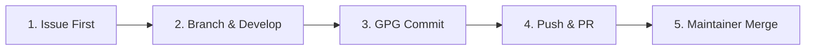

# Developer Workflow Exemplar

This guide documents the standardised end-to-end developer workflow for contributing to the `sdmx-rs` repository. By following this lifecycle, contributors ensure their work integrates smoothly and aligns with the repository's strict quality, cryptographic, and versioning standards.

We use the repository's first foundational baseline milestone (**Issue #1**) as a fully worked real-world exemplar.

---

## The Workflow at a Glance



---

## Stage 1: The Issue (Tracking Intent)

Every contribution must start with an open tracking issue on the forge. The issue is the authoritative record of intent, establishing the scope and requirements before any code is written.

### Exemplar Issue: Issue #1

Below is the structured issue used to define the initial repository bootstrapping chore:

```markdown
# Issue #1: Initialise Workspace Configuration

Initialise repository for the `sdmx-rs` workspace, populating the global optimisation profiles, formatting definitions, compliance gates, tracking exclusions, automated workflows, and the `flake` engine.

## Key Deliverables
- [ ] Initialise root `Cargo.toml` workspace tracking blocks and sub-crate structure.
- [ ] Secure cross-platform compilation stability via `rust-toolchain.toml`.
- [ ] Establish explicit code layout styles and pretty-printer configuration via `rustfmt.toml`.
- [ ] Embed aggressive quality control flags inside `.cargo/config.toml`.
- [ ] Restrict copyleft dependency inclusion with a proactive `deny.toml` configuration.
- [ ] Build the zero-dependency pure `flake.nix` build wrapper.
- [ ] Configure standard source tracking exclusions via `.gitignore`.
- [ ] Establish standardised contributor issue definitions within `.github/ISSUE_TEMPLATE/`.
- [ ] Establish standardised pull request formats via `.github/pull_request_template.md`.
- [ ] Build core automated integration gates inside `.github/workflows/`.
- [ ] Establish maintainer key register and signed commit infrastructure via `.github/maintainer-keys/`.
- [ ] Configure forge hosting and mirror setup via `docs/project/forge-setup.md` runbook.

## Verification
- [ ] Code builds cleanly with zero warnings under `clippy::pedantic` (if code is modified).
- [ ] Verify dependency audit and license compliance gates pass cleanly (`just verify`).
- [ ] Automated CI pipelines (`verify`) pass 100% on the chore branch.

## Dependencies & References
- **Pre-requisites**: None
- **Resources**: None
```

---

## Stage 2: Branch & Develop (Local Development)

Once the issue is defined, the developer checks out a feature branch locally and writes the code. When the code is ready and passes local checks (`just verify`), the work is ready to commit (Stage 3).

### Git Rules
1. **Branch Names**: Branch from `main` using a clean descriptive slug (e.g., `chore/initialise-workspace-configuration`). Do **not** include issue IDs in branch names.
2. **GPG Signing**: All commits must be GPG-signed (using `--gpg-sign` or the Git `commit.gpgsign` global configuration).
3. **Semantic Headers**: Use the Conventional Commits specification.
4. **Issue Association**: Reference the issue using **`Closes #ISSUE_ID`** (for tasks/chores/features) or **`Fixes #ISSUE_ID`** (for bug fixes) at the bottom of the commit body. Do **not** reference Pull Request IDs.

### Create the Feature Branch

```bash
# Create and switch to the feature branch
git checkout -b chore/initialise-workspace-configuration
```

---

## Stage 3: The Commit (Signed Check-in)

With the code written and local checks passing, the developer stages the changes and creates a GPG-signed commit.

> [!NOTE]
> **Keep the branch commit lean.** Its body need only state *what* the change is and why — the exhaustive, enumerated record is authored by the maintainer on the **merge commit** (Stage 5), which is the canonical, signed entry on `main`. This deliberately spares contributors from polishing a commit body to repo standard: the maintainer curates the durable description at merge time rather than blocking review on message quality. The `Closes`/`Fixes` trailer here links the issue for navigability; the merge commit's `Resolves` is what guarantees closure (see [Merge Protocol — Semantic Keywords](../project/merging.md#semantic-keywords)).

### Exemplar Commit Command

```bash
# 1. Stage all modifications
git add .

# 2. Create the GPG-signed commit with a structured multi-line message
git commit --gpg-sign -F - <<'EOF'
chore(repo): initialise workspace configuration

Bootstraps the `sdmx-rs` repository by establishing the complete
workspace layout, deterministic Nix development environment, local
and CI verification quality gates, forge governance tooling, and
foundational architectural design documentation.

Delivers the initial infrastructure baseline as a single unified
commit so that all dependencies, hooks, and verification tools compile
and pass their constraints as a coherent whole.

Closes #1
EOF
```

---

## Stage 4: Push & PR (Review & Gate Verification)

With the commit created locally, the developer pushes the branch and generates a Pull Request (PR) to request code review and trigger the automated CI quality gates.

### Push the Branch

```bash
# Push the branch to the remote repository
git push -u origin chore/initialise-workspace-configuration
```

### Pull Request Rules
1. **PR Title**: The PR title must follow the Conventional Commits specification (matching the main commit title).
2. **Description & Checklist**: Deliverables must be checklisted, and the target Issue ID must be explicitly closed in the description.

### Exemplar Pull Request Command

The developer generates the PR using the GitHub CLI (`gh`), feeding in the detailed deliverables checklist:

```bash
gh pr create --title "chore(repo): initialise workspace configuration" --body-file - <<'EOF'
Delivers the foundational infrastructure for the `sdmx-rs` monorepo by configuring the workspace layout, a deterministic Nix-based development environment, local and CI verification quality gates, forge governance tooling, a signed-and-attested release pipeline, and architectural design documentation.

Bootstrapping the infrastructure as a single unified commit establishes the foundation and ensures that the initial environment configuration, pre-commit hooks, lint rules, and workspace crates compile and satisfy all verification constraints.

## Key Changes

- **Workspace & Cargo Monorepo**: Initialised the root `Cargo.toml` and configured the structural boundaries for the facade (`sdmx-rs`) and subcrates (`sdmx-types`, `sdmx-parsers`, `sdmx-writers`, `sdmx-client`).
- **Toolchain & Nix Environment**: Established `rust-toolchain.toml` and built the `flake.nix` devShell wrapper with cryptographically pinned system dependencies via `flake.lock`, and committed `Cargo.lock` for reproducible builds.
- **Quality Gates & Security**: Embedded compilation quality flags in `.cargo/config.toml`, constrained licences and vulnerabilities via `deny.toml`, configured `cargo-llvm-cov` / Codecov coverage, and built the GitHub Actions workflows (`ci.yml`, `publish.yml`, and `verify-signature.yml`, which uses the committed GPG public keys in `.github/maintainer-keys/` as its trust root). The `publish.yml` pipeline performs per-crate Trusted-Publishing releases with build-provenance and dual (CycloneDX and SPDX) SBOM attestation.
- **Forge Governance**: Established `scripts/forge-apply.sh` (guarded one-shot bootstrap), `scripts/doctor-forge.sh` (continuous spec verification), and `scripts/lib/forge-spec.sh` (machine-readable desired state), backed by committed ruleset and allowlist artifacts under `forge/`.
- **Pretty-Printer Configuration**: Defined `rustfmt.toml` with nightly import ordering (`imports_granularity`, `group_imports`) and doc-comment formatting, establishing the canonical code style for the workspace.
- **Diagnostic Tooling**: Bundled the `scripts/doctor-*.sh` suite, providing automated health checks for environment setup, Git hygiene, Nix configuration, hook integration, and monorepo structure, together with troubleshooting guidance.
- **Maintenance & Release Automation**: Configured `maintenance.toml` to track obligation deadlines and phases; `release.toml` orchestrates per-crate version bumps and signing; automation scripts handle MSRV upgrades, lockfile refreshes (`update-deps`, `update-flake`), and compliance synchronisation.
- **Documentation Infrastructure**: Organised documentation across architecture, design specifications, project operations (release, maintenance, and review procedures), and developer and user guides. The integrated `doc-engine.sh` script manages the ADR, design, and guide lifecycle (creation, renaming, and removal).
- **BATS Integration Tests**: Automated verification of document lifecycle (creation, removal, renaming, and validation), maintenance obligation tracking, monorepo scaffolding, and MSRV upgrade mechanics, together with the release pipeline (changelog generation, prep-release, prepublish, and semver) and the security and signature gates, summarised by a reusable `scripts/run-bats.sh` runner.
- **Hygiene & Hooks**: Established an allow-list `.gitignore`, templates for issue and PR creation, and local git hooks via `pre-commit` (integrating `gitleaks` secret scanning and nightly `rustfmt` rules) and `commitlint`. Set default `.editorconfig`, `.gitattributes`, and `CODEOWNERS` policies.

## Quality Checklist

- [x] I have run the unified quality gate (`just verify` or `nix develop --command just verify`) and all checks pass cleanly.
- [x] I have added doc-comments (`///`) to any new or modified public API items.
- [x] My commits are GPG-signed.

Closes #1
EOF
```

Once submitted, the PR runs through the automated checks in CI. After approval, a maintainer integrates the branch onto `main` using the GPG-signed merge protocol — see Stage 5.

---

## Stage 5: The Merge (Maintainer Integration)

[The maintainer](../project/merging.md), not the contributor, performs the merge. This is a `--no-ff`, GPG-signed merge onto `main`, and its commit message is the **canonical, durable record of the change** — the detailed, enumerated description that travels in `git log` on `main` and mirrors to Codeberg, independent of any forge.

This is a deliberate division of labour: the contributor's branch commit (Stage 2) stays lean, and the maintainer authors the polished, standard-conforming description here at merge time. Rather than blocking PR review on the quality of a contributor's commit body, the maintainer curates the permanent record themselves — a cleaner exit than rounds of message-wording feedback.

### Merge Rules

1. **Authored by the maintainer**: only maintainers push to `main` (enforced by branch-protection rulesets); the merge commit is signed by the maintainer.
2. **`--no-ff` always**: preserves the branch commit and its signature as a parent (see [Merge Protocol](../project/merging.md)).
3. **Detailed body**: the merge commit carries the full enumerated change description — it is the canonical record, not a one-line "Merge branch …".
4. **`Resolves #ISSUE_ID`**: the merge commit uses `Resolves` (not `Closes`/`Fixes`). This is the trailer that **guarantees** the issue closes when the commit lands on `main`; the `Closes`/`Fixes` on the branch commit and PR provide issue *linkage*, while `Resolves` here certifies *integration* (see [Semantic Keywords](../project/merging.md#semantic-keywords)).

### Exemplar Merge Command

```bash
# 1. Bring main up to date
git checkout main
git pull origin main

# 2. GPG-signed --no-ff merge carrying the detailed canonical record
git merge --no-ff --gpg-sign chore/initialise-workspace-configuration -F - <<'EOF'
chore(repo): initialise workspace configuration

Delivers the initial repository baseline for the `sdmx-rs` monorepo by
establishing the workspace layout, deterministic Nix development
environment, local and CI verification quality gates, forge governance
tooling, a signed-and-attested release pipeline, and foundational
architectural design documentation.

Bootstrapping these infrastructure components as a single unified
commit ensures that the environment configuration, pre-commit hooks,
lint rules, and workspace crates compile and satisfy verification
constraints as a coherent whole.

Key Changes:

- Workspace & Cargo Monorepo: Initialised the root `Cargo.toml` and
  configured the structural boundaries for the facade (`sdmx-rs`) and
  subcrates (`sdmx-types`, `sdmx-parsers`, `sdmx-writers`,
  `sdmx-client`).
- Toolchain & Nix Environment: Established `rust-toolchain.toml`
  and built the `flake.nix` devShell wrapper with cryptographically
  pinned system dependencies via `flake.lock`, and committed
  `Cargo.lock` for reproducible builds.
- Quality Gates & Security: Embedded compilation quality flags in
  `.cargo/config.toml`, constrained licences and vulnerabilities via
  `deny.toml`, configured `cargo-llvm-cov` / Codecov coverage, and
  built the GitHub Actions workflows (`ci.yml`, `publish.yml`, and
  `verify-signature.yml`, which uses the committed GPG public keys
  in `.github/maintainer-keys/` as its trust root). The `publish.yml`
  pipeline performs per-crate Trusted-Publishing releases with
  build-provenance and dual (CycloneDX and SPDX) SBOM attestation.
- Forge Governance: Established `scripts/forge-apply.sh` (guarded
  one-shot bootstrap), `scripts/doctor-forge.sh` (continuous spec
  verification), and `scripts/lib/forge-spec.sh` (machine-readable
  desired state), backed by committed ruleset and allowlist artifacts
  under `forge/`.
- Pretty-Printer Configuration: Defined `rustfmt.toml` with nightly
  import ordering (`imports_granularity`, `group_imports`) and
  doc-comment formatting, establishing the canonical code style for
  the workspace.
- Diagnostic Tooling: Bundled the `scripts/doctor-*.sh` suite,
  providing automated health checks for environment setup, Git
  hygiene, Nix configuration, hook integration, and monorepo
  structure, together with troubleshooting guidance.
- Maintenance & Release Automation: Configured `maintenance.toml`
  to track obligation deadlines and phases; `release.toml`
  orchestrates per-crate version bumps and signing; automation
  scripts handle MSRV upgrades, lockfile refreshes (`update-deps`,
  `update-flake`), and compliance synchronisation.
- Documentation Infrastructure: Organised documentation across
  architecture, design specifications, project operations (release,
  maintenance, and review procedures), and developer and user
  guides. The integrated `doc-engine.sh` script manages the ADR,
  design, and guide lifecycle (creation, renaming, and removal).
- BATS Integration Tests: Automated verification of document
  lifecycle (creation, removal, renaming, and validation),
  maintenance obligation tracking, monorepo scaffolding, and MSRV
  upgrade mechanics, together with the release pipeline (changelog
  generation, prep-release, prepublish, and semver) and the security
  and signature gates, summarised by a reusable `scripts/run-bats.sh`
  runner.
- Hygiene & Hooks: Established an allow-list `.gitignore`, templates
  for issue and PR creation, and local git hooks via `pre-commit`
  (integrating `gitleaks` secret scanning and nightly `rustfmt`
  rules) and `commitlint`. Set default `.editorconfig`,
  `.gitattributes`, and `CODEOWNERS` policies.

Resolves #1
EOF

# 3. Push to staging branch so CI runs on this exact SHA
git push origin main:staging-chore-initialise-workspace-configuration

# 4. Once CI is green, publish to every forge, then clean up
git push all main
git push origin --delete staging-chore-initialise-workspace-configuration
git branch -d chore/initialise-workspace-configuration
```
